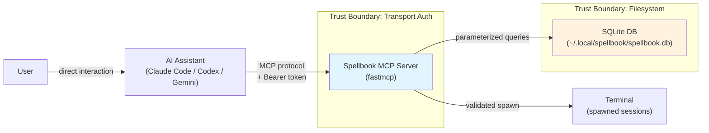

# Security Policy

## Threat Model

Spellbook's MCP server runs as a local process, typically launched by an AI coding assistant (Claude Code, Codex, Gemini CLI). The primary threat actors are:

| Threat Actor | Description | Attack Vector |
|---|---|---|
| Malicious local process | Another process on the same machine connecting to the HTTP transport | DNS rebinding, direct HTTP requests to 127.0.0.1 |
| Prompt injection via external content | Untrusted files, PRs, web pages processed by the AI assistant | Poisoned workflow state, crafted boot_prompt, injection patterns in DB fields |
| Compromised database | Attacker gains write access to ~/.local/spellbook/spellbook.db | Injected workflow state, tampered trust registry, poisoned recovery context |
| Browser-based DNS rebinding | Malicious web page rebinds DNS to localhost, sending requests to the MCP server | CVE-2025-53967-style attacks against unauthenticated local servers |

The server does NOT face internet-originating traffic. All connections are local. The primary risk is privilege escalation: an attacker who can influence MCP tool inputs or persisted state could achieve arbitrary code execution through the AI assistant.

## Trust Boundaries

**Key boundaries:**

1. **Transport**: Bearer token authentication on all HTTP endpoints (except /health). Token generated per server instance, stored at `~/.local/spellbook/.mcp-token` with 0600 permissions.
2. **Tool dispatch**: All tool inputs pass through a validation pipeline (injection detection, pattern matching, schema validation).
3. **State persistence**: Workflow state loaded from the database is validated against a strict schema before use. Invalid state is marked hostile in the trust registry.

## Security Architecture

Spellbook employs a three-layer defense model:

### Layer 1: Transport Authentication

Bearer token authentication for HTTP transport, implemented as ASGI middleware. The server generates a cryptographic token on startup, writes it atomically to `~/.local/spellbook/.mcp-token` with 0600 permissions (no TOCTOU race), and requires all HTTP requests to include it as an `Authorization: Bearer <token>` header. Token comparison uses `secrets.compare_digest` to prevent timing attacks.

Relevant source: `spellbook_mcp/auth.py`

### Layer 2: Input Validation Pipeline

Every tool invocation passes through pattern-based security scanning:

- **Injection detection**: Regex rules for prompt injection, role reassignment, instruction override, AppleScript injection, base64-encoded commands
- **Exfiltration detection**: curl/wget/netcat/SSH patterns, credential file access, DNS exfiltration
- **Escalation detection**: sudo, eval/exec, shell=True subprocess, permission bypass flags
- **Obfuscation detection**: High-entropy strings, hex escapes, char code concatenation

The security mode (standard/paranoid) controls the severity threshold for blocking.

Relevant sources: `spellbook_mcp/security/rules.py`, `spellbook_mcp/security/tools.py`, `spellbook_mcp/security/check.py`

### Layer 3: State Management

Persisted workflow state undergoes schema validation on both save and load:

- Allowlisted keys only (unexpected keys rejected)
- Total size cap (1 MB) and per-field size cap (100 KB)
- boot_prompt restricted to safe operations (Skill, Read, TodoWrite)
- Dangerous operations (Bash, Write, Edit, WebFetch, curl, wget, rm) blocked in boot_prompt
- All string fields scanned for injection patterns
- Invalid state marked as hostile in the trust registry with full audit trail

Relevant source: `spellbook_mcp/resume.py`

## Auth Flow

1. Server starts in HTTP mode (`SPELLBOOK_MCP_TRANSPORT=streamable-http`)
2. `generate_and_store_token()` creates a 32-byte URL-safe token via `secrets.token_urlsafe`
3. Token is written atomically to `~/.local/spellbook/.mcp-token` with 0600 permissions using `os.open()` with `O_CREAT | O_TRUNC` (no TOCTOU race between create and chmod)
4. `BearerAuthMiddleware` is added to the ASGI middleware stack
5. Clients read the token from the file and include it as `Authorization: Bearer <token>` in every request
6. The middleware validates the token on every HTTP request using `secrets.compare_digest` (constant-time comparison)
7. The `/health` endpoint is exempted from auth for monitoring

When running via stdio transport (the default for Claude Code), authentication is not needed as the transport is a direct pipe with no network exposure.

## Findings Summary

All findings from the MCP security audit have been addressed:

| # | Severity | Finding | Status | Commit |
|---|---|---|---|---|
| 1 | CRITICAL | RCE via workflow_state_save: arbitrary boot_prompt injection | FIXED | `1222913` |
| 2 | CRITICAL | RCE via workflow_state_update: merge-based boot_prompt injection | FIXED | `1222913` |
| 3 | HIGH | No authentication on HTTP transport | FIXED | `d0aa78a`, `bd6ed35` |
| 4 | HIGH | No rate limiting on spawn_claude_session | FIXED | `ce9c64f` |
| 5 | HIGH | Path traversal via working_directory in spawn_claude_session | FIXED | `7b70e53` |
| 6 | HIGH | Prompt injection in spawn_claude_session prompt parameter | FIXED | `ce9c64f` |
| 7 | HIGH | boot_prompt validation bypass via multi-line context evasion | FIXED | `4737935` |
| 8 | HIGH | Shell injection via unsanitized terminal command inputs | FIXED | `ce9c64f` |
| 9 | MEDIUM | Recovery context injection via poisoned DB fields | FIXED | `9af38ce` |
| 10 | MEDIUM | Insufficient injection pattern coverage (AppleScript, base64) | FIXED | `9af38ce` |
| 11 | MEDIUM | TERMINAL env var used without validation | FIXED | `536f422` |
| 12 | MEDIUM | Recovery context field length unbounded | FIXED | `9af38ce` |
| 13 | MEDIUM | SPELLBOOK_CLI_COMMAND not validated against allowlist | FIXED | `ef02847` |
| 14 | LOW | DB file permissions too permissive, no connection lifecycle management | FIXED | `266d06d` |

## CVE References

This hardening was motivated by vulnerabilities disclosed in the MCP ecosystem during 2025:

| CVE | Description | Relevance |
|---|---|---|
| [CVE-2025-66414](https://nvd.nist.gov/vuln/detail/CVE-2025-66414) | Server-Side Request Forgery in MCP servers | Motivated HTTP transport auth and host binding |
| [CVE-2025-66416](https://nvd.nist.gov/vuln/detail/CVE-2025-66416) | Prompt injection via tool descriptions | Informed injection pattern expansion |
| [CVE-2025-53967](https://nvd.nist.gov/vuln/detail/CVE-2025-53967) | DNS rebinding attack against local MCP servers | Drove bearer token auth requirement |
| [CVE-2025-59536](https://nvd.nist.gov/vuln/detail/CVE-2025-59536) | Unauthenticated RCE via MCP tool manipulation | Validated the three-barrier defense approach |

## Known Limitations

- **No SQLCipher**: The SQLite database is not encrypted at rest. An attacker with filesystem read access can read all persisted state. Mitigation: 0600 file permissions and 0700 directory permissions.
- **No OAuth/OIDC**: Authentication is a shared secret (bearer token), not a full OAuth flow. Sufficient for local single-user operation but not suitable for multi-user or networked deployments.
- **Regex detection is bypassable**: Pattern-based injection detection can be evaded with sufficient creativity (novel encodings, semantic equivalents, split payloads). The patterns cover known attack vectors but cannot guarantee completeness.
- **No TLS**: HTTP transport uses plain HTTP on localhost. The bearer token travels unencrypted, but since traffic is loopback-only, the risk is limited to local process sniffing.
- **Rate limiting is per-server**: The spawn rate limit resets on server restart. A persistent attacker could restart the server to bypass rate limits.

## Responsible Disclosure

If you discover a security vulnerability in spellbook:

1. **Do NOT open a public issue.**
2. Use [GitHub's private vulnerability reporting](https://github.com/axiomantic/spellbook/security/advisories/new) or email the maintainer directly.
3. Include: description, reproduction steps, and impact assessment.
4. We will acknowledge receipt within 48 hours and provide an initial assessment within 5 business days.

## Configuration

| Environment Variable | Default | Description |
|---|---|---|
| `SPELLBOOK_MCP_AUTH` | (enabled) | Set to `disabled` to skip bearer token auth. Use only for debugging. |
| `SPELLBOOK_MCP_HOST` | `127.0.0.1` | Bind address for HTTP transport. Do not change to `0.0.0.0` in production. |
| `SPELLBOOK_MCP_PORT` | `8765` | Port for HTTP transport. |
| `SPELLBOOK_MCP_TRANSPORT` | `stdio` | Transport mode: `stdio` or `streamable-http`. |
| `SPELLBOOK_CLI_COMMAND` | `claude` | CLI command for spawned sessions. Validated against allowlist: `claude`, `codex`, `gemini`, `opencode`, `crush`. |

## Supported Versions

| Version | Supported |
|---|---|
| latest | Yes |
| < latest | Best effort |
