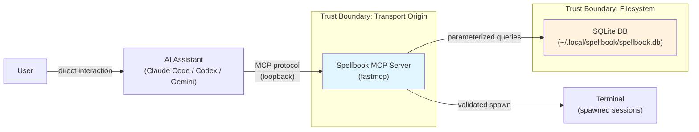

# Security Policy

## Threat Model

Spellbook's MCP server runs as a local process, typically launched by an AI coding assistant (Claude Code, Codex, Gemini CLI). The primary threat actors are:

| Threat Actor | Description | Attack Vector |
|---|---|---|
| Malicious local process | Another process on the same machine connecting to the HTTP transport | DNS rebinding, direct HTTP requests to 127.0.0.1 |
| Prompt injection via external content | Untrusted files, PRs, web pages processed by the AI assistant | Poisoned workflow state, crafted boot_prompt, injection patterns in DB fields |
| Compromised database | Attacker gains write access to ~/.local/spellbook/spellbook.db | Injected workflow state, tampered trust registry, poisoned recovery context |
| Browser-based DNS rebinding | Malicious web page rebinds DNS to localhost, sending requests to the MCP server | CVE-2025-53967-style attacks against unauthenticated local servers |

The server does NOT face internet-originating traffic. All connections are local. The primary risk is privilege escalation: an attacker who can influence MCP tool inputs or persisted state could achieve arbitrary code execution through the AI assistant.

## Trust Boundaries

```mermaid
graph LR
    User["User"] -->|"direct interaction"| Claude["AI Assistant<br>(Claude Code / Codex / Gemini)"]
    Claude -->|"MCP protocol<br>(loopback)"| Server["Spellbook MCP Server<br>(fastmcp)"]
    Server -->|"parameterized queries"| DB["SQLite DB<br>(~/.local/spellbook/spellbook.db)"]
    Server -->|"validated spawn"| Terminal["Terminal<br>(spawned sessions)"]

    subgraph "Trust Boundary: Transport Origin"
        Server
    end

    subgraph "Trust Boundary: Filesystem"
        DB
    end

    style Server fill:#e1f5fe
    style DB fill:#fff3e0
```

**Key boundaries:**

1. **Transport**: The server binds loopback and validates the `Origin` and `Host` headers on every HTTP request. This blocks the browser, which is the only remote actor that can reach a loopback port.
2. **Tool dispatch**: All tool inputs pass through a validation pipeline (injection detection, pattern matching, schema validation).
3. **State persistence**: Workflow state loaded from the database is validated against a strict schema before use. Invalid state is marked hostile in the trust registry.

## Security Architecture

Spellbook employs a multi-layer defense model:

### Layer 1: Transport Origin Validation

`OriginValidationMiddleware` rejects browser-issued cross-origin requests. Binding loopback removes the network as an attack path but not the browser: any page the user visits can issue requests to `127.0.0.1`.

A request carrying no `Origin` header is allowed, and every legitimate MCP client (Claude Code, curl, pi's adapter) sends none. A request carrying an `Origin` is rejected unless that origin matches -- exactly, on scheme, host, and port -- either the daemon's own origin or an entry in `SPELLBOOK_ALLOWED_ORIGINS`; a loopback hostname on another port or scheme does not qualify. A request carrying more than one `Origin` or `Host` header is rejected outright. The `Host` header is validated independently against loopback and the configured bind address, which closes DNS rebinding at a second layer -- a rebound request arrives naming the attacker's own host.

Allowing an absent `Origin` does *not* rest on browsers always sending one, because they do not: a browser omits `Origin` on cross-origin GET navigations and on ``, `<script>`, `<link>`, and `<iframe src>` subresource loads, and attaches it to `fetch`/`XHR` and to cross-origin form submissions. The invariant is narrower and worth stating exactly: **every cross-origin request a page can make without an `Origin` header is a GET or HEAD, and no GET or HEAD route on this daemon has a side effect.** Adding a GET or HEAD route that mutates state, or whose response body matters when an attacker page loads it as a subresource, breaks the invariant -- such a route needs its own check rather than relying on `Origin`.

Rejections are `403 Forbidden`. There are no credentials, so nothing the caller could supply would change the outcome; `401` would imply a retry path that does not exist.

Relevant source: `spellbook/core/auth.py`

### Layer 2: Input Validation Pipeline

Every tool invocation passes through pattern-based security scanning:

- **Injection detection**: Regex rules for prompt injection, role reassignment, instruction override, AppleScript injection, base64-encoded commands
- **Exfiltration detection**: curl/wget/netcat/SSH patterns, credential file access, DNS exfiltration
- **Escalation detection**: sudo, eval/exec, shell=True subprocess, permission bypass flags
- **Obfuscation detection**: High-entropy strings, hex escapes, char code concatenation

The security mode (standard/paranoid) controls the severity threshold for blocking.

Relevant sources: `spellbook/security/rules.py`, `spellbook/security/tools.py`, `spellbook/security/check.py`

### Layer 3: State Management

Persisted workflow state undergoes schema validation on both save and load:

- Allowlisted keys only (unexpected keys rejected)
- Total size cap (1 MB) and per-field size cap (100 KB)
- boot_prompt restricted to safe operations (Skill, Read, TodoWrite)
- Dangerous operations (Bash, Write, Edit, WebFetch, curl, wget, rm) blocked in boot_prompt
- All string fields scanned for injection patterns
- Invalid state marked as hostile in the trust registry with full audit trail

Relevant source: `spellbook/resume.py`

### Layer 4: Runtime Injection Defense

A defense-in-depth system with 5 concentric layers protects against prompt injection via external content (WebFetch, WebSearch, MCP tool output). The layers are: spotlighting (boundary marking), session content accumulator (split injection detection), LODO-evaluated regex patterns, PromptSleuth semantic intent classification (Anthropic haiku), and Ed25519 cryptographic content provenance. Each layer operates independently. See [docs/security.md](docs/security.md) for full technical details.

Relevant sources: `spellbook/security/spotlight.py`, `spellbook/security/sleuth.py`, `spellbook/security/crypto.py`, `spellbook/security/accumulator.py`

## Request Validation Flow

1. Server starts in HTTP mode (`SPELLBOOK_MCP_TRANSPORT=streamable-http`) and binds `SPELLBOOK_HOST` (default `127.0.0.1`)
2. `OriginValidationMiddleware` is added to the ASGI middleware stack
3. On every HTTP request the middleware reads `Host`; a value naming neither loopback nor the configured bind address is rejected with `403`
4. It then reads `Origin`. An absent `Origin` is allowed
5. A present `Origin` is allowed only when it matches the daemon's own origin exactly (scheme, host, and port) or appears in `SPELLBOOK_ALLOWED_ORIGINS`; otherwise `403`. A repeated `Origin` or `Host` header is `403`
6. `/health` is subject to the same `Host` check, so monitoring does not become a rebinding hole

When running via stdio transport (the default for Claude Code), these checks do not apply as the transport is a direct pipe with no network exposure.

## Findings Summary

All findings from the MCP security audit have been addressed:

| # | Severity | Finding | Status | Commit |
|---|---|---|---|---|
| 1 | CRITICAL | RCE via workflow_state_save: arbitrary boot_prompt injection | FIXED | `1222913` |
| 2 | CRITICAL | RCE via workflow_state_update: merge-based boot_prompt injection | FIXED | `1222913` |
| 3 | HIGH | No authentication on HTTP transport | FIXED | `d0aa78a`, `bd6ed35` |
| 4 | HIGH | No rate limiting on spawn_claude_session | FIXED | `ce9c64f` |
| 5 | HIGH | Path traversal via working_directory in spawn_claude_session | FIXED | `7b70e53` |
| 6 | HIGH | Prompt injection in spawn_claude_session prompt parameter | FIXED | `ce9c64f` |
| 7 | HIGH | boot_prompt validation bypass via multi-line context evasion | FIXED | `4737935` |
| 8 | HIGH | Shell injection via unsanitized terminal command inputs | FIXED | `ce9c64f` |
| 9 | MEDIUM | Recovery context injection via poisoned DB fields | FIXED | `9af38ce` |
| 10 | MEDIUM | Insufficient injection pattern coverage (AppleScript, base64) | FIXED | `9af38ce` |
| 11 | MEDIUM | TERMINAL env var used without validation | FIXED | `536f422` |
| 12 | MEDIUM | Recovery context field length unbounded | FIXED | `9af38ce` |
| 13 | MEDIUM | SPELLBOOK_CLI_COMMAND not validated against allowlist | FIXED | `ef02847` |
| 14 | LOW | DB file permissions too permissive, no connection lifecycle management | FIXED | `266d06d` |

## CVE References

This hardening was motivated by vulnerabilities disclosed in the MCP ecosystem during 2025:

| CVE | Description | Relevance |
|---|---|---|
| [CVE-2025-53967](https://nvd.nist.gov/vuln/detail/CVE-2025-53967) | Command injection in Framelink Figma MCP Server | Drove input validation and shell escaping |
| [CVE-2025-66414](https://nvd.nist.gov/vuln/detail/CVE-2025-66414) | DNS rebinding in MCP TypeScript SDK | Motivated HTTP transport auth and host binding |
| [CVE-2025-66416](https://nvd.nist.gov/vuln/detail/CVE-2025-66416) | DNS rebinding in MCP Python SDK | Informed injection pattern expansion |
| [CVE-2025-59536](https://nvd.nist.gov/vuln/detail/CVE-2025-59536) | Code injection in Claude Code startup trust dialog | Validated the three-barrier defense approach |

## Known Limitations

- **No SQLCipher**: The SQLite database is not encrypted at rest. An attacker with filesystem read access can read all persisted state. Mitigation: 0600 file permissions and 0700 directory permissions.
- **No authentication at all**: The server identifies no caller. Any local process running as the user can drive it. This is deliberate -- a token stored mode 0600 defends only against other local users, and any process running as the user could read that file anyway. Not suitable for multi-user or networked deployments.
- **Regex detection is bypassable**: Pattern-based injection detection can be evaded with sufficient creativity (novel encodings, semantic equivalents, split payloads). The patterns cover known attack vectors but cannot guarantee completeness.
- **No TLS**: HTTP transport uses plain HTTP on localhost. Traffic is loopback-only, so the risk is limited to local process sniffing.
- **Rate limiting is per-server**: The spawn rate limit is persistent (backed by the SQLite database) and does NOT reset on server restart. However, a persistent attacker with filesystem access could delete or modify the database to bypass rate limits.

## Responsible Disclosure

If you discover a security vulnerability in spellbook:

1. **Do NOT open a public issue.**
2. Use [GitHub's private vulnerability reporting](https://github.com/axiomantic/spellbook/security/advisories/new) or email the maintainer directly.
3. Include: description, reproduction steps, and impact assessment.
4. We will acknowledge receipt within 48 hours and provide an initial assessment within 5 business days.

## Configuration

| Environment Variable | Default | Description |
|---|---|---|
| `SPELLBOOK_AUTH` | (enabled) | Set to `disabled` to skip Origin/Host validation. Use only for debugging. (`SPELLBOOK_MCP_AUTH` is accepted as a deprecated alias.) |
| `SPELLBOOK_ALLOWED_ORIGINS` | (empty) | Comma-separated origins allowed to call the daemon from a browser, matched exactly on scheme, host, and port. Needed for a browser client on any origin other than the daemon's own, including another port on this machine. |
| `SPELLBOOK_MCP_HOST` | `127.0.0.1` | Bind address for HTTP transport. Do not change to `0.0.0.0` in production. |
| `SPELLBOOK_MCP_PORT` | `8765` | Port for HTTP transport. |
| `SPELLBOOK_MCP_TRANSPORT` | `stdio` | Transport mode: `stdio` or `streamable-http`. |
| `SPELLBOOK_CLI_COMMAND` | `claude` | CLI command for spawned sessions. Validated against allowlist: `claude`, `codex`, `gemini`, `opencode`. |

## Supported Versions

| Version | Supported |
|---|---|
| latest | Yes |
| < latest | Best effort |
