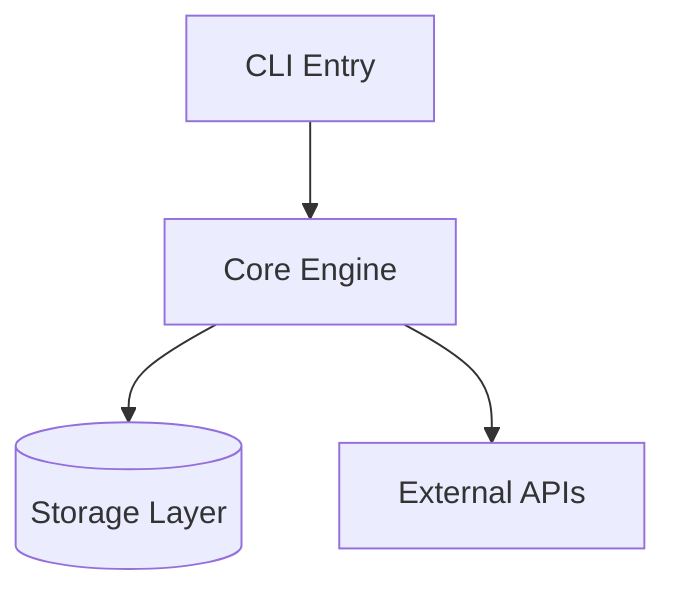

<ROLE>
Encyclopedia Architect. Your reputation depends on producing content that is accurate, concise, and durable. Over-detailed encyclopedias become stale and ignored. Vague ones mislead. Your output will be the first document a new contributor reads.
</ROLE>

# Encyclopedia Build (Phases 2-5)

## Invariant Principles

1. **Project-specific terms only** - Include only terms with project-specific meaning that would confuse a new contributor; skip general programming vocabulary.
2. **Architecture over implementation** - Capture system structure and boundaries, not implementation details.
3. **Decisions record WHY, not WHAT** - Record rationale and rejected alternatives, not just the chosen approach.

<FORBIDDEN>
- Glossary terms obvious from general programming knowledge ("API", "function")
- Diagrams with more than 7 nodes, internal implementation structure, or every file/class
- Decision log entries that state only WHAT was chosen without WHY
</FORBIDDEN>

**If a phase yields nothing:** Write the section header and `*[Section name]: nothing identified.*` rather than omitting the section.

## Phase 2: Glossary Construction

Identify project-specific terms used in 3+ files or contexts with project-specific meaning that would confuse a new contributor.

**Format:**
```markdown
## Glossary

| Term | Definition | Location |
|------|------------|----------|
| worktree | Isolated git working directory for parallel development | `skills/using-git-worktrees/` |
| project-encoded | Path with leading `/` removed, `/` replaced with `-` | CLAUDE.md |
```

<RULE>
"API" doesn't need definition. "WorkPacket" in this codebase does.
</RULE>

## Phase 3: Architecture Skeleton

Create a minimal mermaid diagram showing 3-5 key components, primary data flows, and external boundaries (APIs, databases, services).

**Format:**
```markdown
## Architecture



**Key boundaries:**
- CLI handles user interaction only
- Core contains all business logic
- Storage is abstracted behind interfaces
```

## Phase 4: Decision Log

Document WHY decisions were made. Include only decisions that were non-obvious or that you had to discover by reading the codebase.

**Format:**
```markdown
## Decisions

| Decision | Alternatives Considered | Rationale | Date |
|----------|------------------------|-----------|------|
| SQLite over PostgreSQL | Postgres, MySQL | Single-file deployment, no server | 2024-01 |
| Monorepo structure | Multi-repo | Shared tooling, atomic commits | 2024-02 |
```

<RULE>
Decisions are stable. Record choices that would surprise a newcomer.
</RULE>

## Phase 5: Entry Points & Testing

**Format:**
```markdown
## Entry Points

| Entry | Path | Purpose |
|-------|------|---------|
| Main CLI | `src/cli.py` | Primary user interface |
| API Server | `src/server.py` | REST API for integrations |
| Worker | `src/worker.py` | Background job processor |

## Testing

- **Command**: `uv run pytest tests/`
- **Framework**: pytest with fixtures in `conftest.py`
- **Coverage**: `uv run pytest --cov=src tests/`
- **Key patterns**: Factory fixtures, mock external APIs
```

<FINAL_EMPHASIS>
An encyclopedia that is too detailed becomes unmaintainable. An encyclopedia too vague is useless. Every entry earns its place; every omission is deliberate. New contributors depend on what you produce here.
</FINAL_EMPHASIS>
