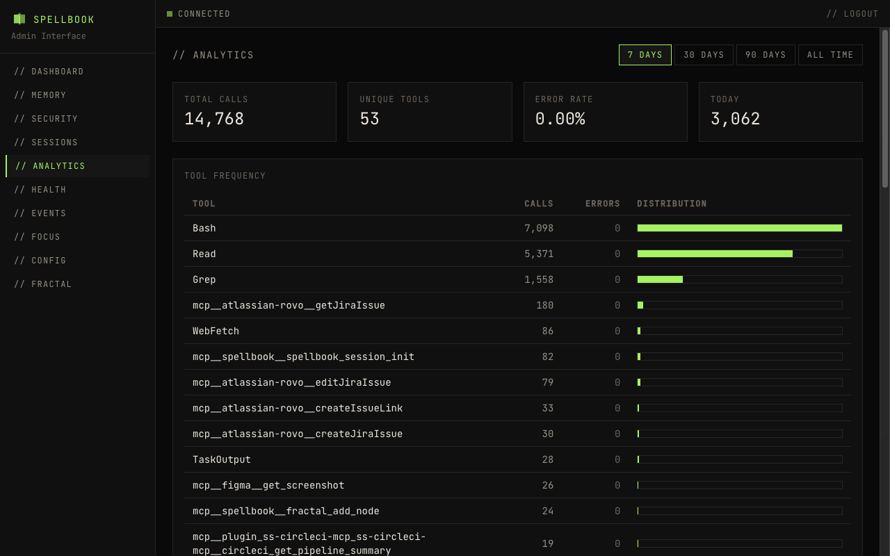

# Analytics

The analytics page shows tool call statistics derived from `security_events` data. All data is aggregated server-side via SQL `GROUP BY`.

## Period Selector

Choose from: 24h, 7d, 30d, all.

## Summary Cards

| Card | Description |
|------|-------------|
| Total Events | Total security events in the selected period |
| Unique Tools | Number of distinct tools that generated events |
| Error Rate % | Percentage of events with error severity |
| Events Today | Event count for the current day |

## Tool Frequency

Table showing each tool's usage, sorted by call count descending:

| Column | Description |
|--------|-------------|
| tool name | Name of the tool |
| call count | Total invocations in the period |
| error count | Number of error events |
| error rate | Percentage of calls that errored |

## Error Rate

Highlights tools with the highest error percentages.

## Timeline

Event volume over time, bucketed by hour (for 24h period) or day (for 7d, 30d, all).
