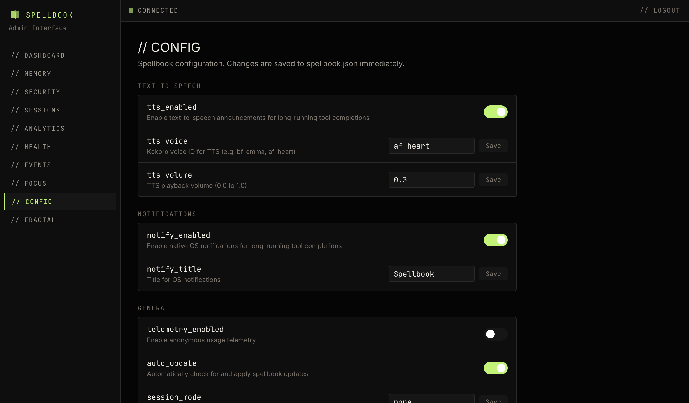

# Configuration

The config page provides an editor for Spellbook settings. Changes are saved immediately via API.

## Setting Groups

### Notifications

Settings for native OS notifications:

- **Enabled**: Toggle notifications on or off
- **Title**: Default notification title

### General

Other Spellbook configuration values.

## Editing

- Boolean settings use toggle switches
- String settings use inline text inputs
- Changes take effect immediately on save
