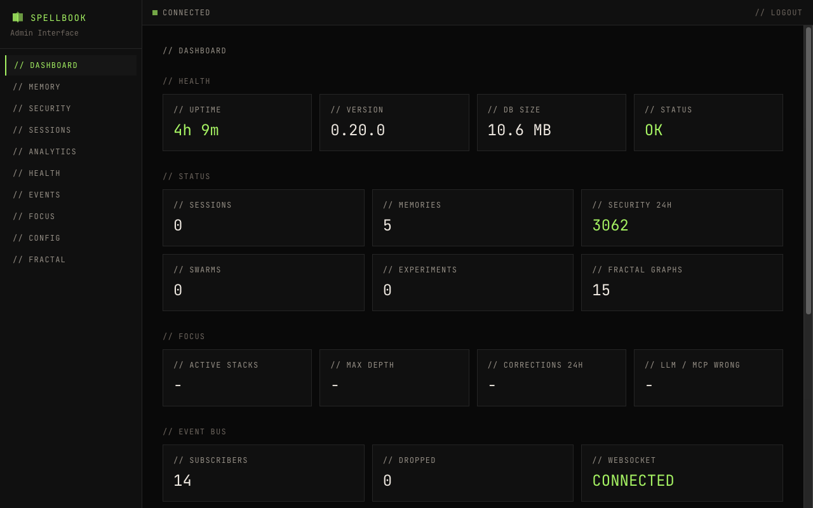

# Dashboard

The dashboard is the landing page after login. It provides a high-level overview of server state and recent activity.

## Sections

### Status

- Server uptime
- Memory count
- Security events
- Active sessions
- Database sizes

### Focus

- Active stacks
- Max depth
- Corrections in the last 24 hours
- LLM wrong / MCP wrong split

### Event Bus

- WebSocket connection status
- Live event feed from the asyncio EventBus

### Activity

- Recent session activity feed

## Auto-Refresh

All dashboard data auto-refreshes every 30 seconds via TanStack Query.
