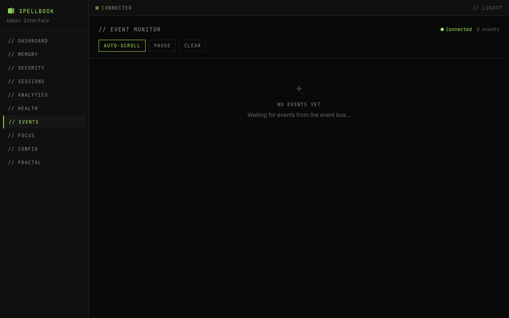

# Event Monitor

The events page is a live event bus monitor. It connects via WebSocket to stream events from the asyncio EventBus in real-time.

## Connection

A status indicator in the page header shows the current WebSocket state: connected, disconnected, or reconnecting. The client reconnects automatically with exponential backoff on disconnection.

## Filters

- **Subsystem checkboxes**: Filter by Memory, Security, Session, Config, Fractal, Swarm, Experiment, or Forge
- **Text search**: Search across event content

## Event Display

Each event shows:

- **Timestamp**: When the event occurred
- **Subsystem badge**: Color-coded badge indicating the source subsystem
- **Event type**: Specific event classification
- **Data payload**: Expandable to view the full event data

## Behavior

- **Auto-scroll**: Toggle to automatically scroll to the newest events. Enabled by default.
- **Client-side buffer**: Capped at 500 events. Oldest events are dropped when the buffer is full.
