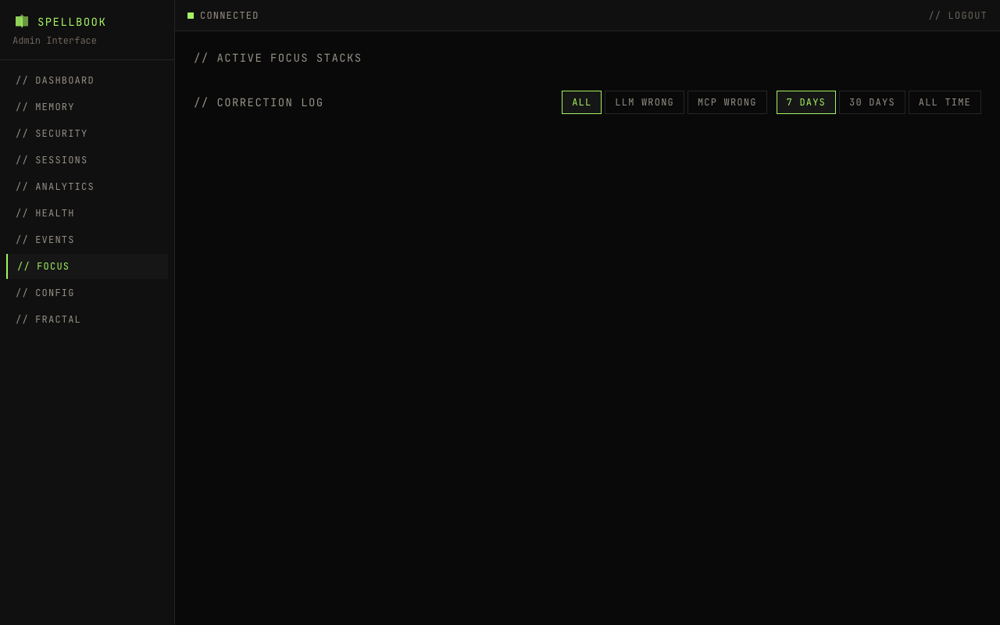

# Focus Tracking

The focus page provides visibility into Zeigarnik focus-tracking state. Data comes from the `stint_stack` and `stint_correction_events` tables in `spellbook.db`.

## Active Focus Stacks

Per-project stint stacks showing current depth. Each stack card displays:

- **Project name**
- **Active stint name**
- **Purpose**
- **behavioral_mode**
- **entered_at**

A color-coded depth gauge indicates stack health: green at low depth, yellow when approaching the threshold, red at or above depth 5. Cards are expandable to view all stack entries.

## Correction Log

Chronological table of stint correction events.

### Columns

| Column | Description |
|--------|-------------|
| timestamp | When the correction occurred |
| project | Project the correction applies to |
| correction_type | Either `llm_wrong` or `mcp_wrong` |
| diff_summary | Brief description of what changed |

### Filters

- **Period**: 24h, 7d, 30d, or all
- **Project**: Filter by specific project
- **Correction type**: Filter by `llm_wrong` or `mcp_wrong`

### Expandable Rows

Click a row to see the `old_stack_json` vs `new_stack_json` diff.
