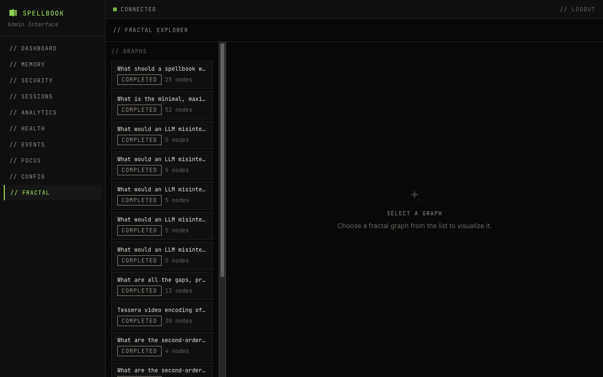

# Fractal Explorer

The fractal page is an interactive graph explorer for fractal-thinking exploration graphs. It renders graphs using Cytoscape.js.

## Graph List

The left panel lists all graphs with:

- **Seed question**: The root question that started the exploration
- **Status**: completed, active, or other graph states
- **Node count**: Total nodes in the graph

Select a graph to render it in the main viewport.

## Graph Visualization

### Node Types

- **Question nodes**: Rendered as ellipses
- **Answer nodes**: Rendered as rectangles

### Node Colors

| Status | Color |
|--------|-------|
| open | Cyan |
| claimed | Amber |
| answered | Green |
| synthesized | Bright green |
| saturated | Gray |
| error | Red |

### Edge Types

- **Standard edges**: Solid lines connecting parent to child nodes
- **Convergence edges**: Dashed cyan lines
- **Contradiction edges**: Dashed red lines

## Node Detail

Click a node to view:

- Full content text
- Node metadata (status, timestamps, claims)
- Synthesis content (if synthesized)

## Chat Log

A panel showing the exploration trace for individual nodes, displaying the sequence of questions and answers that led to the current state.

## Navigation

- **Zoom**: Scroll wheel or pinch
- **Pan**: Click and drag on empty space
- **Viewport persistence**: Current zoom and position are stored in URL parameters, preserved across page reloads
