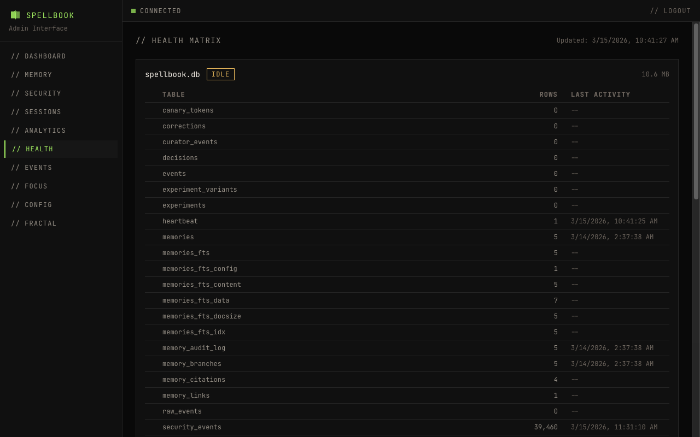

# Health Matrix

The health page shows the status of all 4 SQLite databases used by Spellbook.

## Databases

| Database | Purpose |
|----------|---------|
| spellbook.db | Core data: memories, security events, sessions, config, focus |
| fractal.db | Fractal-thinking exploration graphs |
| forged.db | Forge project and iteration data |
| coordination.db | Swarm coordination and work distribution |

## Database Cards

Each database card shows:

- **Name**: Database filename
- **File size**: Size on disk
- **Status indicator**: One of healthy, idle, error, or missing
- **Table list**: All tables in the database with row counts and last activity timestamp

## Status Logic

| Status | Condition |
|--------|-----------|
| healthy | Database is queryable and has activity within the last 24 hours |
| idle | Database is queryable but no activity in the last 24 hours |
| error | Database query fails |
| missing | Database file does not exist on disk |

## Auto-Refresh

Health data auto-refreshes every 30 seconds.
