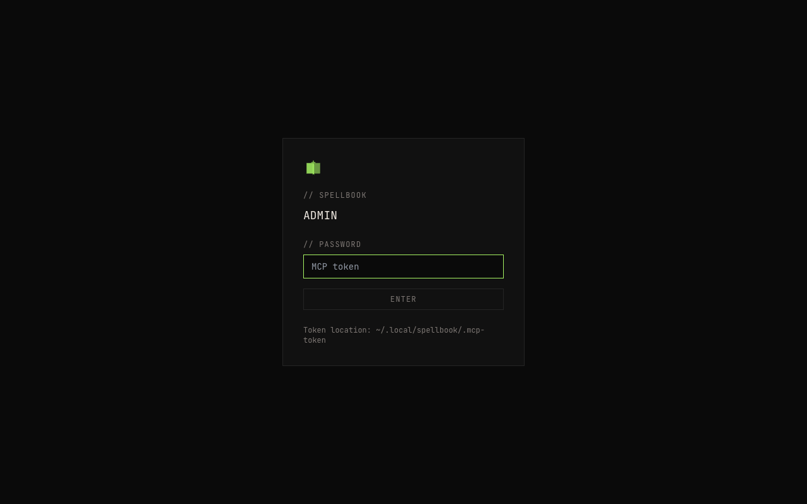

# Spellbook Admin Interface

The admin interface is a web-based dashboard served from the Spellbook MCP daemon at `http://localhost:8765/admin/`. It provides operational visibility and management across all Spellbook subsystems. Built with React 18, TypeScript, Tailwind CSS. Requires `spellbook[admin]` optional extra.

!!! note "Platform Compatibility"
    The admin interface works with all supported coding assistants (Claude Code, OpenCode, Codex, Gemini CLI, Crush). Most pages (Memory, Security, Analytics, Health, Events, Focus, Config, Fractal) pull data from the MCP server's own databases and work identically regardless of which assistant is connected. However, the **Sessions** page scans Claude Code JSONL session files and may not display session data from other assistants. Contributions to add session parsing for additional platforms are welcome.

## Prerequisites

- MCP daemon running: `python3 scripts/spellbook-server.py install`
- Admin extra installed: `uv pip install -e ".[admin]"`

## Authentication

Token-based auth. The admin reads the MCP bearer token from `~/.local/spellbook/.mcp-token`. On first visit, you see the login page. Paste the token to authenticate. Session persists via HTTP-only cookie.



## Navigation

The sidebar contains 10 pages:

- Dashboard
- Memory
- Security
- Sessions
- Analytics
- Health
- Events
- Focus
- Config
- Fractal

WebSocket connection status is shown in the header.

## Pages

| Page | Description |
|------|-------------|
| [Dashboard](dashboard.md) | Server status, focus summary, live event bus, and recent activity |
| [Memory](memory.md) | Search and browse stored memories with expandable detail rows |
| [Security](security.md) | Security event log with severity and event type filtering |
| [Sessions](sessions.md) | Claude Code and OpenCode session viewer with project filtering |
| [Analytics](analytics.md) | Tool call frequency, error rates, and event volume timeline |
| [Health](health.md) | Subsystem health matrix for all 4 SQLite databases |
| [Events](events.md) | Live WebSocket event bus monitor with subsystem filtering |
| [Focus](focus.md) | Zeigarnik focus stacks and stint correction log |
| [Config](config.md) | Configuration editor for TTS, notifications, and general settings |
| [Fractal](fractal.md) | Interactive graph explorer for fractal-thinking exploration graphs |

## CLI Access

Open the admin interface in your default browser:

```bash
spellbook admin open
```
