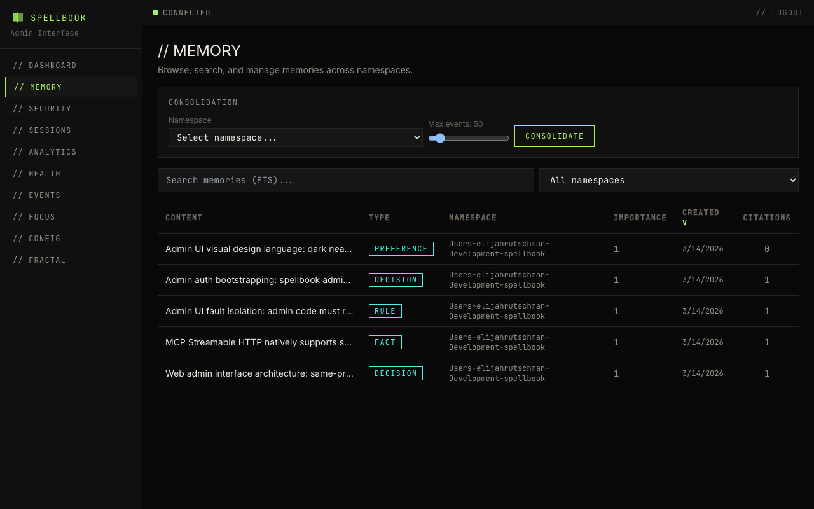

# Memory Browser

The memory page lets you search and browse all stored memories.

## Search

The search bar filters memories by content text. Results update as you type.

## Table Columns

| Column | Description |
|--------|-------------|
| content | Memory text (truncated in table view) |
| memory_type | Classification of the memory |
| tags | Associated tags |
| created_at | Timestamp when the memory was stored |

## Expandable Rows

Click a row to expand it. The expanded view shows the full memory content and any associated citations.

## Pagination

Results are paginated. Navigate between pages using the controls at the bottom of the table.
