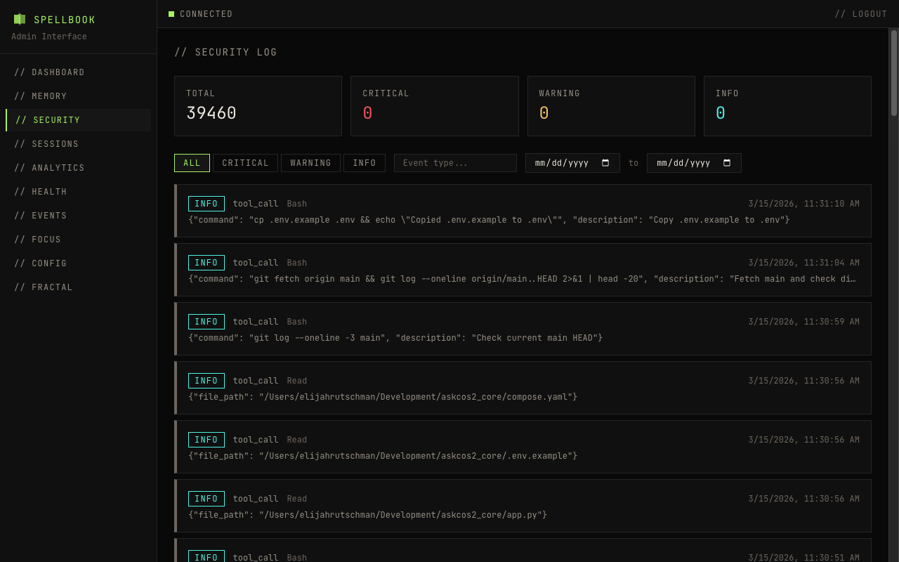

# Security Log

The security page displays all events from the `security_events` table in `spellbook.db`.

## Filters

- **Severity**: Filter by info, warning, error, or critical
- **Event type**: Filter by specific event types

## Table Columns

| Column | Description |
|--------|-------------|
| timestamp | When the event occurred |
| event_type | Category of security event |
| tool_name | Tool that triggered the event |
| severity | info, warning, error, or critical |
| details | Summary of the event |

## Expandable Rows

Click a row to see the full event payload.

## Pagination

Results are paginated with configurable page size.
