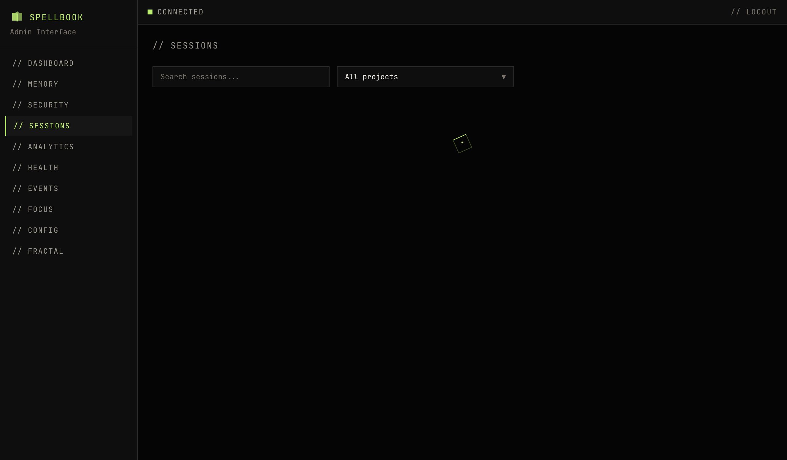

# Sessions

The sessions page shows Claude Code and OpenCode sessions tracked by Spellbook.

!!! note "Claude Code Data Format"
    Session data is parsed from Claude Code JSONL session files stored under `~/.claude/projects/`. Sessions from other coding assistants (OpenCode, Codex, Gemini CLI, Crush) are not currently displayed. Contributions to add session file parsing for additional platforms are welcome.

## Filters

- **Project filter**: Multi-select checkbox dropdown. Multiple projects can be selected simultaneously.
- **Search**: Free-text search filters by session content (slug, title, first user message).

## Table Columns

| Column | Description |
|--------|-------------|
| session ID | Truncated session identifier |
| project | Project the session belongs to |
| slug | Session slug |
| branch | Git branch active during the session |
| status | Current session status |
| started_at | When the session began |

## Expandable Rows

Click a row to see full session details including the first user message.

## Pagination

Results are paginated. Navigate between pages using the controls at the bottom of the table.
