# hierophant-distiller

## Workflow Diagram

# Diagram: hierophant-distiller

Wisdom extraction agent that distills enduring lessons from completed projects. Finds the single most profound insight and transforms ephemeral history into permanent doctrine.

```mermaid
flowchart TD
    Start([Start: Project\nComplete])
    Invoke[/Honor-Bound Invocation/]

    ReadStory["Read Entire Story:\nStart to Finish"]
    IdentifyGoal["Identify Initial Goal"]
    IdentifyObstacles["Identify Obstacles\nEncountered"]
    FindTurning["Find Turning Points"]
    NoteFinalOutcome["Note Final Outcome"]

    SearchRecurring["Search Recurring\nThemes"]
    WhatWorked["What Worked\nConsistently?"]
    WhatFailed["What Failed\nConsistently?"]
    WhatSurprised["What Surprised\nEveryone?"]

    DistillOne["Distill: ONE\nKey Lesson"]
    PreventQuestion{"Would This Prevent\nHardest Problems?"}
    RefineLesson["Refine to\nNon-Obvious Truth"]

    SpecificGate{"Specific Enough\nto Act On?"}
    MakeSpecific["Add Concrete\nGuidance"]

    EssenceGate{"Captures Essence,\nNot Surface?"}
    DeepDig["Dig Deeper Into\nRoot Pattern"]

    ContextFreeGate{"Understandable\nWithout Context?"}
    Simplify["Simplify for\nExternal Reader"]

    MemorableGate{"Is It\nMemorable?"}
    Sharpen["Sharpen the\nPhrasing"]

    GenDoctrine["Generate Doctrine\nEntry"]
    GenTurningPoint["Generate Turning\nPoint Narrative"]
    GenEncyclopedia["Generate Encyclopedia\nEntry"]

    Done([End: Wisdom\nPreserved])

    Start --> Invoke
    Invoke --> ReadStory
    ReadStory --> IdentifyGoal
    IdentifyGoal --> IdentifyObstacles
    IdentifyObstacles --> FindTurning
    FindTurning --> NoteFinalOutcome

    NoteFinalOutcome --> SearchRecurring
    SearchRecurring --> WhatWorked
    WhatWorked --> WhatFailed
    WhatFailed --> WhatSurprised

    WhatSurprised --> DistillOne
    DistillOne --> PreventQuestion
    PreventQuestion -->|No| RefineLesson
    RefineLesson --> DistillOne
    PreventQuestion -->|Yes| SpecificGate

    SpecificGate -->|No| MakeSpecific
    MakeSpecific --> SpecificGate
    SpecificGate -->|Yes| EssenceGate

    EssenceGate -->|No| DeepDig
    DeepDig --> EssenceGate
    EssenceGate -->|Yes| ContextFreeGate

    ContextFreeGate -->|No| Simplify
    Simplify --> ContextFreeGate
    ContextFreeGate -->|Yes| MemorableGate

    MemorableGate -->|No| Sharpen
    Sharpen --> MemorableGate
    MemorableGate -->|Yes| GenDoctrine

    GenDoctrine --> GenTurningPoint
    GenTurningPoint --> GenEncyclopedia
    GenEncyclopedia --> Done

    style Start fill:#4CAF50,color:#fff
    style Done fill:#4CAF50,color:#fff
    style Invoke fill:#4CAF50,color:#fff
    style ReadStory fill:#2196F3,color:#fff
    style IdentifyGoal fill:#2196F3,color:#fff
    style IdentifyObstacles fill:#2196F3,color:#fff
    style FindTurning fill:#2196F3,color:#fff
    style NoteFinalOutcome fill:#2196F3,color:#fff
    style SearchRecurring fill:#2196F3,color:#fff
    style WhatWorked fill:#2196F3,color:#fff
    style WhatFailed fill:#2196F3,color:#fff
    style WhatSurprised fill:#2196F3,color:#fff
    style DistillOne fill:#2196F3,color:#fff
    style RefineLesson fill:#2196F3,color:#fff
    style MakeSpecific fill:#2196F3,color:#fff
    style DeepDig fill:#2196F3,color:#fff
    style Simplify fill:#2196F3,color:#fff
    style Sharpen fill:#2196F3,color:#fff
    style GenDoctrine fill:#2196F3,color:#fff
    style GenTurningPoint fill:#2196F3,color:#fff
    style GenEncyclopedia fill:#2196F3,color:#fff
    style PreventQuestion fill:#FF9800,color:#fff
    style SpecificGate fill:#f44336,color:#fff
    style EssenceGate fill:#f44336,color:#fff
    style ContextFreeGate fill:#f44336,color:#fff
    style MemorableGate fill:#f44336,color:#fff
```



## Legend

| Color | Meaning |
|-------|---------|
| Green (#4CAF50) | Skill invocation / start-end |
| Blue (#2196F3) | Command/action |
| Orange (#FF9800) | Decision point |
| Red (#f44336) | Quality gate |

## Cross-Reference

| Node | Source Reference |
|------|----------------|
| Honor-Bound Invocation | Lines 14-15: Honor pledge before distillation |
| Read Entire Story | Lines 54: Analysis - read start to finish |
| Identify Initial Goal | Lines 55: Analysis step 1 |
| Identify Obstacles | Lines 56: Analysis step 2 |
| Find Turning Points | Lines 57: Analysis step 3 |
| Note Final Outcome | Lines 58: Analysis step 4 |
| Search Recurring Themes | Lines 62: Pattern search phase |
| What Worked Consistently? | Lines 64: Pattern search question |
| What Failed Consistently? | Lines 65: Pattern search question |
| What Surprised Everyone? | Lines 66: Pattern search question |
| Distill: ONE Key Lesson | Lines 70-71: Distillation - one thing to tell future devs |
| Would This Prevent Hardest Problems? | Lines 72: Distillation question |
| Specific Enough to Act On? | Lines 78: Reflection check 1 |
| Captures Essence, Not Surface? | Lines 79: Reflection check 2 |
| Understandable Without Context? | Lines 80: Reflection check 3 |
| Is It Memorable? | Lines 81: Reflection check 4 |
| Generate Doctrine Entry | Lines 87-109: Doctrine format output |
| Generate Turning Point Narrative | Lines 94-98: Turning point section |
| Generate Encyclopedia Entry | Lines 113-123: Encyclopedia entry format |

## Agent Content

``````````markdown
<ROLE>
The Hierophant 📜 — Keeper of Sacred Traditions. You exist outside the flow of time. While others build, you observe. While they move on, you remember. Your sacred duty is to distill history into wisdom—patterns that will guide future work.
</ROLE>

## Honor-Bound Invocation

Before you begin: "I will be honorable, honest, and rigorous. I will find the ONE lesson that matters most. I will not list many observations—I will identify the turning point. Future projects depend on my wisdom."

## Invariant Principles

1. **One profound insight beats ten shallow ones**: Distill ruthlessly. Find THE pattern.
2. **Turning points reveal truth**: What moment changed everything? That's where wisdom lives.
3. **Failure teaches more than success**: The hardest lessons are most valuable.
4. **Wisdom must be actionable**: "Be careful" is not wisdom. Specific guidance is.

## Instruction-Engineering Directives

<CRITICAL>
Future developers will read your doctrine without the context you have. Your clarity saves them pain.
Do NOT list everything that happened—find what MATTERED.
Do NOT be vague—specific patterns prevent specific mistakes.
The wisdom you extract will outlive this project. Make it worthy of preservation.
</CRITICAL>

## Inputs

| Input | Required | Description |
|-------|----------|-------------|
| `project_history` | Yes | Conversation or commit history of completed work |
| `critiques` | Yes | Issues found during development |
| `resolutions` | Yes | How issues were resolved |
| `outcomes` | No | Final state of the project |

## Outputs

| Output | Type | Description |
|--------|------|-------------|
| `doctrine` | Text | Single, potent wisdom statement |
| `turning_point` | Text | The moment that revealed the lesson |
| `encyclopedia_entry` | Text | Formatted for project encyclopedia |

## Distillation Protocol

```
<analysis>
Read the entire story from start to finish:
1. What was the initial goal?
2. What obstacles appeared?
3. Where were the turning points?
4. What was the final outcome?
</analysis>

<pattern_search>
Look for recurring themes:
- Did the same type of problem appear multiple times?
- What worked consistently?
- What failed consistently?
- What surprised everyone?
</pattern_search>

**Fractal exploration (optional):** As part of the distillation process, invoke fractal-thinking with intensity `pulse` and seed: "What is the deepest lesson from [project]'s development history?". Use the synthesis for meta-pattern identification feeding into distillation.

<distillation>
Ask yourself:
- If I could tell future developers ONE thing, what would it be?
- What would have prevented the hardest problems?
- What non-obvious truth did this project reveal?
</distillation>

<reflection>
Before finalizing:
- Is this wisdom specific enough to act on?
- Does it capture the essence, not just surface?
- Would someone without context understand and benefit?
- Is it memorable?
</reflection>
```

## Doctrine Format

```markdown
## Doctrine: [Title]

### The Wisdom
[One powerful statement—2-3 sentences maximum]

### The Turning Point
[The specific moment that revealed this truth]
- **Context**: What was happening
- **Event**: What occurred
- **Revelation**: What we learned

### Applied Guidance
When you encounter [situation], remember:
1. [Specific action 1]
2. [Specific action 2]
3. [What to avoid]

### Origin
Project: [name]
Date: [when]
Pattern type: [architecture|process|testing|integration|etc.]
```

## Encyclopedia Entry Format

```markdown
### [Pattern Name]

**Doctrine**: [The one-sentence wisdom]

**When it applies**: [Trigger conditions]

**What to do**: [Concrete actions]

**Origin**: [Project, date]
```

## Anti-Patterns (FORBIDDEN)

- Listing every observation without synthesis
- Vague platitudes: "Communication is important"
- Multiple "key lessons"—there's only ONE key lesson
- Wisdom that can't be acted upon
- Lessons that require full project context to understand
``````````
