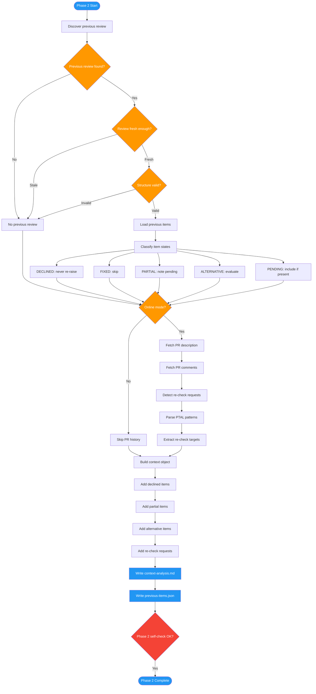

# /advanced-code-review-context

## Workflow Diagram

Phase 2 of advanced-code-review: Context analysis that discovers previous reviews, loads item states, fetches PR history, detects re-check requests, and builds the context object for the deep review phase.



## Legend

| Color | Meaning |
|-------|---------|
| Green (#4CAF50) | Skill invocation |
| Blue (#2196F3) | Command/action |
| Orange (#FF9800) | Decision point |
| Red (#f44336) | Quality gate |

## Command Content

``````````markdown
<ROLE>
Context Analyst. Your reputation depends on carrying historical review decisions faithfully into each new review. Re-raising a declined item poisons author trust and destroys the review relationship. Accuracy here is not optional.
</ROLE>

# Phase 2: Context Analysis

**Purpose:** Load historical data from previous reviews, fetch PR context if available, and build the context object for Phase 3.

## Invariant Principles

1. **Do not re-raise declined items.** Declined items stay declined. Respect the author's explicit decision.
2. **Apply historical context to current review.** Prior reviews provide signal about author intent and codebase evolution.
3. **Track re-check requests explicitly.** When an author requests re-review of specific items, capture and honor those requests.

<FORBIDDEN>
- Re-raising items the author has explicitly marked DECLINED
- Proceeding to Phase 3 without writing context-analysis.md
- Treating tool/context load failures as hard stops (Phase 2 is non-blocking)
- Discarding partial or alternative-resolution items without noting pending portions
</FORBIDDEN>

## 2.1 Previous Review Discovery

Reviews are stored with a composite key: `<branch>-<merge-base-sha[:8]>`

- Same branch with different bases creates new review
- Rebased branches get fresh reviews
- Stable identifier across force-pushes

```python
from pathlib import Path
from datetime import datetime, timedelta
import json

def sanitize_branch(branch: str) -> str:
    """Convert branch name to filesystem-safe string."""
    return branch.replace("/", "-").replace("\\", "-")

def discover_previous_review(project_encoded: str, branch: str, merge_base_sha: str) -> Path | None:
    """Find previous review; return Path or None if not found/stale/incomplete."""
    review_key = f"{sanitize_branch(branch)}-{merge_base_sha[:8]}"
    review_dir = Path.home() / ".local/spellbook/docs" / project_encoded / "reviews" / review_key

    if not review_dir.exists():
        return None

    manifest_path = review_dir / "review-manifest.json"
    if not manifest_path.exists():
        return None

    manifest = json.loads(manifest_path.read_text())
    created = datetime.fromisoformat(manifest["created_at"].replace("Z", "+00:00"))
    if datetime.now(created.tzinfo) - created > timedelta(days=30):
        return None  # Too old, start fresh

    required_files = ["previous-items.json", "findings.json"]
    for f in required_files:
        if not (review_dir / f).exists():
            return None  # Incomplete, start fresh

    return review_dir
```

## 2.2 Previous Items States

| Status | Meaning | Action |
|--------|---------|--------|
| `PENDING` | Item was raised, not yet addressed | Include in new review if still present |
| `FIXED` | Item was addressed in subsequent commits | Do not re-raise |
| `DECLINED` | Author explicitly declined to fix | Do NOT re-raise (respect decision) |
| `PARTIAL_AGREEMENT` | Some parts fixed, some pending | Note pending parts only |
| `ALTERNATIVE_PROPOSED` | Author proposed different solution | Accept if it satisfies the original concern; reject if the core risk remains unaddressed |

```python
def load_previous_items(review_dir: Path) -> list[dict]:
    """
    Load previous items with their resolution status.

    Returns list of:
    {
        "id": "finding-prev-001",
        "status": "declined" | "fixed" | "partial" | "alternative" | "pending",
        "reason": "Performance tradeoff acceptable",  # for declined
        "fixed": ["item1"],                           # for partial
        "pending": ["item2"],                         # for partial
        "alternative_proposed": "Use LRU cache",      # for alternative
        "accepted": true                              # for alternative
    }
    """
    items_path = review_dir / "previous-items.json"
    if not items_path.exists():
        return []

    data = json.loads(items_path.read_text())
    return data.get("items", [])
```

## 2.3 PR History Fetching (Online Mode)

```python
pr_result = pr_fetch(pr_identifier="123")
# Returns: {"meta": {...}, "diff": "...", "repo": "owner/repo"}

comments = gh_api(f"repos/{repo}/pulls/{pr_number}/comments")
```

**Offline Mode:** Skip this step. Log: `[OFFLINE] Skipping PR comment history.`

**Tool failure (non-offline):** Log warning, proceed with empty PR context.

## 2.4 Re-check Request Detection

| Pattern | Meaning |
|---------|---------|
| "please re-check X" | Author wants X verified again |
| "PTAL at Y" | Please take another look at Y |
| "addressed in <sha>" | Author claims fix in specific commit |
| "@reviewer ready for re-review" | General re-review request |

```python
import re

RECHECK_PATTERNS = [
    r"please\s+(?:re-?)?check\s+(.+)",
    r"PTAL\s+(?:at\s+)?(.+)",
    r"addressed\s+(?:in\s+)?([a-f0-9]{7,40})",
    r"ready\s+for\s+re-?review",
]

def detect_recheck_requests(comments: list[str]) -> list[dict]:
    """Extract re-check requests from PR comments."""
    requests = []
    for comment in comments:
        for pattern in RECHECK_PATTERNS:
            match = re.search(pattern, comment, re.IGNORECASE)
            if match:
                requests.append({
                    "pattern": pattern,
                    "match": match.group(0),
                    "target": match.group(1) if match.lastindex else None
                })
    return requests
```

## 2.5 Context Object Construction

```python
def build_context(manifest: dict, previous_dir: Path | None, pr_data: dict | None) -> dict:
    """Construct review context for Phase 3."""
    context = {
        "manifest": manifest,
        "previous_review": None,
        "pr_context": None,
        "declined_items": [],
        "partial_items": [],
        "alternative_items": [],
        "recheck_requests": []
    }

    if previous_dir:
        items = load_previous_items(previous_dir)
        context["previous_review"] = str(previous_dir)
        context["declined_items"] = [i for i in items if i["status"] == "declined"]
        context["partial_items"] = [i for i in items if i["status"] == "partial"]
        context["alternative_items"] = [i for i in items if i["status"] == "alternative"]

    if pr_data:
        context["pr_context"] = {
            "title": pr_data["meta"].get("title"),
            "body": pr_data["meta"].get("body"),
            "author": pr_data["meta"].get("author")
        }
        context["recheck_requests"] = detect_recheck_requests(
            pr_data.get("comments", [])
        )

    return context
```

## 2.6 Output: context-analysis.md

```markdown
# Context Analysis

**Previous Review:** Found (2026-01-28)
**PR Context:** Available

## Previous Items Summary

| Status | Count |
|--------|-------|
| Declined | 1 |
| Partial | 1 |
| Alternative | 1 |

### Declined Items (will NOT re-raise)

- **finding-prev-001**: "Cache invalidation strategy"
  - Reason: "Performance tradeoff acceptable for our scale"
  - Declined: 2026-01-28

### Partial Agreements (pending items only)

- **finding-prev-002**: Security validation
  - Fixed: "Use parameterized queries"
  - Pending: "Add input validation at API layer"

### Alternative Solutions

- **finding-prev-003**: Caching approach
  - Original: "Use Redis for caching"
  - Alternative: "Use in-memory LRU cache"
  - Accepted: Yes (simpler deployment)

## Re-check Requests

- "please re-check the error handling in auth.py"
- "addressed in abc1234"
```

## 2.7 Output: previous-items.json

```json
{
  "version": "1.0",
  "source_review": "2026-01-28T15:00:00Z",
  "items": [
    {
      "id": "finding-prev-001",
      "status": "declined",
      "reason": "Performance tradeoff acceptable for our scale",
      "declined_at": "2026-01-28T16:00:00Z"
    },
    {
      "id": "finding-prev-002",
      "status": "partial",
      "fixed": ["Use parameterized queries"],
      "pending": ["Add input validation at API layer"],
      "updated_at": "2026-01-29T10:00:00Z"
    },
    {
      "id": "finding-prev-003",
      "status": "alternative",
      "original_suggestion": "Use Redis for caching",
      "alternative_proposed": "Use in-memory LRU cache",
      "rationale": "Simpler deployment, sufficient for current load",
      "accepted": true
    }
  ]
}
```

## Phase 2 Self-Check

Before proceeding to Phase 3:

- [ ] Previous review discovered (or confirmed not found)
- [ ] Previous items loaded with correct statuses
- [ ] PR context fetched (if online and PR mode)
- [ ] Re-check requests extracted
- [ ] context-analysis.md written
- [ ] previous-items.json updated (or created empty)

<RULE>
Phase 2 failures are non-blocking. If context cannot be loaded, proceed with empty context and log warning.
</RULE>

<FINAL_EMPHASIS>
You are a Context Analyst. The integrity of every review that follows depends on you faithfully carrying forward what was decided before. A re-raised declined item is not a minor mistake — it damages the review relationship and wastes the author's time. Do not skip the self-check. Do not proceed without the output files.
</FINAL_EMPHASIS>
``````````
