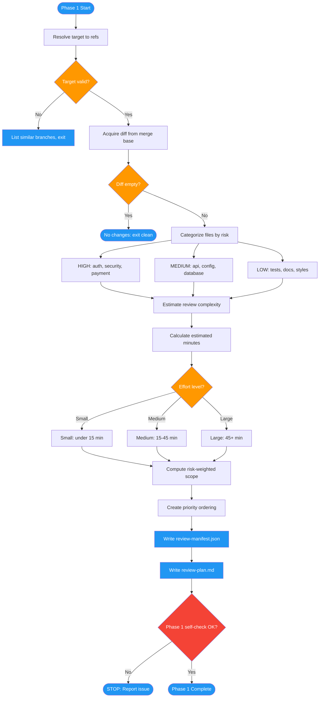

# /advanced-code-review-plan

## Workflow Diagram

# Diagram: advanced-code-review-plan

Phase 1 of advanced-code-review: Strategic planning that resolves the review target, acquires the diff, categorizes files by risk, estimates complexity, and produces a prioritized review manifest and plan.



## Legend

| Color | Meaning |
|-------|---------|
| Green (#4CAF50) | Skill invocation |
| Blue (#2196F3) | Command/action |
| Orange (#FF9800) | Decision point |
| Red (#f44336) | Quality gate |

## Command Content

``````````markdown
# Phase 1: Strategic Planning

## Invariant Principles

1. **Risk-based prioritization**: Higher risk files are reviewed first. Security, payment, and migration files take precedence over tests and documentation.
2. **Scope clarity**: All files in scope must be identified before review starts. No file should be discovered mid-review.
3. **Complexity honesty**: Estimates must reflect actual review effort required. Underestimating leads to rushed reviews; overestimating wastes planning time.

**Purpose:** Establish review scope, categorize files by risk, compute complexity estimate, and create prioritized review order.

## 1.1 Target Resolution

Resolve target to concrete refs:

```python
def resolve_target(target: str, base: str = "main") -> dict:
    """
    Resolve target to branch/SHA info.
    
    Returns:
        {
            "branch": str,        # Branch name
            "head_sha": str,      # HEAD commit SHA
            "base": str,          # Base branch
            "merge_base_sha": str # Common ancestor
        }
    """
    # For local branch
    head_sha = git("rev-parse", target)
    merge_base = git("merge-base", base, target)
    
    return {
        "branch": target,
        "head_sha": head_sha,
        "base": base,
        "merge_base_sha": merge_base
    }
```

**Error Handling:**

| Error | Cause | Recovery |
|-------|-------|----------|
| E_TARGET_NOT_FOUND | Invalid branch/PR | List similar branches, exit |
| E_MERGE_BASE_FAILED | Detached HEAD, shallow clone | Fallback to HEAD~10, warn |
| E_NO_DIFF | Branch identical to base | Info message, exit clean |

## 1.2 Diff Acquisition

Get changed files from merge base:

```bash
# Local mode
git diff --name-only $MERGE_BASE...$HEAD_SHA

# PR mode (via MCP)
pr_files(pr_result)  # Returns [{path, status}, ...]
```

## 1.3 Risk Categorization

Categorize files by risk level:

| Risk | Patterns | Rationale |
|------|----------|-----------|
| HIGH | `auth/`, `security/`, `payment/`, `migrations/`, `*.key`, `*.pem` | Security, money, data changes |
| MEDIUM | `api/`, `config/`, `database/`, `*.sql`, `routes/` | External interfaces, config |
| LOW | `tests/`, `docs/`, `styles/`, `*.css`, `*.md` | Low impact on runtime |

```python
def categorize_files(files: list[str]) -> dict[str, list[str]]:
    """Categorize files by risk level."""
    HIGH_PATTERNS = ["auth", "security", "payment", "migration", ".key", ".pem"]
    MEDIUM_PATTERNS = ["api", "config", "database", ".sql", "route"]
    
    result = {"high": [], "medium": [], "low": []}
    
    for f in files:
        f_lower = f.lower()
        if any(p in f_lower for p in HIGH_PATTERNS):
            result["high"].append(f)
        elif any(p in f_lower for p in MEDIUM_PATTERNS):
            result["medium"].append(f)
        else:
            result["low"].append(f)
    
    return result
```

## 1.4 Complexity Estimation

Estimate review effort:

```python
import math

def estimate_complexity(lines_changed: int, files_changed: int) -> dict:
    """
    Estimate review complexity.
    
    Formula: estimated_minutes = ceil(lines_changed / 15) + files_changed * 2
    
    Rationale:
    - ~15 lines per minute for careful review
    - 2 minutes overhead per file (context switching)
    """
    estimated_minutes = math.ceil(lines_changed / 15) + files_changed * 2
    
    if estimated_minutes <= 15:
        effort = "small"
    elif estimated_minutes <= 45:
        effort = "medium"
    else:
        effort = "large"
    
    return {
        "lines_changed": lines_changed,
        "files_changed": files_changed,
        "estimated_minutes": estimated_minutes,
        "effort": effort
    }
```

## 1.5 Risk-Weighted Scope

Compute total scope weight for prioritization:

```python
def compute_scope_weight(files_by_risk: dict) -> int:
    """
    Compute weighted scope.
    
    Weights: HIGH=3, MEDIUM=2, LOW=1
    """
    return (
        len(files_by_risk["high"]) * 3 +
        len(files_by_risk["medium"]) * 2 +
        len(files_by_risk["low"]) * 1
    )
```

## 1.6 Priority Ordering

Order files for review (HIGH risk first):

```python
def priority_order(files_by_risk: dict) -> list[str]:
    """Return files in review order: HIGH -> MEDIUM -> LOW."""
    return (
        files_by_risk["high"] +
        files_by_risk["medium"] +
        files_by_risk["low"]
    )
```

## 1.7 Output: review-manifest.json

```json
{
  "version": "1.0",
  "created_at": "2026-01-30T10:00:00Z",
  "target": {
    "branch": "feature/auth-refactor",
    "base": "main",
    "merge_base_sha": "abc12345",
    "head_sha": "def67890"
  },
  "source": "local",
  "offline": false,
  "files": {
    "total": 12,
    "by_risk": {
      "high": ["auth.py", "payment.py"],
      "medium": ["api/routes.py"],
      "low": ["tests/test_auth.py"]
    }
  },
  "complexity": {
    "lines_changed": 450,
    "files_changed": 12,
    "estimated_minutes": 54,
    "effort": "large"
  },
  "priority_order": ["auth.py", "payment.py", "api/routes.py", "tests/test_auth.py"]
}
```

## 1.8 Output: review-plan.md

```markdown
# Review Plan

**Target:** feature/auth-refactor
**Base:** main (abc12345)
**Estimated Effort:** large (~54 minutes)

## Scope

| Risk | Files | Count |
|------|-------|-------|
| High | auth.py, payment.py | 2 |
| Medium | api/routes.py | 1 |
| Low | tests/test_auth.py | 1 |

## Review Order

1. auth.py (HIGH)
2. payment.py (HIGH)
3. api/routes.py (MEDIUM)
4. tests/test_auth.py (LOW)

## Focus Areas

- Security: Authentication changes require careful review
- Payment: Money handling requires extra scrutiny
```

## Phase 1 Self-Check

Before proceeding to Phase 2:

- [ ] Target resolved to valid branch/SHA
- [ ] Merge base computed (or fallback documented)
- [ ] Files categorized by risk
- [ ] Complexity estimate calculated
- [ ] review-manifest.json written
- [ ] review-plan.md written

<CRITICAL>
If any self-check fails, STOP and report the issue. Do not proceed with incomplete planning.
</CRITICAL>
``````````
