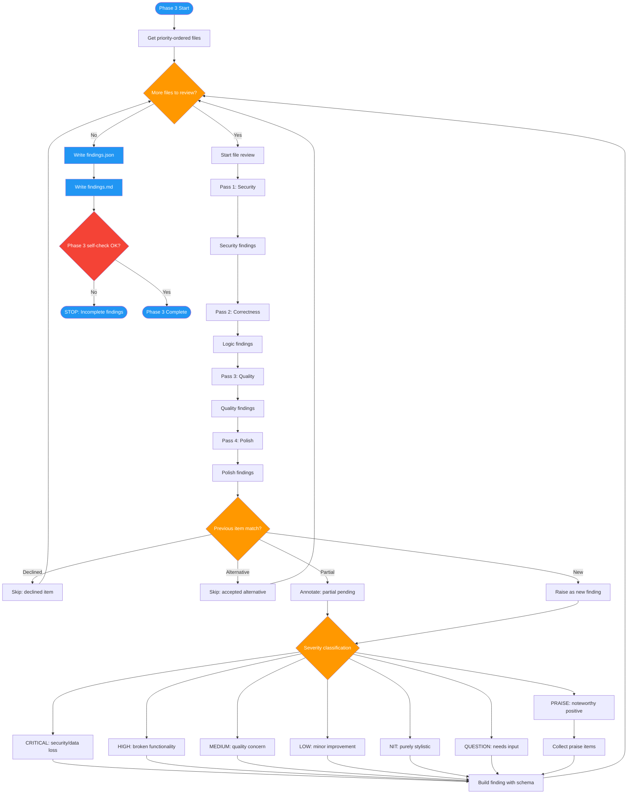

# /advanced-code-review-review

## Workflow Diagram

# Diagram: advanced-code-review-review

Phase 3 of advanced-code-review: Deep multi-pass code review that analyzes each file through security, correctness, quality, and polish passes, integrates previous item context, and generates structured findings.



## Legend

| Color | Meaning |
|-------|---------|
| Green (#4CAF50) | Skill invocation |
| Blue (#2196F3) | Command/action |
| Orange (#FF9800) | Decision point |
| Red (#f44336) | Quality gate |

## Command Content

``````````markdown
# Phase 3: Deep Review

## Invariant Principles

1. **Verification before assertion**: Never claim an issue exists without evidence from the actual code. Every finding must include concrete evidence.
2. **Severity accuracy**: Match severity to actual impact. A style nit is not HIGH severity; a security vulnerability is not LOW.
3. **Multi-pass thoroughness**: Each pass has a specific focus. Do not skip passes or combine them. Security issues found in Pass 3 indicate Pass 1 was incomplete.

**Purpose:** Perform multi-pass code analysis, generate findings with severity classification, and respect previous review context.

## 3.1 Multi-Pass Review Order

Review code in multiple passes, each focused on a specific category:

| Pass | Focus | Severity Range | Description |
|------|-------|----------------|-------------|
| 1 | Security | Critical, High | Injection, auth bypass, data exposure, secrets |
| 2 | Correctness | High, Medium | Logic errors, edge cases, null handling, race conditions |
| 3 | Quality | Medium, Low | Maintainability, complexity, patterns, readability |
| 4 | Polish | Low, Nit | Style, naming, minor optimizations, documentation |

**Rationale:** Multi-pass approach ensures critical issues are found first and aren't overshadowed by style nits.

## 3.2 Severity Taxonomy

Use precise severity definitions:

| Severity | Definition | Examples |
|----------|------------|----------|
| CRITICAL | Data loss, security breach, production outage | SQL injection, auth bypass, infinite loop in main path |
| HIGH | Broken functionality, incorrect behavior | Off-by-one, null dereference, race condition |
| MEDIUM | Quality concern, technical debt | High complexity, missing error handling, code duplication |
| LOW | Minor improvement, optimization | Inefficient algorithm (non-hot path), better naming |
| NIT | Purely stylistic | Formatting, comment style, import order |
| QUESTION | Information-seeking; needs contributor input | Confirm upstream sends field X, clarify error handling intent |
| PRAISE | Noteworthy positive | Clever solution, good pattern usage, excellent tests |

**Severity Decision Tree:**

```
Is it a security issue, bug, or data loss risk?
  -> Yes: CRITICAL
  -> No: Continue

Does it break contracts, architecture, or core functionality?
  -> Yes: HIGH
  -> No: Continue

Is it a code quality or maintainability concern?
  -> Yes: MEDIUM
  -> No: Continue

Is it a minor improvement or optimization?
  -> Yes: LOW
  -> No: Continue

Is it purely stylistic?
  -> Yes: NIT
  -> No: Continue

Does it require contributor input to resolve?
  -> Yes: QUESTION
  -> No: PRAISE (if positive) or skip
```

## 3.3 Finding Schema

Each finding follows this structure:

```json
{
  "id": "finding-001",
  "severity": "HIGH",
  "category": "security",
  "file": "auth.py",
  "line": 45,
  "end_line": 47,
  "summary": "SQL injection via string interpolation",
  "reason": "User input from request directly concatenated into SQL query without sanitization",
  "evidence": "query = f\"SELECT * FROM users WHERE id = {user_id}\"",
  "suggestion": "Use parameterized queries: cursor.execute(\"SELECT * FROM users WHERE id = %s\", (user_id,))",
  "verification_status": null,
  "previous_status": null,
  "tags": ["owasp-injection", "cwe-89"]
}
```

**Field Requirements:**

| Field | Required | Nullable | Notes |
|-------|----------|----------|-------|
| id | Yes | No | Unique within review |
| severity | Yes | No | One of CRITICAL/HIGH/MEDIUM/LOW/NIT/QUESTION/PRAISE |
| category | Yes | No | security/logic/error/type/test/perf/style/doc |
| file | Yes | No | Relative path |
| line | Yes | No | Start line (1-indexed) |
| end_line | No | Yes | End line (null = single line) |
| summary | Yes | No | One-line description |
| reason | No | Yes | Detailed explanation (null for NIT/PRAISE) |
| evidence | Yes | No | Code snippet showing issue |
| suggestion | No | Yes | Recommended fix (null if unclear) |
| verification_status | No | Yes | Set in Phase 4 |
| previous_status | No | Yes | From Phase 2 context |
| tags | No | No | Always array (empty if none) |

## 3.4 Previous Items Integration

During review, check each potential finding against previous items:

```python
def should_raise_finding(finding: dict, context: dict) -> tuple[bool, str | None]:
    """
    Determine if a finding should be raised given previous context.
    
    Returns:
        (should_raise, previous_status)
    """
    # Check declined items - never re-raise
    for declined in context["declined_items"]:
        if finding_matches(finding, declined):
            return (False, "declined")
    
    # Check accepted alternatives - don't re-raise original issue
    for alt in context["alternative_items"]:
        if alt["accepted"] and finding_matches_original(finding, alt):
            return (False, "alternative_accepted")
    
    # Check partial items - only raise pending parts
    for partial in context["partial_items"]:
        if finding_matches_pending(finding, partial):
            finding["previous_status"] = "partial_pending"
            return (True, "partial_pending")
    
    return (True, None)
```

## 3.5 Category Definitions

| Category | Scope |
|----------|-------|
| security | Injection, XSS, auth bypass, secrets exposure, CSRF |
| logic | Off-by-one, null handling, race condition, incorrect algorithm |
| error | Missing error handling, swallowed exceptions, unclear errors |
| type | Type mismatch, unsafe cast, missing validation |
| test | Missing tests, weak assertions, flaky tests |
| perf | O(n^2) in hot path, memory leak, blocking I/O |
| style | Naming, formatting, dead code |
| doc | Missing/wrong comments, outdated docs |

## 3.6 Review Execution

For each file in priority order:

```python
def review_file(file_path: str, diff: str, context: dict) -> list[dict]:
    """
    Review a single file through all passes.
    """
    findings = []
    
    # Pass 1: Security
    security_findings = analyze_security(file_path, diff)
    findings.extend(filter_by_context(security_findings, context))
    
    # Pass 2: Correctness
    logic_findings = analyze_logic(file_path, diff)
    findings.extend(filter_by_context(logic_findings, context))
    
    # Pass 3: Quality
    quality_findings = analyze_quality(file_path, diff)
    findings.extend(filter_by_context(quality_findings, context))
    
    # Pass 4: Polish
    polish_findings = analyze_polish(file_path, diff)
    findings.extend(filter_by_context(polish_findings, context))
    
    return findings
```

## 3.7 Noteworthy Collection

Collect positive observations for PRAISE findings:

```python
NOTEWORTHY_PATTERNS = [
    "comprehensive test coverage",
    "clever use of pattern",
    "excellent error messages",
    "good documentation",
    "clean abstraction",
    "thoughtful edge case handling"
]
```

## 3.8 Output: findings.json

```json
{
  "version": "1.0",
  "generated_at": "2026-01-30T10:30:00Z",
  "review_sha": "def67890",
  "findings": [
    {
      "id": "finding-001",
      "severity": "HIGH",
      "category": "security",
      "file": "auth.py",
      "line": 45,
      "end_line": 47,
      "summary": "SQL injection via string interpolation",
      "reason": "User input from request directly concatenated into SQL query",
      "evidence": "query = f\"SELECT * FROM users WHERE id = {user_id}\"",
      "suggestion": "Use parameterized queries",
      "verification_status": null,
      "previous_status": null,
      "tags": ["owasp-injection", "cwe-89"]
    }
  ],
  "summary": {
    "total": 8,
    "by_severity": {
      "CRITICAL": 0,
      "HIGH": 2,
      "MEDIUM": 3,
      "LOW": 2,
      "NIT": 1,
      "QUESTION": 0,
      "PRAISE": 0
    },
    "by_category": {
      "security": 2,
      "logic": 1,
      "quality": 3,
      "style": 2
    },
    "skipped_declined": 1,
    "skipped_alternative": 1
  }
}
```

## 3.9 Output: findings.md

```markdown
# Review Findings

**Generated:** 2026-01-30 10:30 UTC
**Files Reviewed:** 12
**Findings:** 8 (2 HIGH, 3 MEDIUM, 2 LOW, 1 NIT)
**Skipped:** 2 (1 declined, 1 alternative accepted)

---

## HIGH Severity

### [HIGH-001] SQL injection via string interpolation

**File:** auth.py:45-47
**Category:** Security

User input from request directly concatenated into SQL query.

```python
# Current
query = f"SELECT * FROM users WHERE id = {user_id}"

# Suggested
cursor.execute("SELECT * FROM users WHERE id = %s", (user_id,))
```

**Tags:** owasp-injection, cwe-89

---

## MEDIUM Severity

...
```

## Phase 3 Self-Check

Before proceeding to Phase 4:

- [ ] All files reviewed in priority order
- [ ] All four passes completed per file
- [ ] Declined items not re-raised
- [ ] Partial items annotated correctly
- [ ] Each finding has required fields
- [ ] findings.json written
- [ ] findings.md written

<CRITICAL>
Do not proceed to verification with incomplete findings. Every finding must have file, line, and evidence.
</CRITICAL>
``````````
