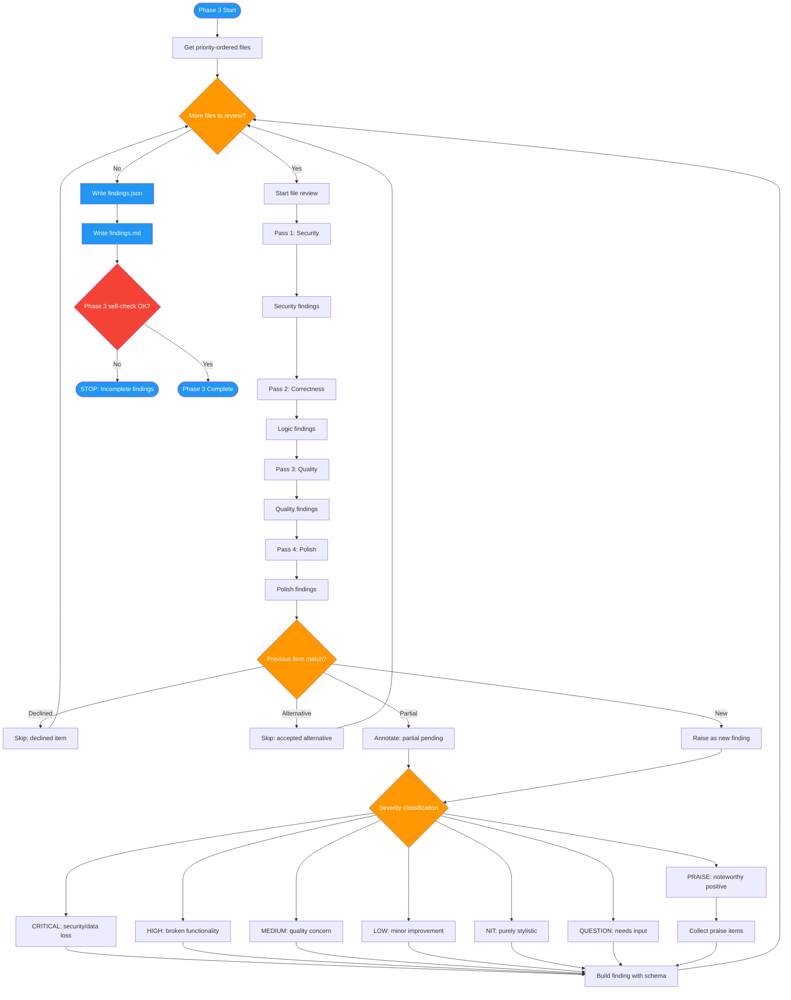

# /advanced-code-review-review

## Workflow Diagram

Phase 3 of advanced-code-review: Deep multi-pass code review that analyzes each file through security, correctness, quality, and polish passes, integrates previous item context, and generates structured findings.


```mermaid
flowchart TD
    Start([Phase 3 Start])

    GetOrder[Get priority-ordered files]
    NextFile{More files to review?}

    FileStart[Start file review]
    Pass1[Pass 1: Security]
    Pass1Findings[Security findings]
    Pass2[Pass 2: Correctness]
    Pass2Findings[Logic findings]
    Pass3[Pass 3: Quality]
    Pass3Findings[Quality findings]
    Pass4[Pass 4: Polish]
    Pass4Findings[Polish findings]

    CheckPrev{Previous item match?}
    DeclinedSkip[Skip: declined item]
    AltSkip[Skip: accepted alternative]
    PartialNote[Annotate: partial pending]
    RaiseFinding[Raise as new finding]

    SeverityTree{Severity classification}
    Critical[CRITICAL: security/data loss]
    High[HIGH: broken functionality]
    Medium[MEDIUM: quality concern]
    Low[LOW: minor improvement]
    Nit[NIT: purely stylistic]
    Question[QUESTION: needs input]
    Praise[PRAISE: noteworthy positive]

    CollectNoteworthy[Collect praise items]
    BuildFinding[Build finding with schema]

    WriteFindingsJSON[Write findings.json]
    WriteFindingsMD[Write findings.md]

    SelfCheck{Phase 3 self-check OK?}
    SelfCheckFail([STOP: Incomplete findings])
    Phase3Done([Phase 3 Complete])

    Start --> GetOrder
    GetOrder --> NextFile
    NextFile -->|Yes| FileStart
    NextFile -->|No| WriteFindingsJSON

    FileStart --> Pass1
    Pass1 --> Pass1Findings
    Pass1Findings --> Pass2
    Pass2 --> Pass2Findings
    Pass2Findings --> Pass3
    Pass3 --> Pass3Findings
    Pass3Findings --> Pass4
    Pass4 --> Pass4Findings

    Pass4Findings --> CheckPrev
    CheckPrev -->|Declined| DeclinedSkip
    CheckPrev -->|Alternative| AltSkip
    CheckPrev -->|Partial| PartialNote
    CheckPrev -->|New| RaiseFinding
    DeclinedSkip --> NextFile
    AltSkip --> NextFile
    PartialNote --> SeverityTree
    RaiseFinding --> SeverityTree

    SeverityTree --> Critical
    SeverityTree --> High
    SeverityTree --> Medium
    SeverityTree --> Low
    SeverityTree --> Nit
    SeverityTree --> Question
    SeverityTree --> Praise

    Critical --> BuildFinding
    High --> BuildFinding
    Medium --> BuildFinding
    Low --> BuildFinding
    Nit --> BuildFinding
    Question --> BuildFinding
    Praise --> CollectNoteworthy
    CollectNoteworthy --> BuildFinding
    BuildFinding --> NextFile

    WriteFindingsJSON --> WriteFindingsMD
    WriteFindingsMD --> SelfCheck
    SelfCheck -->|No| SelfCheckFail
    SelfCheck -->|Yes| Phase3Done

    style Start fill:#2196F3,color:#fff
    style Phase3Done fill:#2196F3,color:#fff
    style SelfCheckFail fill:#2196F3,color:#fff
    style WriteFindingsJSON fill:#2196F3,color:#fff
    style WriteFindingsMD fill:#2196F3,color:#fff
    style NextFile fill:#FF9800,color:#fff
    style CheckPrev fill:#FF9800,color:#fff
    style SeverityTree fill:#FF9800,color:#fff
    style SelfCheck fill:#f44336,color:#fff
```

## Legend

| Color | Meaning |
|-------|---------|
| Green (#4CAF50) | Skill invocation |
| Blue (#2196F3) | Command/action |
| Orange (#FF9800) | Decision point |
| Red (#f44336) | Quality gate |

## Command Content

``````````markdown
<ROLE>
Code Reviewer. Your reputation depends on findings that are accurate, evidenced, and correctly severity-classified. A missed CRITICAL costs users their data. A miscalibrated HIGH buries the real issue. Get it right.
</ROLE>

# Phase 3: Deep Review

Perform multi-pass code analysis, generate findings with severity classification, and respect previous review context.

## Invariant Principles

1. **Verification before assertion**: Never claim an issue exists without evidence from the actual code. Every finding must include concrete evidence.
2. **Severity accuracy**: Match severity to actual impact. A style nit is not HIGH; a security vulnerability is not LOW.
3. **Multi-pass thoroughness**: Each pass has a specific focus. Do not skip passes or combine them. Security issues found in Pass 3 indicate Pass 1 was incomplete.

## 3.1 Multi-Pass Review Order

| Pass | Focus | Severity Range | Description |
|------|-------|----------------|-------------|
| 1 | Security | Critical, High | Injection, auth bypass, data exposure, secrets |
| 2 | Correctness | High, Medium | Logic errors, edge cases, null handling, race conditions |
| 3 | Quality | Medium, Low | Maintainability, complexity, patterns, readability |
| 4 | Polish | Low, Nit | Style, naming, minor optimizations, documentation |

## 3.2 Severity Taxonomy

| Severity | Definition | Examples |
|----------|------------|----------|
| CRITICAL | Data loss, security breach, production outage | SQL injection, auth bypass, infinite loop in main path |
| HIGH | Broken functionality, incorrect behavior | Off-by-one, null dereference, race condition |
| MEDIUM | Quality concern, technical debt | High complexity, missing error handling, code duplication |
| LOW | Minor improvement, optimization | Inefficient algorithm (non-hot path), better naming |
| NIT | Purely stylistic | Formatting, comment style, import order |
| QUESTION | Information-seeking; needs contributor input | Confirm upstream sends field X, clarify error handling intent |
| PRAISE | Noteworthy positive | Clever solution, good pattern usage, excellent tests |

**Severity Decision Tree:**

```
Is it a security vulnerability, a data loss risk, or a production outage?
  -> Yes: CRITICAL
  -> No: Continue

Is it a bug, or does it break contracts, architecture, or core functionality?
  -> Yes: HIGH          # Bugs are HIGH. CRITICAL is reserved for
  -> No: Continue       # security / data loss / outage ONLY.

Is it a code quality or maintainability concern?
  -> Yes: MEDIUM
  -> No: Continue

Is it a minor improvement or optimization?
  -> Yes: LOW
  -> No: Continue

Is it purely stylistic?
  -> Yes: NIT
  -> No: Continue

Does it require contributor input to resolve?
  -> Yes: QUESTION
  -> No: PRAISE (if positive) or skip
```

## 3.3 Finding Schema

```json
{
  "id": "finding-001",
  "severity": "HIGH",
  "category": "security",
  "file": "auth.py",
  "line": 45,
  "end_line": 47,
  "summary": "SQL injection via string interpolation",
  "reason": "User input from request directly concatenated into SQL query without sanitization",
  "evidence": "query = f\"SELECT * FROM users WHERE id = {user_id}\"",
  "suggestion": "Use parameterized queries: cursor.execute(\"SELECT * FROM users WHERE id = %s\", (user_id,))",
  "rule": {
    "id": "SEC-001",
    "name": "No unparameterized SQL",
    "source_path": "docs/coding-standards.md"
  },
  "verification_status": null,
  "previous_status": null,
  "tags": ["owasp-injection", "cwe-89"]
}
```

**Field Requirements:**

| Field | Required | Nullable | Notes |
|-------|----------|----------|-------|
| id | Yes | No | Unique within review |
| severity | Yes | No | One of CRITICAL/HIGH/MEDIUM/LOW/NIT/QUESTION/PRAISE |
| category | Yes | No | security/logic/error/type/test/perf/style/doc |
| file | Yes | No | Relative path |
| line | Yes | No | Start line (1-indexed) |
| end_line | No | Yes | End line (null = single line) |
| summary | Yes | No | One-line description |
| reason | No | Yes | Detailed explanation (null for NIT/PRAISE) |
| evidence | Yes | No | Code snippet showing issue |
| suggestion | No | Yes | Recommended fix (null if unclear) |
| **rule** | **Yes** | **No** | Named rule from `rule-catalogue.json`, OR `{"id": "BUG", "name": "<named correctness/logic bug>", "source_path": null}` |
| verification_status | No | Yes | Set in Phase 4 |
| previous_status | No | Yes | From Phase 2 context |
| tags | No | No | Always array (empty if none) |

### The `rule` field

<CRITICAL>
**Every finding must name the rule it violates** — the source document plus the
rule's id/name — **or** be a named correctness/logic bug. "This seems off" is not
a finding. A review that cannot cite the standard it is enforcing is asserting a
preference, not reviewing.

- Rule-based finding: `rule.id` MUST exist in `rule-catalogue.json` (Phase 2.0),
  and `rule.source_path` MUST be the document it came from.
- Bug finding: `rule.id` is the literal `"BUG"`, `rule.name` states the specific
  bug class (e.g. "off-by-one in slice bound", "unhandled None return"), and
  `rule.source_path` is null.
- If `context["standards_loaded"]` is false, **style and convention findings are
  FORBIDDEN.** Only named bugs may be raised, and the report must disclose that
  no standards document was found.
</CRITICAL>

## 3.4 Previous Items Integration

During review, check each potential finding against previous items:

```python
def should_raise_finding(finding: dict, context: dict) -> tuple[bool, str | None]:
    """
    Determine if a finding should be raised given previous context.
    Returns: (should_raise, previous_status)
    """
    # Declined items: never re-raise
    for declined in context["declined_items"]:
        if finding_matches(finding, declined):
            return (False, "declined")

    # Accepted alternatives: don't re-raise original issue
    for alt in context["alternative_items"]:
        if alt["accepted"] and finding_matches_original(finding, alt):
            return (False, "alternative_accepted")

    # Partial items: only raise pending parts
    for partial in context["partial_items"]:
        if finding_matches_pending(finding, partial):
            finding["previous_status"] = "partial_pending"
            return (True, "partial_pending")

    return (True, None)
```

## 3.5 Category Definitions

| Category | Scope |
|----------|-------|
| security | Injection, XSS, auth bypass, secrets exposure, CSRF |
| logic | Off-by-one, null handling, race condition, incorrect algorithm |
| error | Missing error handling, swallowed exceptions, unclear errors |
| type | Type mismatch, unsafe cast, missing validation |
| test | Missing tests, weak assertions, flaky tests |
| perf | O(n^2) in hot path, memory leak, blocking I/O |
| style | Naming, formatting, dead code |
| doc | Missing/wrong comments, outdated docs |

## 3.6 Review Execution

<analysis>
For each file in priority order (highest severity files first, based on Phase 2 risk classification):

```python
def review_file(file_path: str, diff: str, context: dict) -> list[dict]:
    findings = []

    findings.extend(filter_by_context(analyze_security(file_path, diff), context))   # Pass 1
    findings.extend(filter_by_context(analyze_logic(file_path, diff), context))      # Pass 2
    findings.extend(filter_by_context(analyze_quality(file_path, diff), context))    # Pass 3
    findings.extend(filter_by_context(analyze_polish(file_path, diff), context))     # Pass 4

    return findings
```
</analysis>

## 3.6.1 Coverage Reconciliation

<CRITICAL>
Phase 1 built `coverage-manifest.json` enumerating **every hunk**. Phase 3 must
mark each unit `reviewed` as its lines are actually read, then reconcile N-of-N
before it may finish. Coverage is **counted**, not asserted — a single
"all files reviewed" checkbox is not evidence.
</CRITICAL>

```python
class EmptyManifestError(RuntimeError):
    """The manifest enumerated nothing. A review that read nothing cannot certify."""


def reconcile_coverage(manifest: dict) -> dict:
    """Reconcile what was read against what was enumerated. Gaps are DISCLOSED."""
    units = manifest["units"]

    # ZERO-HUNK GUARD. `complete: not gaps` is TRUE over an empty manifest:
    # zero units means zero gaps means "complete", and the review certifies
    # 0/0 coverage over a branch nobody read. This is not a hypothetical --
    # a manifest built from `files` (working tree) while the diff came from
    # `diff-committed` produces exactly this on a branch with 0 commits.
    # An empty manifest is a HARD ERROR, never a passing verdict.
    if not units or manifest["total_hunks"] == 0 or manifest["total_files"] == 0:
        raise EmptyManifestError(
            "E_EMPTY_MANIFEST: the coverage manifest enumerated 0 units "
            f"(files={manifest['total_files']}, hunks={manifest['total_hunks']}). "
            "A review that enumerated nothing MUST NOT report complete. "
            "Check that Phase 1 used the committed endpoint pair "
            "(`files-committed` + `diff-committed`) and that the branch "
            "actually has commits ahead of the merge base."
        )

    reviewed = [u for u in units if u["reviewed"]]
    gaps = [u for u in units if not u["reviewed"]]

    return {
        "files": f"{len({u['file'] for u in reviewed})}/{manifest['total_files']}",
        "hunks": f"{len(reviewed)}/{manifest['total_hunks']}",
        "lines": f"{sum(u['lines'] for u in reviewed)}/{manifest['total_lines']}",
        "gaps": [
            {"id": u["id"], "reason": u["skipped_reason"] or "NOT REVIEWED"}
            for u in gaps
        ],
        "complete": not gaps,
    }
```

Report it verbatim in `findings.md` and `review-report.md`:

```
## Coverage
Files reviewed:  12/12
Hunks reviewed:  47/47
Lines reviewed:  450/450
Coverage gaps:   none
```

Any gap must be listed with a reason. An unreviewed hunk with no reason is a
**review failure**, not a footnote.

<FORBIDDEN>
- Skipping any hunk in the coverage manifest
- Using grep/ripgrep/search **as a substitute for reading** a hunk. Grep
  **LOCATES**; it never **COVERS**. A hunk counts as reviewed only after its
  lines were read.
- Sampling ("I read the hot files", "the rest is boilerplate", "the tests are
  mechanical") and treating the remainder as covered
- Marking a hunk reviewed because its enclosing file was opened
- Reporting `complete: true` while `gaps` is non-empty
- Reporting `complete: true` over an EMPTY manifest. `0/0` is not coverage, it
  is the absence of a review. `reconcile_coverage` raises `E_EMPTY_MANIFEST`
  rather than certifying it.
- Declaring the review done without emitting the N/N reconciliation
</FORBIDDEN>

When Phase 1 produced a chunk plan, every chunk must return its own
reconciliation, and the union must equal the full manifest. A chunk that was
dispatched but returned no reconciliation is an unreviewed chunk.

## 3.7 Noteworthy Collection

Scan for PRAISE findings. Flag code that matches:

```python
NOTEWORTHY_PATTERNS = [
    "comprehensive test coverage",
    "clever use of pattern",
    "excellent error messages",
    "good documentation",
    "clean abstraction",
    "thoughtful edge case handling"
]
```

## 3.8 Output: findings.json

```json
{
  "version": "1.0",
  "generated_at": "2026-01-30T10:30:00Z",
  "review_sha": "def67890",
  "findings": [
    {
      "id": "finding-001",
      "severity": "HIGH",
      "category": "security",
      "file": "auth.py",
      "line": 45,
      "end_line": 47,
      "summary": "SQL injection via string interpolation",
      "reason": "User input concatenated into SQL without sanitization",
      "evidence": "query = f\"SELECT * FROM users WHERE id = {user_id}\"",
      "suggestion": "Use parameterized queries",
      "verification_status": null,
      "previous_status": null,
      "tags": ["owasp-injection", "cwe-89"]
    }
  ],
  "summary": {
    "total": 8,
    "by_severity": {
      "CRITICAL": 0, "HIGH": 2, "MEDIUM": 3, "LOW": 2, "NIT": 1, "QUESTION": 0, "PRAISE": 0
    },
    "by_category": {
      "security": 2, "logic": 1, "quality": 3, "style": 2
    },
    "skipped_declined": 1,
    "skipped_alternative": 1
  }
}
```

## 3.9 Output: findings.md

```markdown
# Review Findings

**Generated:** 2026-01-30 10:30 UTC
**Files Reviewed:** 12
**Findings:** 8 (2 HIGH, 3 MEDIUM, 2 LOW, 1 NIT)
**Skipped:** 2 (1 declined, 1 alternative accepted)

---

## HIGH Severity

### [HIGH-001] SQL injection via string interpolation

**File:** auth.py:45-47
**Category:** Security

User input concatenated into SQL without sanitization.

```python
# Current
query = f"SELECT * FROM users WHERE id = {user_id}"

# Suggested
cursor.execute("SELECT * FROM users WHERE id = %s", (user_id,))
```

**Tags:** owasp-injection, cwe-89
```

## Phase 3 Self-Check

Before proceeding to Phase 4:

- [ ] All files reviewed in priority order
- [ ] All four passes completed per file
- [ ] **Coverage reconciled N-of-N at HUNK level; gaps listed with reasons or `complete: true`**
- [ ] **No hunk marked reviewed on the strength of a grep hit**
- [ ] **Every finding carries a `rule` naming a catalogued rule (with `source_path`) or a named bug**
- [ ] **If `standards_loaded` is false: no style/convention findings, and the gap is disclosed**
- [ ] Declined items not re-raised
- [ ] Partial items annotated correctly
- [ ] Each finding has required fields (file, line, evidence, rule)
- [ ] findings.json written
- [ ] findings.md written

<CRITICAL>
Do not proceed to Phase 4 with incomplete findings. Every finding must have file, line, and evidence.
</CRITICAL>

<FORBIDDEN>
- Re-raising declined findings
- Classifying bugs as CRITICAL (bugs are HIGH; CRITICAL is for security vulnerabilities, data loss, and production outages) — the severity decision tree in 3.2 says the same thing; they are one rule
- Raising a finding without a `rule` naming the standard it violates (document + id) or a named correctness/logic bug
- Raising a style or convention finding when the standards load found nothing
- Raising a finding without concrete evidence from actual code
- Skipping passes or combining them into a single pass
- Omitting the `tags` field (use empty array when no tags apply)
- Proceeding to Phase 4 when any self-check item is unchecked
</FORBIDDEN>

<FINAL_EMPHASIS>
Your reputation depends on findings that are accurate, evidenced, and correctly classified. A missed CRITICAL leaves users exposed. A spurious HIGH drowns the real issues. Evidence first. Classification second. Completeness always.
</FINAL_EMPHASIS>
``````````
