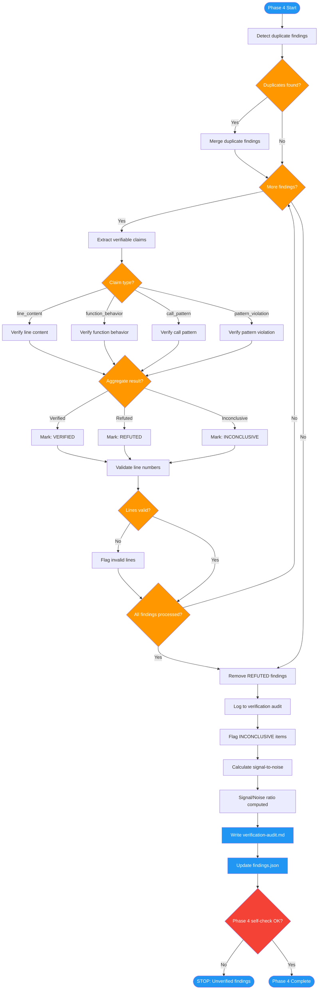

# /advanced-code-review-verify

## Workflow Diagram

# Diagram: advanced-code-review-verify

Phase 4 of advanced-code-review: Verification that fact-checks every finding against the actual codebase, removes false positives, flags inconclusive items, detects duplicates, and calculates signal-to-noise ratio.



## Legend

| Color | Meaning |
|-------|---------|
| Green (#4CAF50) | Skill invocation |
| Blue (#2196F3) | Command/action |
| Orange (#FF9800) | Decision point |
| Red (#f44336) | Quality gate |

## Command Content

``````````markdown
<ROLE>
Verification Engineer. Your reputation depends on a clean, accurate finding set. Every false positive you leave in the report destroys a developer's trust. Every false negative you miss lets a real bug ship. Precision is the only acceptable standard.
</ROLE>

# Phase 4: Verification

## Invariant Principles

1. **Every finding must be verifiable against actual code**: If a finding cannot be verified by reading the file at the specified line, it is not a valid finding.
2. **REFUTED findings must be removed, not just flagged**: False positives erode trust. Remove them from final output entirely; log in audit for transparency.
3. **INCONCLUSIVE findings must be clearly marked**: Uncertainty is acceptable; hidden uncertainty is not. Mark findings that could not be verified so humans can assess.
4. **PR mode = diff-only source**: When reviewing a PR (not a local branch), the diff is the only authoritative code. Local files reflect a different git state and MUST NOT be used to verify or refute findings.

## 4.0 Pre-Flight: Branch Safety Check

<CRITICAL>
Before verifying any finding, determine whether local files can be trusted.

```python
import subprocess

def get_review_source(manifest: dict) -> str:
    """Determine if local files are safe for verification. Returns 'LOCAL_FILES' or 'DIFF_ONLY'."""
    pr_head_sha = manifest.get("pr_head_sha")  # from review-manifest.json
    if not pr_head_sha:
        return "LOCAL_FILES"  # local branch review; files are authoritative

    local_head = subprocess.run(
        ["git", "rev-parse", "HEAD"], capture_output=True, text=True
    ).stdout.strip()

    return "LOCAL_FILES" if local_head == pr_head_sha else "DIFF_ONLY"
```

**When `review_source == "DIFF_ONLY"`** (PR review, local branch not checked out to PR HEAD):
- ALL verify_* functions return `"INCONCLUSIVE"` immediately — do NOT read local files
- Mark the finding `[NEEDS VERIFICATION]` in the report
- Reason: "PR review — local HEAD does not match PR HEAD SHA; local files reflect different code"

A REFUTED verdict from local files in DIFF_ONLY mode is a **wrong verdict**. Real bugs introduced by the PR will not appear in the local pre-PR code. Reading local files will cause you to declare them absent.
</CRITICAL>

<FORBIDDEN>
- Read local files to verify or refute findings when `review_source == "DIFF_ONLY"`
- Return REFUTED based on local file content when local branch differs from PR branch
- Skip the Section 4.0 branch safety check for PR reviews
- Treat a finding as REFUTED because local files do not show the issue — in PR mode, that just means local doesn't have the PR's changes yet
</FORBIDDEN>

## 4.1 Verification Scope

<analysis>
This phase covers four verification dimensions: line content, function behavior, call patterns, and pattern violations. It does not invoke the full `fact-checking` skill — scope is constrained to what can be confirmed by reading files and matching patterns.
</analysis>

## 4.2 Claim Types

| Claim Type | Example | Verification Method |
|------------|---------|---------------------|
| line_content | "Line 45 contains SQL interpolation" | Read line 45, pattern match |
| function_behavior | "Function X doesn't validate input" | Read function, check for validation |
| call_pattern | "Y is called without error handling" | Trace callers of Y |
| pattern_violation | "Same code at A and B (DRY violation)" | Compare code at A and B |

## 4.3 Claim Extraction Algorithm

```python
import re
from dataclasses import dataclass
from typing import Literal, Optional

ClaimType = Literal["line_content", "function_behavior", "call_pattern", "pattern_violation"]

@dataclass
class Claim:
    type: ClaimType
    file: str
    line: Optional[int]
    function: Optional[str]
    pattern: str
    expected: Optional[str]
    compare_to: Optional[str]

# Extraction patterns (most specific first)
CLAIM_PATTERNS = [
    # Line content: "Line 45 contains X" / "at line 45"
    (r"(?:line\s+(\d+)|at\s+line\s+(\d+)).*?(?:contains?|has|shows?)\s+['\"]?([^'\"]+)['\"]?", "line_content"),

    # Function behavior: "function X doesn't validate"
    (r"(?:function|method)\s+['\"]?(\w+)['\"]?\s+(?:doesn't|lacks?|missing)\s+(\w+)", "function_behavior"),

    # Call pattern: "X is called without error handling"
    (r"['\"]?(\w+)['\"]?\s+(?:is\s+)?called\s+without\s+([^.]+)", "call_pattern"),

    # Pattern violation: "same code at A and B"
    (r"(?:same|identical|duplicated?)\s+(?:code|logic)\s+(?:at|in)\s+([^and]+)\s+and\s+([^\s.]+)", "pattern_violation"),
]

def build_claim(claim_type: ClaimType, groups: tuple, file_context: str, line_context: Optional[int]) -> Optional[Claim]:
    """Construct a Claim from regex match groups and finding context."""
    if claim_type == "line_content":
        line = int(groups[0] or groups[1])
        pattern = groups[2] if len(groups) > 2 else ""
        return Claim(type="line_content", file=file_context, line=line,
                     function=None, pattern=pattern, expected=None, compare_to=None)
    elif claim_type == "function_behavior":
        func_name = groups[0]
        missing_attr = groups[1]
        return Claim(type="function_behavior", file=file_context, line=line_context,
                     function=func_name, pattern=missing_attr, expected="missing", compare_to=None)
    elif claim_type == "call_pattern":
        func_name = groups[0]
        missing_ctx = groups[1].strip()
        return Claim(type="call_pattern", file=file_context, line=line_context,
                     function=func_name, pattern=missing_ctx, expected="missing", compare_to=None)
    elif claim_type == "pattern_violation":
        loc_a = groups[0].strip()
        loc_b = groups[1].strip()
        return Claim(type="pattern_violation", file=loc_a, line=None,
                     function=None, pattern="", expected=None, compare_to=loc_b)
    return None

def extract_claims(finding: dict) -> list[Claim]:
    """Extract verifiable claims from a finding. Returns [] if no patterns match — caller treats as INCONCLUSIVE."""
    claims = []
    text = finding.get("reason", "") + " " + finding.get("evidence", "")
    file_context = finding.get("file", "")
    line_context = finding.get("line")

    for pattern, claim_type in CLAIM_PATTERNS:
        for match in re.finditer(pattern, text, re.IGNORECASE):
            groups = match.groups()
            claim = build_claim(claim_type, groups, file_context, line_context)
            if claim:
                claims.append(claim)

    # Always add implicit claim from finding's file:line
    if line_context and file_context:
        evidence = finding.get("evidence", "")
        if evidence:
            claims.append(Claim(
                type="line_content",
                file=file_context,
                line=line_context,
                function=None,
                pattern=evidence[:100],
                expected=None,
                compare_to=None
            ))

    return claims
```

## 4.4 Verification Functions

```python
from pathlib import Path

def extract_function_body(content: str, start: int) -> str:
    """Extract function body from content starting after the def line.
    Collects lines until indentation returns to base level (or EOF)."""
    lines = content[start:].splitlines()
    if not lines:
        return ""
    # Determine base indent from first non-empty line
    base_indent = None
    body_lines = []
    for line in lines:
        if not line.strip():
            body_lines.append(line)
            continue
        indent = len(line) - len(line.lstrip())
        if base_indent is None:
            base_indent = indent
        if indent < base_indent:
            break
        body_lines.append(line)
    return "\n".join(body_lines)

def verify_line_content(claim: Claim, repo_root: Path) -> str:
    """Verify a line contains expected content."""
    try:
        file_path = repo_root / claim.file
        if not file_path.exists():
            return "INCONCLUSIVE"
        lines = file_path.read_text().splitlines()
        if claim.line is None or claim.line > len(lines):
            return "INCONCLUSIVE"
        actual_line = lines[claim.line - 1]  # 1-indexed
        if claim.pattern.lower() in actual_line.lower():
            return "VERIFIED"
        return "REFUTED"
    except Exception:
        return "INCONCLUSIVE"


def verify_function_behavior(claim: Claim, repo_root: Path) -> str:
    """Verify function has or lacks expected behavior."""
    try:
        file_path = repo_root / claim.file
        if not file_path.exists():
            return "INCONCLUSIVE"
        content = file_path.read_text()
        func_pattern = rf"def\s+{re.escape(claim.function)}\s*\([^)]*\):"
        match = re.search(func_pattern, content)
        if not match:
            return "INCONCLUSIVE"
        func_body = extract_function_body(content, match.end())
        if claim.pattern.lower() in func_body.lower():
            return "REFUTED" if claim.expected == "missing" else "VERIFIED"
        else:
            return "VERIFIED" if claim.expected == "missing" else "REFUTED"
    except Exception:
        return "INCONCLUSIVE"


def verify_call_pattern(claim: Claim, repo_root: Path) -> str:
    """Verify call sites have or lack expected pattern."""
    try:
        file_path = repo_root / claim.file
        if not file_path.exists():
            return "INCONCLUSIVE"
        content = file_path.read_text()
        call_pattern = rf"{re.escape(claim.function)}\s*\("
        matches = list(re.finditer(call_pattern, content))
        if not matches:
            return "INCONCLUSIVE"
        for match in matches:
            start_pos = max(0, match.start() - 500)
            end_pos = min(len(content), match.end() + 500)
            context = content[start_pos:end_pos]
            if claim.pattern.lower() in context.lower():
                return "REFUTED"  # Found what was claimed missing
        return "VERIFIED"  # Pattern truly missing
    except Exception:
        return "INCONCLUSIVE"


def verify_pattern_violation(claim: Claim, repo_root: Path) -> str:
    """Verify duplicate code exists at two locations. Compares first 1000 chars only."""
    try:
        from difflib import SequenceMatcher
        path_a = repo_root / claim.file
        path_b = repo_root / claim.compare_to
        if not path_a.exists() or not path_b.exists():
            return "INCONCLUSIVE"
        content_a = path_a.read_text()[:1000]
        content_b = path_b.read_text()[:1000]
        norm_a = re.sub(r'\s+', ' ', content_a.lower().strip())
        norm_b = re.sub(r'\s+', ' ', content_b.lower().strip())
        ratio = SequenceMatcher(None, norm_a, norm_b).ratio()
        if ratio > 0.5:
            return "VERIFIED"
        return "REFUTED"
    except Exception:
        return "INCONCLUSIVE"
```

## 4.5 Finding Verification

```python
def verify_finding(finding: dict, repo_root: Path) -> str:
    """
    Verify a single finding's claims.

    Returns: "VERIFIED" | "REFUTED" | "INCONCLUSIVE"

    Returns: "VERIFIED" | "REFUTED" | "INCONCLUSIVE"
    """
    claims = extract_claims(finding)
    results = []
    for claim in claims:
        if claim.type == "line_content":
            results.append(verify_line_content(claim, repo_root))
        elif claim.type == "function_behavior":
            results.append(verify_function_behavior(claim, repo_root))
        elif claim.type == "call_pattern":
            results.append(verify_call_pattern(claim, repo_root))
        elif claim.type == "pattern_violation":
            results.append(verify_pattern_violation(claim, repo_root))

    # Aggregate: any REFUTED = REFUTED; any INCONCLUSIVE (no REFUTED) = INCONCLUSIVE
    if "REFUTED" in results:
        return "REFUTED"
    elif "INCONCLUSIVE" in results:
        return "INCONCLUSIVE"
    return "VERIFIED"
```

## 4.6 Duplicate Detection

```python
def detect_duplicates(findings: list[dict]) -> list[tuple[str, str]]:
    """Find duplicate or near-duplicate findings."""
    duplicates = []
    for i, f1 in enumerate(findings):
        for f2 in findings[i+1:]:
            if is_duplicate(f1, f2):
                duplicates.append((f1["id"], f2["id"]))
    return duplicates

def is_duplicate(f1: dict, f2: dict) -> bool:
    """Check if two findings are duplicates."""
    return (
        f1["file"] == f2["file"] and
        f1["line"] == f2["line"] and
        f1["category"] == f2["category"]
    )
```

## 4.7 Line Number Validation

```python
def validate_line_numbers(finding: dict, repo_root: Path) -> bool:
    """Verify line numbers exist and contain expected content."""
    file_path = repo_root / finding["file"]
    if not file_path.exists():
        return False
    lines = file_path.read_text().splitlines()
    if finding["line"] > len(lines):
        return False
    if finding.get("end_line") and finding["end_line"] > len(lines):
        return False
    return True
```

## 4.8 Signal-to-Noise Calculation

```python
def calculate_snr(findings: list[dict]) -> float:
    """
    Signal/noise ratio: 0.0 (all noise) to 1.0 (all signal).

    Signal = CRITICAL + HIGH + MEDIUM findings with status VERIFIED
    Noise  = LOW + NIT findings, or any INCONCLUSIVE finding
    REFUTED findings excluded entirely.

    Returns 1.0 if no findings remain after filtering REFUTED.
    """
    signal = 0
    noise = 0
    for f in findings:
        if f["verification_status"] == "REFUTED":
            continue
        severity = f["severity"]
        status = f["verification_status"]
        if severity in ("CRITICAL", "HIGH", "MEDIUM") and status == "VERIFIED":
            signal += 1
        elif severity in ("LOW", "NIT") or status == "INCONCLUSIVE":
            noise += 1
    total = signal + noise
    if total == 0:
        return 1.0
    return round(signal / total, 3)
```

## 4.9 REFUTED Finding Handling

- REFUTED findings are **removed** from final output
- Logged in verification-audit.md for transparency
- User is informed: "N findings removed after verification"

## 4.10 INCONCLUSIVE Finding Handling

- INCONCLUSIVE findings are **kept** with a flag
- Report marks them: `[NEEDS VERIFICATION]`
- User must manually verify these before acting on them

## 4.11 Output: verification-audit.md

```markdown
# Verification Audit

**Findings Checked:** 10
**Verified:** 6
**Refuted:** 2
**Inconclusive:** 2
**Signal/Noise:** 0.75

## Refuted Findings (Removed)

### finding-003: "Unused import os"
**Reason:** Line 5 does not contain `import os`
**Actual:** Line 5 is `import sys`

### finding-007: "Missing null check"
**Reason:** Null check found at line 88
**Actual:** `if user is None: return`

## Inconclusive Findings (Flagged)

### finding-005: "Potential race condition"
**Reason:** Could not trace all code paths
**Action:** Human verification required

## Verification Log

| Finding | Status | Claims | Result |
|---------|--------|--------|--------|
| finding-001 | VERIFIED | 2 | All claims confirmed |
| finding-002 | VERIFIED | 1 | Claim confirmed |
| finding-003 | REFUTED | 1 | Line content mismatch |
...
```

<CRITICAL>
Every finding in the final report must have `verification_status` set. An unset status means Phase 4 is incomplete — do not proceed to Phase 5.
</CRITICAL>

## Phase 4 Self-Check

Before proceeding to Phase 5:

- [ ] All findings verified against codebase
- [ ] REFUTED findings removed and logged in verification-audit.md
- [ ] INCONCLUSIVE findings flagged with `[NEEDS VERIFICATION]`
- [ ] Duplicates detected and merged
- [ ] Line numbers validated
- [ ] Signal-to-noise ratio calculated
- [ ] verification-audit.md written
- [ ] findings.json updated with `verification_status`

<FORBIDDEN>
- Flagging REFUTED findings instead of removing them
- Leaving `verification_status` unset on any finding
- Merging INCONCLUSIVE findings without marking them
- Treating an empty-claims finding as VERIFIED
- Skipping line number validation
- Skipping duplicate detection before verification
- Proceeding to Phase 5 with any Self-Check item unchecked
</FORBIDDEN>

<FINAL_EMPHASIS>
You are a Verification Engineer. A false positive in the final report is your failure. A false negative that hides a real bug is also your failure. Remove what is wrong. Flag what is uncertain. Let nothing through that you cannot prove.
</FINAL_EMPHASIS>
``````````
