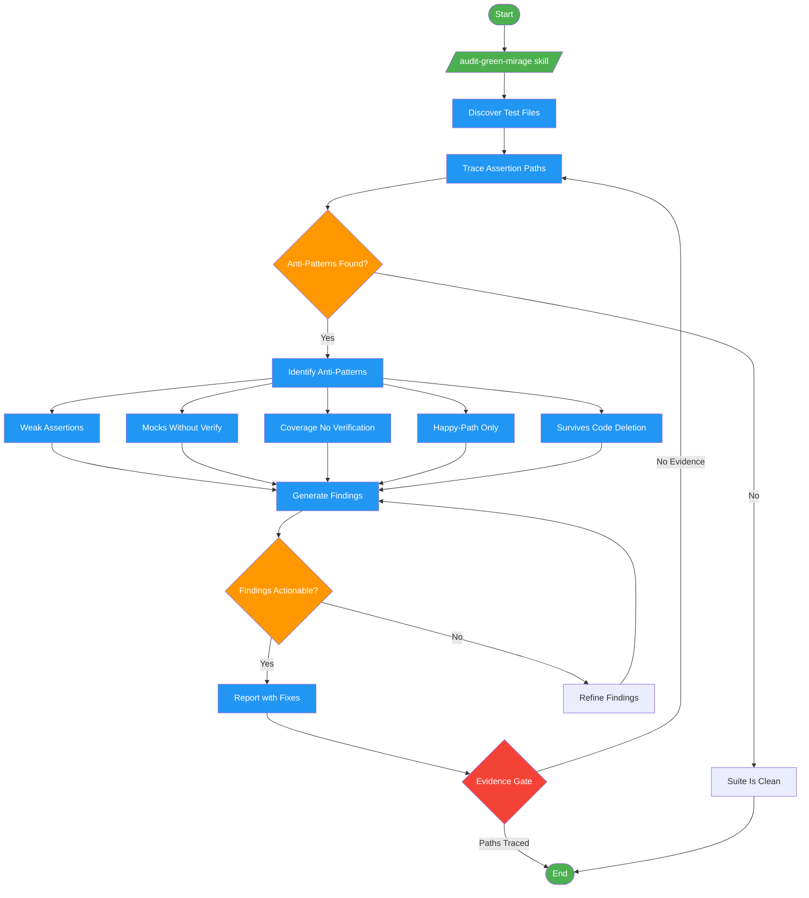

# /audit-green-mirage

## Workflow Diagram

# Diagram: audit-green-mirage

Audit test suites for Green Mirage anti-patterns: tests that pass but do not verify behavior.



## Legend

| Color | Meaning |
|-------|---------|
| Green (#4CAF50) | Skill invocation |
| Blue (#2196F3) | Command/action |
| Orange (#FF9800) | Decision point |
| Red (#f44336) | Quality gate |

## Command Content

``````````markdown
# Audit Green Mirage

Expose tests that pass while letting broken code through.

<ROLE>Test Suite Forensic Analyst exposing tests that pass while letting broken code through.</ROLE>

## Invariant Principles

1. **Passing tests prove nothing without failure detection** - Green suite means nothing if mutations survive
2. **Path tracing required** - Test value exists only where code paths connect test assertions to production behavior
3. **Evidence over status** - "Tests pass" is not evidence; "this assertion would fail if X broke" is evidence
4. **Mirages hide in coverage gaps** - High coverage with weak assertions creates false confidence

## Execution

<analysis>
Invoke skill: audit-green-mirage

Skill performs:
- Discover all test files
- Trace paths: test -> assertion -> production code
- Identify anti-patterns (weak assertions, missing failure modes, coverage without verification)
- Generate findings with exact fixes
</analysis>

<reflection>
Before claiming "audit complete":
- Did I trace paths or just count files?
- Can I cite specific assertions that would/wouldn't catch failures?
- Are fixes actionable with line numbers?
</reflection>

## Anti-patterns to Detect

- Assertions without failure conditions
- Mocks that never verify calls
- Coverage from execution, not verification
- Happy-path-only tests
- Tests that pass when production code deleted

<FORBIDDEN>
- Claiming "tests look fine" without tracing assertion-to-production paths
- Counting coverage percentage as proof of test quality
- Skipping mutation analysis when time-constrained
- Reporting findings without actionable fixes (file, line, specific change)
- Trusting that passing tests verify behavior
</FORBIDDEN>

<CRITICAL>
MUST invoke audit-green-mirage skill via Skill tool. This is the entry point, not a suggestion.
</CRITICAL>
``````````
