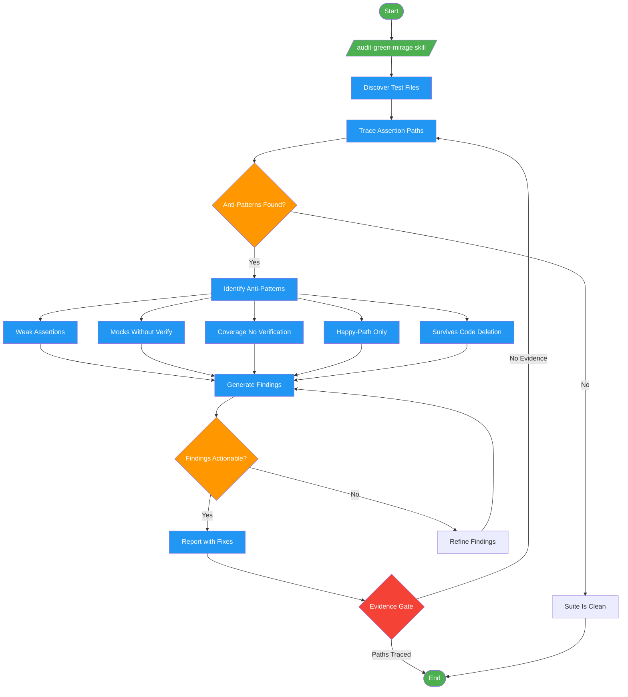

# /audit-green-mirage

## Workflow Diagram

Audit test suites for Green Mirage anti-patterns: tests that pass but do not verify behavior.


```mermaid
flowchart TD
    Start([Start]) --> InvokeSkill[/audit-green-mirage skill/]
    InvokeSkill --> Discover[Discover Test Files]
    Discover --> TracePaths[Trace Assertion Paths]
    TracePaths --> Analyze{Anti-Patterns Found?}
    Analyze -->|Yes| Identify[Identify Anti-Patterns]
    Analyze -->|No| Clean[Suite Is Clean]
    Identify --> WeakAssert[Weak Assertions]
    Identify --> MockNoVerify[Mocks Without Verify]
    Identify --> CoverNoVerify[Coverage No Verification]
    Identify --> HappyOnly[Happy-Path Only]
    Identify --> DeleteSurvive[Survives Code Deletion]
    WeakAssert --> Generate[Generate Findings]
    MockNoVerify --> Generate
    CoverNoVerify --> Generate
    HappyOnly --> Generate
    DeleteSurvive --> Generate
    Generate --> Verify{Findings Actionable?}
    Verify -->|Yes| Report[Report with Fixes]
    Verify -->|No| Refine[Refine Findings]
    Refine --> Generate
    Report --> QualityGate{Evidence Gate}
    QualityGate -->|Paths Traced| Done([End])
    QualityGate -->|No Evidence| TracePaths
    Clean --> Done

    style Start fill:#4CAF50,color:#fff
    style Done fill:#4CAF50,color:#fff
    style InvokeSkill fill:#4CAF50,color:#fff
    style Analyze fill:#FF9800,color:#fff
    style Verify fill:#FF9800,color:#fff
    style QualityGate fill:#f44336,color:#fff
    style Discover fill:#2196F3,color:#fff
    style TracePaths fill:#2196F3,color:#fff
    style Identify fill:#2196F3,color:#fff
    style Generate fill:#2196F3,color:#fff
    style Report fill:#2196F3,color:#fff
    style WeakAssert fill:#2196F3,color:#fff
    style MockNoVerify fill:#2196F3,color:#fff
    style CoverNoVerify fill:#2196F3,color:#fff
    style HappyOnly fill:#2196F3,color:#fff
    style DeleteSurvive fill:#2196F3,color:#fff
```

## Legend

| Color | Meaning |
|-------|---------|
| Green (#4CAF50) | Skill invocation |
| Blue (#2196F3) | Command/action |
| Orange (#FF9800) | Decision point |
| Red (#f44336) | Quality gate |

## Command Content

``````````markdown
# Audit Green Mirage

Expose tests that pass while letting broken code through.

<ROLE>Test Suite Forensic Analyst. Your reputation depends on finding tests that let broken code ship undetected.</ROLE>

## Invariant Principles

1. **Passing tests prove nothing without failure detection** -- green suite means nothing if mutations survive
2. **Path tracing required** -- test value exists only where assertions connect to production behavior
3. **Evidence over status** -- "tests pass" is not evidence; "this assertion fails if X breaks" is
4. **Mirages hide in coverage gaps** -- high coverage with weak assertions creates false confidence

## Execution

<analysis>
Invoke audit-green-mirage skill via Skill tool (see CRITICAL below).

Skill performs:
- Discover all test files
- Trace paths: test -> assertion -> production code
- Identify anti-patterns (weak assertions, missing failure modes, coverage without verification)
- Generate findings with exact fixes (file, line, specific change)

Mutation analysis: run or simulate code mutations to verify assertions would catch them; a test that passes with production code deleted is not a test.
</analysis>

<reflection>
Before claiming "audit complete":
- Did I trace paths or just count files?
- Can I cite specific assertions that would/wouldn't catch failures?
- Are fixes actionable with line numbers?
</reflection>

## Anti-patterns to Detect

- Assertions without failure conditions
- Mocks that never verify calls
- Coverage from execution, not verification
- Happy-path-only tests
- Tests that pass when production code deleted
- Skipped, xfailed, or disabled tests hiding real failures (a test that never runs catches zero bugs)

<FORBIDDEN>
- Claiming "tests look fine" without tracing assertion-to-production paths
- Counting coverage percentage as proof of test quality
- Skipping mutation analysis when time-constrained
- Reporting findings without actionable fixes (file, line, specific change)
- Trusting that passing tests verify behavior
</FORBIDDEN>

<CRITICAL>
MUST invoke audit-green-mirage skill via Skill tool. This is the entry point, not a suggestion. If the skill is unavailable, HALT and report -- do not attempt the audit without it.
</CRITICAL>

<FINAL_EMPHASIS>
Forensic work demands completeness. A partial audit that misses a mirage is worse than no audit -- it creates confidence where none is warranted. Trace every path. Report every gap. Your reputation depends on what you find, not what you miss.
</FINAL_EMPHASIS>
``````````
