# /audit-mirage-analyze

## Workflow Diagram

# Diagram: audit-mirage-analyze

Systematic line-by-line audit of test functions against 8 Green Mirage Patterns.

```mermaid
flowchart TD
    Start([Start: Test Files Identified]) --> SelectFile[Select Next Test File]
    SelectFile --> SelectTest[Select Next Test Function]

    SelectTest --> Purpose[Identify Test Purpose]
    Purpose --> Setup[Analyze Setup Lines]
    Setup --> Action[Analyze Action Lines]
    Action --> Trace[Trace Complete Code Path]

    Trace --> Assertions[Analyze Each Assertion]

    Assertions --> P1{Pattern 1: Existence vs Validity?}
    P1 --> P2{Pattern 2: Partial Assertions?}
    P2 --> P3{Pattern 3: Shallow Matching?}
    P3 --> P4{Pattern 4: Lack of Consumption?}
    P4 --> P5{Pattern 5: Mocking Reality?}
    P5 --> P6{Pattern 6: Swallowed Errors?}
    P6 --> P7{Pattern 7: State Mutation Unverified?}
    P7 --> P8{Pattern 8: Incomplete Branches?}

    P8 --> Verdict{Test Verdict?}
    Verdict -->|No Patterns| Solid[SOLID]
    Verdict -->|Some Patterns| Partial[PARTIAL]
    Verdict -->|Many Patterns| Mirage[GREEN MIRAGE]

    Solid --> EstEffort[Estimate Fix Effort]
    Partial --> EstEffort
    Mirage --> EstEffort

    EstEffort --> MoreTests{More Tests in File?}
    MoreTests -->|Yes| SelectTest
    MoreTests -->|No| MoreFiles{More Test Files?}
    MoreFiles -->|Yes| SelectFile
    MoreFiles -->|No| Done([All Tests Audited])

    style Start fill:#2196F3,color:#fff
    style SelectFile fill:#2196F3,color:#fff
    style SelectTest fill:#2196F3,color:#fff
    style Purpose fill:#2196F3,color:#fff
    style Setup fill:#2196F3,color:#fff
    style Action fill:#2196F3,color:#fff
    style Trace fill:#2196F3,color:#fff
    style Assertions fill:#2196F3,color:#fff
    style P1 fill:#FF9800,color:#fff
    style P2 fill:#FF9800,color:#fff
    style P3 fill:#FF9800,color:#fff
    style P4 fill:#FF9800,color:#fff
    style P5 fill:#FF9800,color:#fff
    style P6 fill:#FF9800,color:#fff
    style P7 fill:#FF9800,color:#fff
    style P8 fill:#FF9800,color:#fff
    style Verdict fill:#FF9800,color:#fff
    style Solid fill:#4CAF50,color:#fff
    style Partial fill:#FF9800,color:#fff
    style Mirage fill:#f44336,color:#fff
    style EstEffort fill:#2196F3,color:#fff
    style MoreTests fill:#FF9800,color:#fff
    style MoreFiles fill:#FF9800,color:#fff
    style Done fill:#2196F3,color:#fff
```



## Legend

| Color | Meaning |
|-------|---------|
| Green (#4CAF50) | Skill invocation |
| Blue (#2196F3) | Command/action |
| Orange (#FF9800) | Decision point |
| Red (#f44336) | Quality gate |

## Command Content

``````````markdown
# Phase 2-3: Systematic Audit and Green Mirage Patterns

This command file contains the detailed audit templates and all 9 Green Mirage Patterns for subagent execution.

## Invariant Principles

1. **Every test function gets audited** - No skipping tests because they "look fine"; line-by-line analysis catches what scanning misses
2. **Assertions determine test value** - A test without meaningful assertions is worse than no test; it creates false confidence
3. **Score by pattern, not by gut** - Use the 9 Green Mirage Patterns as the scoring rubric, not subjective assessment

## Phase 2: Systematic Line-by-Line Audit

For EACH test file, work through EVERY test function:

```
### Test: `test_function_name` (file.py:line)

**Purpose (from name/docstring):** What this test claims to verify

**Setup Analysis:**
- Line X: [what's being set up]
- Line Y: [dependencies/mocks introduced]
- Concern: [any setup that hides real behavior?]

**Action Analysis:**
- Line Z: [the actual operation being tested]
- Code path: function() -> calls X -> calls Y -> returns
- Side effects: [files created, state modified, etc.]

**Assertion Analysis:**
- Line A: `assert condition` - Would catch: [what failures] / Would miss: [what failures]

**Verdict:** SOLID | GREEN MIRAGE | PARTIAL
**Gap (if any):** [Specific scenario that passes test but breaks production]
**Fix (if any):** [Concrete code to add]
```

### Code Path Tracing

For each test action, trace the COMPLETE path:

```
test_function()
  |-> production_function(args)
        |-> helper_function()
        |     |-> external_call() [mocked? real?]
        |     |-> returns value
        |-> processes result
        |-> returns final
  |-> assertion checks final

Questions at each step:
- Is this step tested or assumed to work?
- If this step returned garbage, would the test catch it?
- Are error paths tested or only happy paths?
```

## Phase 3: The 9 Green Mirage Patterns

Check EVERY test against ALL patterns:

### Pattern 1: Existence vs. Validity
**Symptom:** Checking something exists without validating correctness.
```python
# GREEN MIRAGE
assert output_file.exists()
assert len(result) > 0
assert response is not None
```
**Question:** If the content was garbage, would this catch it?

### Pattern 2: Partial Assertions (CODE SMELL - INVESTIGATE DEEPER)
**Symptom:** Using `in`, substring checks, or partial matches instead of complete values.

This pattern is a STRONG CODE SMELL requiring deeper investigation. Tests should shine a bright light on data, not make a quick glance.

```python
# GREEN MIRAGE - Partial assertions hide bugs
assert 'SELECT' in query           # Garbage SQL could contain SELECT
assert 'error' not in output       # Wrong output might not have 'error'
assert expected_id in result       # Result could have wrong structure
assert key in response_dict        # Value at key could be garbage
```

**SOLID tests assert COMPLETE objects:**
```python
# SOLID - Full assertions expose everything
assert query == "SELECT id, name FROM users WHERE active = true"
assert result == {"id": 123, "name": "test", "status": "active"}
```

**Investigation Required:**
1. WHY is this a partial assertion? What is the test avoiding checking?
2. WHAT could be wrong with the unchecked parts?
3. HOW would a complete assertion change this test?

### Pattern 3: Shallow String/Value Matching
**Symptom:** Checking keywords without validating structure.
```python
# GREEN MIRAGE
assert 'SELECT' in query
assert 'error' not in output
assert result.status == 'success'  # But is the data correct?
```
**Question:** Could syntactically broken output still contain this keyword?

### Pattern 4: Lack of Consumption
**Symptom:** Never USING the generated output in a way that validates it.
```python
# GREEN MIRAGE
generated_code = compiler.generate()
assert generated_code  # Never compiled!

result = api.fetch_data()
assert result  # Never deserialized or used!
```
**Question:** Is this output ever compiled/parsed/executed/deserialized?

### Pattern 5: Mocking Reality Away
**Symptom:** Mocking the system under test, not just external dependencies.
```python
# GREEN MIRAGE - tests the mock, not the code
@mock.patch('mymodule.core_logic')
def test_processing(mock_logic):
    mock_logic.return_value = expected
    result = process()  # core_logic never runs!
```
**Question:** Is the ACTUAL code path exercised, or just mocks?

### Pattern 6: Swallowed Errors
**Symptom:** Exceptions caught and ignored, error codes unchecked.
```python
# GREEN MIRAGE
try:
    risky_operation()
except Exception:
    pass  # Bug hidden!

result = command()  # Return code ignored
```
**Question:** Would this test fail if an exception was raised?

### Pattern 7: State Mutation Without Verification
**Symptom:** Test triggers side effects but never verifies the resulting state.
```python
# GREEN MIRAGE
user.update_profile(new_data)
assert user.update_profile  # Checked call happened, not result

db.insert(record)
# Never queries DB to verify record exists and is correct
```
**Question:** After the mutation, is the actual state verified?

### Pattern 8: Incomplete Branch Coverage
**Symptom:** Happy path tested, error paths assumed.
```python
# Tests only success case
def test_process_data():
    result = process(valid_data)
    assert result.success

# Missing: test_process_invalid_data, test_process_empty, test_process_malformed
```
**Question:** What happens when input is invalid/empty/malformed/boundary?

### Pattern 9: Skipped Tests Hiding Failures

**Symptom:** Tests marked as skipped, xfail, or conditionally excluded to avoid dealing with failures. A skipped test is a test that never runs. A test that never runs catches zero bugs. If the skip exists because the test exposes a real bug, the skip is actively hiding a production problem to keep the build green.

**The only legitimate skips** are environmental constraints where the test literally cannot execute:
- OS-specific tests on a different OS (`@pytest.mark.skipif(sys.platform != 'linux')`)
- Hardware-dependent tests without the hardware (GPU, TPU, FPGA)
- Framework-version-specific tests on an older version

**Everything else is a Green Mirage:**
```python
# GREEN MIRAGE - Skipping because it fails is not fixing it
@pytest.mark.skip(reason="flaky, needs investigation")
def test_concurrent_writes():
    ...

# GREEN MIRAGE - xfail used to sweep known bugs under the rug
@pytest.mark.xfail(reason="race condition in handler")
def test_event_ordering():
    ...

# GREEN MIRAGE - Conditional skip to dodge a bug on specific systems
@pytest.mark.skipif(sys.platform == 'darwin', reason="segfaults on macOS")
def test_memory_management():
    ...

# GREEN MIRAGE - unittest style
@unittest.skip("TODO: fix after refactor")
def test_data_migration():
    ...

# GREEN MIRAGE - Conditional import skip hiding missing dependency
pytest.importorskip("some_module")  # If the module is needed, install it
```

**Investigation Required:**
1. WHY is this test skipped? Is it a real environmental constraint, or covering up a failure?
2. WHAT bug does the test expose when unskipped? That bug exists in production right now.
3. HOW long has this skip been in place? Stale skips are forgotten bugs.

**Question:** If you remove the skip decorator and the test fails, is that a bug in the test or a bug in the production code? If production code, you found a live defect being hidden by a green build.

## Effort Estimation Guidelines

| Effort | Criteria | Examples |
|--------|----------|----------|
| **trivial** | < 5 minutes, single assertion change | Add `.to_equal(expected)` instead of `.to_be_truthy()` |
| **moderate** | 5-30 minutes, requires reading production code | Add state verification, strengthen partial assertions |
| **significant** | 30+ minutes, requires new test infrastructure | Add schema validation, create edge case tests, refactor mocked tests |
``````````
