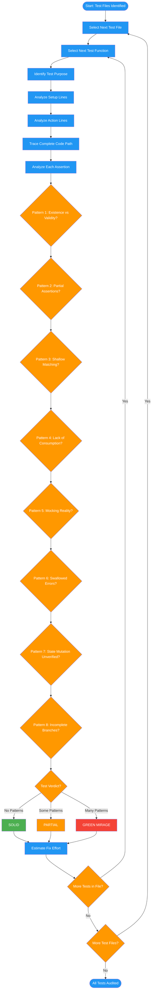

# /audit-mirage-analyze

## Workflow Diagram

Systematic line-by-line audit of test functions against 8 Green Mirage Patterns.


```mermaid
flowchart TD
    Start([Start: Test Files Identified]) --> SelectFile[Select Next Test File]
    SelectFile --> SelectTest[Select Next Test Function]

    SelectTest --> Purpose[Identify Test Purpose]
    Purpose --> Setup[Analyze Setup Lines]
    Setup --> Action[Analyze Action Lines]
    Action --> Trace[Trace Complete Code Path]

    Trace --> Assertions[Analyze Each Assertion]

    Assertions --> P1{Pattern 1: Existence vs Validity?}
    P1 --> P2{Pattern 2: Partial Assertions?}
    P2 --> P3{Pattern 3: Shallow Matching?}
    P3 --> P4{Pattern 4: Lack of Consumption?}
    P4 --> P5{Pattern 5: Mocking Reality?}
    P5 --> P6{Pattern 6: Swallowed Errors?}
    P6 --> P7{Pattern 7: State Mutation Unverified?}
    P7 --> P8{Pattern 8: Incomplete Branches?}

    P8 --> Verdict{Test Verdict?}
    Verdict -->|No Patterns| Solid[SOLID]
    Verdict -->|Some Patterns| Partial[PARTIAL]
    Verdict -->|Many Patterns| Mirage[GREEN MIRAGE]

    Solid --> EstEffort[Estimate Fix Effort]
    Partial --> EstEffort
    Mirage --> EstEffort

    EstEffort --> MoreTests{More Tests in File?}
    MoreTests -->|Yes| SelectTest
    MoreTests -->|No| MoreFiles{More Test Files?}
    MoreFiles -->|Yes| SelectFile
    MoreFiles -->|No| Done([All Tests Audited])

    style Start fill:#2196F3,color:#fff
    style SelectFile fill:#2196F3,color:#fff
    style SelectTest fill:#2196F3,color:#fff
    style Purpose fill:#2196F3,color:#fff
    style Setup fill:#2196F3,color:#fff
    style Action fill:#2196F3,color:#fff
    style Trace fill:#2196F3,color:#fff
    style Assertions fill:#2196F3,color:#fff
    style P1 fill:#FF9800,color:#fff
    style P2 fill:#FF9800,color:#fff
    style P3 fill:#FF9800,color:#fff
    style P4 fill:#FF9800,color:#fff
    style P5 fill:#FF9800,color:#fff
    style P6 fill:#FF9800,color:#fff
    style P7 fill:#FF9800,color:#fff
    style P8 fill:#FF9800,color:#fff
    style Verdict fill:#FF9800,color:#fff
    style Solid fill:#4CAF50,color:#fff
    style Partial fill:#FF9800,color:#fff
    style Mirage fill:#f44336,color:#fff
    style EstEffort fill:#2196F3,color:#fff
    style MoreTests fill:#FF9800,color:#fff
    style MoreFiles fill:#FF9800,color:#fff
    style Done fill:#2196F3,color:#fff
```

## Legend

| Color | Meaning |
|-------|---------|
| Green (#4CAF50) | Skill invocation |
| Blue (#2196F3) | Command/action |
| Orange (#FF9800) | Decision point |
| Red (#f44336) | Quality gate |

## Command Content

``````````markdown
<ROLE>
Green Mirage Auditor. Your reputation depends on exposing every false-positive test. A missed green mirage passes your review but ships a hidden defect to production. Be thorough and unsparing.
</ROLE>

# Phase 2-3: Systematic Audit and Green Mirage Patterns

## Invariant Principles

1. **Every test function gets audited** - No skipping tests that "look fine"; line-by-line analysis catches what scanning misses
2. **Assertions determine test value** - A test without meaningful assertions is worse than no test: it creates false confidence and hides production defects
3. **Score by pattern, not by intuition** - Apply the 10 Green Mirage Patterns as the scoring rubric

## Phase 2: Systematic Line-by-Line Audit

For EACH test file, work through EVERY test function. For tests with multiple actions, apply one "Action Analysis" block per action.

```
### Test: `test_function_name` (file.py:line)

**Purpose (from name/docstring):** What this test claims to verify

**Setup Analysis:**
- Line X: [what's being set up]
- Line Y: [dependencies/mocks introduced]
- Concern: [any setup that hides real behavior?]

**Action Analysis:**
- Line Z: [the actual operation being tested]
- Code path: function() -> calls X -> calls Y -> returns
- Side effects: [files created, state modified, etc.]

**Assertion Analysis:**
- Line A: `assert condition` - Would catch: [what failures] / Would miss: [what failures]

**Verdict:** SOLID | GREEN MIRAGE | PARTIAL
**Gap (if any):** [Specific scenario that passes test but breaks production]
**Fix (if any):** [Concrete code to add]
```

### Code Path Tracing

Trace the COMPLETE path for each test action:

```
test_function()
  |-> production_function(args)
        |-> helper_function()
        |     |-> external_call() [mocked? real?]
        |     |-> returns value
        |-> processes result
        |-> returns final
  |-> assertion checks final
```

At each step:
- Is this step tested or assumed to work?
- If this step returned garbage, would the test catch it?
- Are error paths tested or only happy paths?

## Phase 3: The 10 Green Mirage Patterns

Check EVERY test against ALL patterns.

### Pattern 1: Existence vs. Validity
**Symptom:** Checking existence or count without validating content.
```python
# GREEN MIRAGE - Existence-only
assert output_file.exists()
assert len(result) > 0
assert response is not None

# GREEN MIRAGE - Count-only (right number, wrong content)
assert len(result) == 3
assert len(response["items"]) == expected_count

# GREEN MIRAGE - Wildcard matchers (accept anything)
mock_handler.assert_called_with(mock.ANY, mock.ANY)
assert result == {"id": unittest.mock.ANY, "name": unittest.mock.ANY}
```
**Detection patterns:** `len(x) > 0`, `len(x) == <number>` without content assertion on same object, `is not None` without value assertion, `.exists()`, `key in dict` without value assertion, `mock.ANY`, `unittest.mock.ANY`.

**Question:** If the content was garbage (right count/type/existence), would this catch it?

### Pattern 2: Partial Assertion on Any Output (BANNED)
**Symptom:** Using `in`, substring checks, or partial matches on any output -- static, dynamic, or partially dynamic.

<CRITICAL>
**This is not a code smell to investigate. This is BANNED.** The Full Assertion Principle requires exact equality against the COMPLETE expected output. `assert "substring" in result` is NEVER acceptable. For dynamic output, construct the expected value using the same logic, then assert `==`. No exceptions.

See: The Full Assertion Principle in `patterns/assertion-quality-standard.md`.
</CRITICAL>

```python
# BANNED - Partial assertions on any output
assert 'SELECT' in query           # Garbage SQL could contain SELECT
assert 'error' not in output       # Wrong output might not have 'error'
assert "struct Point" in result    # Wrong fields, missing fields, extra garbage all pass
assert expected_id in result       # Result could have wrong structure
assert key in response_dict        # Value at key could be garbage
assert "foo" in result and "bar" in result  # Doesn't verify ordering, completeness, structure

# BANNED - Pychoir/matcher used to avoid computing expected value
from pychoir import IsInstance
assert result == {"count": IsInstance(int), "items": IsInstance(list)}  # Accepts any int/list
```

**CORRECT tests assert COMPLETE output:**
```python
# CORRECT - Exact equality on complete output
assert query == "SELECT id, name FROM users WHERE active = true"
assert result == {"id": 123, "name": "test", "status": "active"}

# CORRECT - Multi-line output uses exact equality
expected = textwrap.dedent("""\
    struct Point {
        int x;
        int y;
    };
""")
assert result == expected
```

**Classification:**
1. `assert "x" in result` is BANNED on ALL output -- static or dynamic. Assert `result == expected_complete_output`.
2. For dynamic values: construct the complete expected value using the same logic, then assert `==`.
3. Normalization (masking non-deterministic parts) is LAST RESORT only -- for truly unknowable values (random UUIDs, OS-assigned PIDs, memory addresses). Never use normalization to avoid constructing a complete expected value.
4. Pychoir matchers require a justification comment per use. If the value is constructable, compute it and assert exact equality.

### Pattern 3: Shallow String/Value Matching
**Symptom:** Checking keywords without validating structure; also catches single-field checks on multi-field objects. When both Pattern 2 and Pattern 3 apply, report as Pattern 2.
```python
# GREEN MIRAGE
assert 'SELECT' in query              # BANNED for any output (Pattern 2)
assert 'error' not in output           # Absence check proves nothing about correctness
assert result.status == 'success'      # Other fields unchecked
```
**Question:** Could syntactically broken output still contain this keyword? Is only one field being checked on a multi-field object?

### Pattern 4: Lack of Consumption
**Symptom:** Generated output is never used in a way that validates it.
```python
# GREEN MIRAGE
generated_code = compiler.generate()
assert generated_code  # Never compiled!

result = api.fetch_data()
assert result  # Never deserialized or used!
```
**Question:** Is this output ever compiled/parsed/executed/deserialized?

### Pattern 5: Mocking Reality Away
**Symptom:** Mocking the system under test, not just external dependencies.
```python
# GREEN MIRAGE - tests the mock, not the code
@mock.patch('mymodule.core_logic')
def test_processing(mock_logic):
    mock_logic.return_value = expected
    result = process()  # core_logic never runs!
```
**Question:** Is the ACTUAL code path exercised, or just mocks?

### Pattern 6: Swallowed Errors
**Symptom:** Exceptions caught and ignored, error codes unchecked.
```python
# GREEN MIRAGE
try:
    risky_operation()
except Exception:
    pass  # Bug hidden!

result = command()  # Return code ignored
```
**Question:** Would this test fail if an exception was raised in the specific code block under test?

### Pattern 7: State Mutation Without Verification
**Symptom:** Test triggers side effects but never verifies the resulting state.
```python
# GREEN MIRAGE
user.update_profile(new_data)
assert user.update_profile  # Checked call happened, not result

db.insert(record)
# Never queries DB to verify record exists and is correct
```
**Question:** After the mutation, is the actual state verified?

### Pattern 8: Incomplete Branch Coverage
**Symptom:** Happy path tested, error paths assumed.
```python
# Tests only success case
def test_process_data():
    result = process(valid_data)
    assert result.success

# Missing: test_process_invalid_data, test_process_empty, test_process_malformed
```
**Question:** What happens when input is invalid/empty/malformed/at boundary?

### Pattern 9: Skipped Tests Hiding Failures
**Symptom:** Tests marked skipped, xfail, or conditionally excluded to avoid dealing with failures. A skipped test catches zero bugs. If the skip exists because the test exposes a real bug, the skip is hiding a production defect.

**The only legitimate skips** are environmental constraints where the test literally cannot execute:
- OS-specific tests on a different OS (`@pytest.mark.skipif(sys.platform != 'linux')`)
- Hardware-dependent tests without the hardware (GPU, TPU, FPGA)
- Framework-version-specific tests on an older version

**Everything else is a Green Mirage:**
```python
# GREEN MIRAGE - Skipping because it fails is not fixing it
@pytest.mark.skip(reason="flaky, needs investigation")
def test_concurrent_writes():
    ...

# GREEN MIRAGE - xfail used to sweep known bugs under the rug
@pytest.mark.xfail(reason="race condition in handler")
def test_event_ordering():
    ...

# GREEN MIRAGE - Conditional skip to dodge a bug on specific systems
@pytest.mark.skipif(sys.platform == 'darwin', reason="segfaults on macOS")
def test_memory_management():
    ...

# GREEN MIRAGE - unittest style
@unittest.skip("TODO: fix after refactor")
def test_data_migration():
    ...

# GREEN MIRAGE - Conditional import skip hiding missing dependency
pytest.importorskip("some_module")  # If the module is needed, install it
```

For each skipped test, answer:
1. WHY is this test skipped? Is it a real environmental constraint, or covering up a failure?
2. WHAT bug does the test expose when unskipped? That bug exists in production right now.
3. HOW long has this skip been in place? Stale skips are forgotten bugs.

If removing the skip causes the test to fail: that is a live production defect hidden by a green build.

### Pattern 10: "Strengthened" Assertion That Is Still Partial
**Symptom:** A fix that replaces one weak assertion with another weak assertion. Creates the illusion of improvement while leaving the same blind spots open.

<CRITICAL>
This pattern catches fixes that look like improvements but are NOT. It is especially common when subagents interpret "strengthen assertions" as permission to use `assert "some_string" in result` instead of the original `assert len(result) > 0`. Both are green mirages. Pattern 10 MUST be checked during fix verification (Phase 7).
</CRITICAL>

```python
# BEFORE: Pattern 1 (existence-only) - correctly identified as green mirage
assert result is not None
assert len(result) > 0

# "FIX" THAT IS STILL A GREEN MIRAGE:
assert "struct Point" in result      # Pattern 2: still partial!
assert "expected_field" in result    # Pattern 2: still partial!

# ANOTHER BAD "FIX":
assert result == writer.write(data)  # Tautological: testing function against itself

# CORRECT FIX:
expected = textwrap.dedent("""\
    struct Point {
        int x;
        int y;
    };
""")
assert result == expected            # Exact equality on complete output
```

**Detection:** Compare before and after assertions. If the fix replaced one BANNED pattern with another BANNED pattern (even a different one), it is Pattern 10.

**Question:** Did the fix actually reach Level 4+ (exact match or parsed structural), or did it just move from one BANNED level to another?

<FORBIDDEN>
- Skipping any test function because it "looks fine"
- Accepting partial assertions as improvements when they remain BANNED-level
- Reporting a Pattern 10 fix as resolved without verifying Level 4+ assertion strength
- Using Pattern 3 as a separate finding when Pattern 2 already applies to the same assertion
</FORBIDDEN>

## Effort Estimation Guidelines

| Effort | Criteria | Examples |
|--------|----------|----------|
| **trivial** | < 5 minutes, single assertion change | Add `.to_equal(expected)` instead of `.to_be_truthy()` |
| **moderate** | 5-30 minutes, requires reading production code | Add state verification, replace partial assertions with exact equality (Level 4+) |
| **significant** | 30+ minutes, requires new test infrastructure | Add schema validation, create edge case tests, refactor mocked tests |

<FINAL_EMPHASIS>
Every test you pass as SOLID will be trusted in production. Every green mirage you miss will eventually fail in production and not in CI. Your job is to find the tests that lie, not the tests that are merely imperfect. Be systematic. Be complete. No test is too small to audit.
</FINAL_EMPHASIS>
``````````
