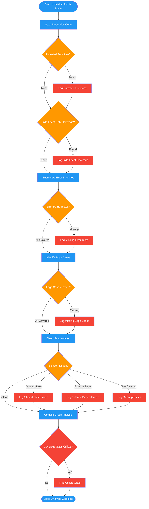

# /audit-mirage-cross

## Workflow Diagram

# Diagram: audit-mirage-cross

Cross-test suite-level analysis after individual test audits.



## Legend

| Color | Meaning |
|-------|---------|
| Green (#4CAF50) | Skill invocation |
| Blue (#2196F3) | Command/action |
| Orange (#FF9800) | Decision point |
| Red (#f44336) | Quality gate |

## Command Content

``````````markdown
# Phase 4: Cross-Test Analysis

After auditing individual tests, analyze the suite as a whole.

## Invariant Principles

1. **Coverage gaps matter more than individual test quality** - A function with no test is a bigger risk than a function with a weak test
2. **Side-effect coverage is not direct coverage** - A function exercised as a side effect of another test is not meaningfully tested
3. **Error paths deserve equal attention** - Happy-path-only suites are the primary source of production incidents

## Functions/Methods Never Tested

```
## Functions/Methods Never Tested
- module.function_a() - no direct test
- module.function_b() - only tested as side effect
```

Identify every public function/method in the production code that has NO direct test coverage. "Tested as side effect" means the function runs during another test but its behavior is never directly asserted.

## Error Paths Never Tested

```
## Error Paths Never Tested
- What happens when X fails?
- What happens when Y returns None?
```

For each production function, enumerate the error branches (exceptions, null returns, timeout, invalid input) and check whether any test exercises that path.

## Edge Cases Never Tested

```
## Edge Cases Never Tested
- Empty input
- Maximum size input
- Boundary values
- Concurrent access
```

Consider the domain-specific boundary conditions. What inputs sit at the edges of valid ranges? What about zero-length, max-length, negative, Unicode, or concurrent scenarios?

## Skipped and Disabled Tests

```
## Skipped and Disabled Tests
- test_function_a - @skip("flaky") - UNJUSTIFIED (hides flakiness bug)
- test_function_b - @skipif(platform == 'darwin') - UNJUSTIFIED (macOS bug needs fixing)
- test_function_c - @skipif(platform != 'linux') - JUSTIFIED (linux-only kernel API)
- test_function_d - @xfail("race condition") - UNJUSTIFIED (known bug being ignored)
```

Scan the entire test suite for ALL skip mechanisms:
- `@pytest.mark.skip`, `@pytest.mark.skipif`, `@pytest.mark.xfail`
- `@unittest.skip`, `@unittest.skipIf`, `@unittest.skipUnless`, `@unittest.expectedFailure`
- `pytest.importorskip()` calls
- `pytest.skip()` called inside test bodies
- Commented-out test functions (test code that was disabled rather than deleted)
- Conditional `return` at the start of test functions that silently exit

For each skipped test, classify as **JUSTIFIED** or **UNJUSTIFIED**:
- **JUSTIFIED**: The test literally cannot run in this environment (wrong OS, missing hardware, incompatible framework version)
- **UNJUSTIFIED**: The test is skipped because it fails, is flaky, was broken by a refactor, or someone decided to deal with it later. These are live defects hiding behind a green build.

Report the total count: `X tests skipped, Y unjustified (Y bugs hiding in production)`

## Test Isolation Issues

```
## Test Isolation Issues
- Tests that depend on other tests (shared state)
- Tests that depend on external state
- Tests that don't clean up
```

Identify tests that share mutable state, depend on test execution order, rely on external services or files, or fail to restore state after execution.
``````````
