# /audit-mirage-report

## Workflow Diagram

# Diagram: audit-mirage-report

Generate findings report with machine-parseable YAML and human-readable summary.

```mermaid
flowchart TD
    Start([Start: Audit Data Collected]) --> YAML[Generate YAML Block]

    YAML --> Metadata[Write Audit Metadata]
    Metadata --> Summary[Write Summary Counts]
    Summary --> Patterns[Write Pattern Counts]
    Patterns --> Findings[Write Each Finding]

    Findings --> DepDetect{Dependencies Between Findings?}
    DepDetect -->|Shared Fixtures| LinkDeps[Link depends_on Fields]
    DepDetect -->|Cascading| LinkDeps
    DepDetect -->|Independent| Remediation

    LinkDeps --> Remediation[Build Remediation Plan]
    Remediation --> Phases[Order into Fix Phases]
    Phases --> Effort[Estimate Total Effort]

    Effort --> Human[Generate Human Summary]
    Human --> DetailedFindings[Write Detailed Findings]

    DetailedFindings --> EachFinding[For Each Critical Finding]
    EachFinding --> ShowCode[Show Current Code]
    ShowCode --> ShowBlind[Show Blind Spot]
    ShowBlind --> ShowTrace[Show Failure Trace]
    ShowTrace --> ShowFix[Show Consumption Fix]

    ShowFix --> MoreFindings{More Findings?}
    MoreFindings -->|Yes| EachFinding
    MoreFindings -->|No| WritePath[Compute Output Path]

    WritePath --> ProjectEncode[Project-Encode Path]
    ProjectEncode --> Gate{Report Self-Contained?}
    Gate -->|No| AddContext[Add Missing Context]
    AddContext --> Gate
    Gate -->|Yes| WriteFile[Write Report File]

    WriteFile --> OutputSummary[Show Next Steps]
    OutputSummary --> FixTests[/Suggest: fixing-tests/]
    FixTests --> Done([Report Complete])

    style Start fill:#2196F3,color:#fff
    style YAML fill:#2196F3,color:#fff
    style Metadata fill:#2196F3,color:#fff
    style Summary fill:#2196F3,color:#fff
    style Patterns fill:#2196F3,color:#fff
    style Findings fill:#2196F3,color:#fff
    style DepDetect fill:#FF9800,color:#fff
    style LinkDeps fill:#2196F3,color:#fff
    style Remediation fill:#2196F3,color:#fff
    style Phases fill:#2196F3,color:#fff
    style Effort fill:#2196F3,color:#fff
    style Human fill:#2196F3,color:#fff
    style DetailedFindings fill:#2196F3,color:#fff
    style EachFinding fill:#2196F3,color:#fff
    style ShowCode fill:#2196F3,color:#fff
    style ShowBlind fill:#2196F3,color:#fff
    style ShowTrace fill:#2196F3,color:#fff
    style ShowFix fill:#2196F3,color:#fff
    style MoreFindings fill:#FF9800,color:#fff
    style WritePath fill:#2196F3,color:#fff
    style ProjectEncode fill:#2196F3,color:#fff
    style Gate fill:#f44336,color:#fff
    style AddContext fill:#2196F3,color:#fff
    style WriteFile fill:#2196F3,color:#fff
    style OutputSummary fill:#2196F3,color:#fff
    style FixTests fill:#4CAF50,color:#fff
    style Done fill:#2196F3,color:#fff
```



## Legend

| Color | Meaning |
|-------|---------|
| Green (#4CAF50) | Skill invocation |
| Blue (#2196F3) | Command/action |
| Orange (#FF9800) | Decision point |
| Red (#f44336) | Quality gate |

## Command Content

``````````markdown
# Phase 5-6: Findings Report and Output

## Invariant Principles

1. **Machine-parseable output is mandatory** - The YAML block enables downstream tools (fixing-tests) to consume findings directly
2. **Severity determines fix order** - Critical findings block shipping; important findings must be addressed; minor findings are queued
3. **Reports must be self-contained** - A reader should understand every finding without re-running the audit

<CRITICAL>
The findings report MUST include both:
1. Machine-parseable YAML block at START
2. Human-readable summary and detailed findings

This enables the fixing-tests skill to consume the output directly.
</CRITICAL>

## Machine-Parseable YAML Block

```yaml
---
# GREEN MIRAGE AUDIT REPORT
# Generated: [ISO 8601 timestamp]

audit_metadata:
  timestamp: "2024-01-15T10:30:00Z"
  test_files_audited: 5
  test_functions_audited: 47
  production_files_touched: 12

summary:
  total_tests: 47
  solid: 31
  green_mirage: 12
  partial: 4
  skipped_total: 3
  skipped_unjustified: 2

patterns_found:
  pattern_1_existence_vs_validity: 3
  pattern_2_partial_assertions: 4
  pattern_3_shallow_matching: 2
  pattern_4_lack_of_consumption: 1
  pattern_5_mocking_reality: 0
  pattern_6_swallowed_errors: 1
  pattern_7_state_mutation: 1
  pattern_8_incomplete_branches: 4
  pattern_9_skipped_tests: 2

findings:
  - id: "finding-1"
    priority: critical          # critical | important | minor
    test_file: "tests/test_auth.py"
    test_function: "test_login_success"
    line_number: 45
    pattern: 2
    pattern_name: "Partial Assertions"
    effort: trivial             # trivial | moderate | significant
    depends_on: []              # IDs of findings that must be fixed first
    blind_spot: "Login could return malformed user object and test would pass"
    production_impact: "Broken user sessions in production"

  - id: "finding-2"
    priority: critical
    test_file: "tests/test_auth.py"
    test_function: "test_logout"
    line_number: 78
    pattern: 7
    pattern_name: "State Mutation Without Verification"
    effort: moderate
    depends_on: ["finding-1"]   # Shares fixtures with finding-1
    blind_spot: "Session not actually cleared, just returns success"
    production_impact: "Session persistence after logout"

remediation_plan:
  phases:
    - phase: 1
      name: "Foundation fixes"
      findings: ["finding-1"]
      rationale: "Other tests depend on auth fixtures"

    - phase: 2
      name: "Auth suite completion"
      findings: ["finding-2"]
      rationale: "Depends on phase 1 fixtures"

  total_effort_estimate: "2-3 hours"
  recommended_approach: sequential  # sequential | parallel | mixed
---
```

## Effort Estimation Guidelines

| Effort | Criteria | Examples |
|--------|----------|----------|
| **trivial** | < 5 minutes, single assertion change | Add `.to_equal(expected)` instead of `.to_be_truthy()` |
| **moderate** | 5-30 minutes, requires reading production code | Add state verification, strengthen partial assertions |
| **significant** | 30+ minutes, requires new test infrastructure | Add schema validation, create edge case tests, refactor mocked tests |

## Dependency Detection

Identify dependencies between findings:

| Dependency Type | Detection | YAML Format |
|-----------------|-----------|-------------|
| Shared fixtures | Two tests share setup | `depends_on: ["finding-1"]` |
| Cascading assertions | Test A's output feeds test B | `depends_on: ["finding-3"]` |
| File-level batching | Multiple findings in one file | Note in rationale |
| Independent | No dependencies | `depends_on: []` |

## Human-Readable Summary

```
## Audit Summary

Total Tests Audited: X
|-- SOLID (would catch failures): Y
|-- GREEN MIRAGE (would miss failures): Z
|-- PARTIAL (some gaps): W

Patterns Found:
|-- Pattern 1 (Existence vs. Validity): N instances
|-- Pattern 2 (Partial Assertions): N instances
|-- Pattern 3 (Shallow Matching): N instances
|-- Pattern 4 (Lack of Consumption): N instances
|-- Pattern 5 (Mocking Reality): N instances
|-- Pattern 6 (Swallowed Errors): N instances
|-- Pattern 7 (State Mutation): N instances
|-- Pattern 8 (Incomplete Branches): N instances
|-- Pattern 9 (Skipped Tests): N instances (M unjustified)

Effort Breakdown:
|-- Trivial fixes: N (< 5 min each)
|-- Moderate fixes: N (5-30 min each)
|-- Significant fixes: N (30+ min each)

Estimated Total Remediation: [X hours]
```

## Detailed Findings Template

For each critical finding:

```
---
**Finding #1: [Descriptive Title]**

| Field | Value |
|-------|-------|
| ID | `finding-1` |
| Priority | CRITICAL |
| File | `path/to/test.py::test_function` (line X) |
| Pattern | 2 - Partial Assertions |
| Effort | trivial / moderate / significant |
| Depends On | None / [finding-N, ...] |

**Current Code:**
```python
[exact code from test]
```

**Blind Spot:**
[Specific scenario where broken code passes this test]

**Trace:**
```
test_function()
  |-> production_function(args)
        |-> returns garbage
  |-> assertion checks [partial thing]
  |-> PASSES despite garbage because [reason]
```

**Production Impact:**
[What would break in production that this test misses]

**Consumption Fix:**
```python
[exact code to add/change]
```

**Why This Fix Works:**
[How the fix would catch the failure]

---
```

## Phase 6: Report Output

Write to: `$SPELLBOOK_CONFIG_DIR/docs/<project-encoded>/audits/auditing-green-mirage-<YYYY-MM-DD>-<HHMMSS>.md`

Project encoding:
```bash
PROJECT_ENCODED=$(echo "$PROJECT_ROOT" | sed 's|^/||' | tr '/' '-')
mkdir -p "$SPELLBOOK_CONFIG_DIR/docs/${PROJECT_ENCODED}/audits"
```

**If not in git repo:** Ask user if they want to run `git init`. If no, use: `$SPELLBOOK_CONFIG_DIR/docs/_no-repo/$(basename "$PWD")/audits/`

Final user output:
```
## Audit Complete

Report: ~/.local/spellbook/docs/<project-encoded>/audits/auditing-green-mirage-<timestamp>.md

Summary:
- Tests audited: X
- Green mirages found: Y
- Estimated fix time: Z

Next Steps:
/fixing-tests [report-path]
```
``````````
