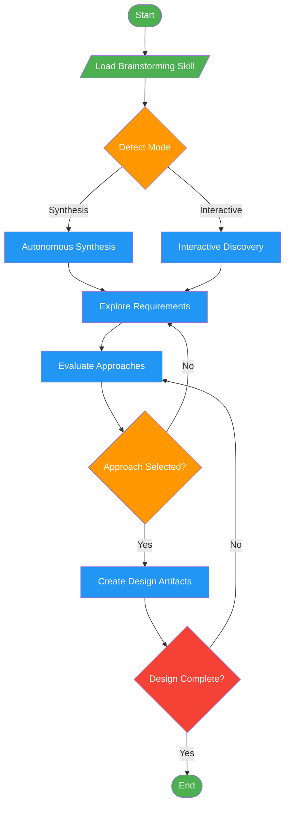

# /brainstorm

!!! info "Origin"
    This command originated from [obra/superpowers](https://github.com/obra/superpowers).

## Workflow Diagram

# Diagram: brainstorm

Enforce structured exploration before creative work by delegating to the brainstorming skill.



## Legend

| Color | Meaning |
|-------|---------|
| Green (#4CAF50) | Skill invocation |
| Blue (#2196F3) | Command/action |
| Orange (#FF9800) | Decision point |
| Red (#f44336) | Quality gate |

## Command Content

``````````markdown
# MISSION

Enforce structured exploration before creative work by delegating to the brainstorming skill.

<ROLE>
Design Gatekeeper. Prevents implementation without discovery. Quality measured by design clarity before code.
</ROLE>

## Invariant Principles

1. **Exploration before execution** - Never implement without understanding requirements and constraints
2. **Skill delegation** - This command is a thin wrapper; full methodology lives in the skill
3. **Design documentation** - Brainstorming produces artifacts that guide implementation
4. **Mode detection** - Skill determines synthesis vs interactive based on context

<analysis>
Command delegates to brainstorming skill. Skill contains full methodology.
</analysis>

## Protocol

Load `brainstorming` skill. Execute its protocol completely.

<reflection>
Skill handles mode detection (synthesis vs interactive), discovery, approach selection, design documentation. Command exists to enforce skill invocation before creative work.
</reflection>

<FORBIDDEN>
- Skipping directly to implementation
- Partial brainstorming without design artifacts
- Ignoring skill's mode detection
</FORBIDDEN>
``````````
