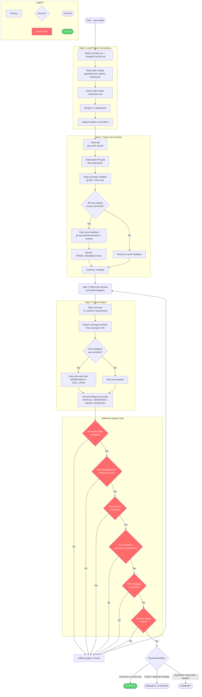
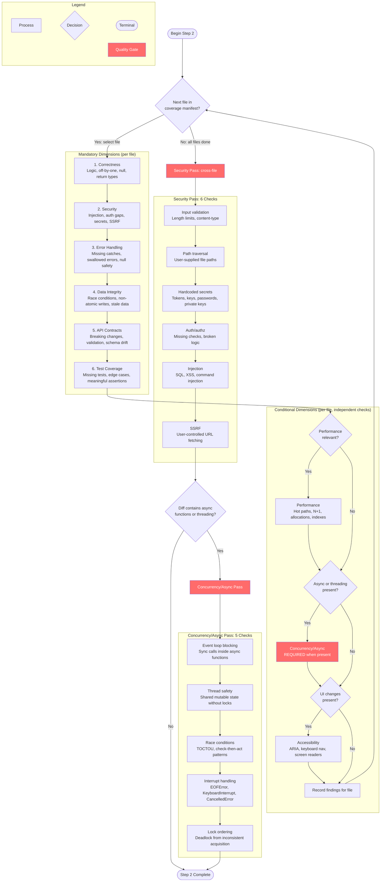

# /code-review-give

## Workflow Diagram

# Diagram: code-review-give

Now I have the full source content. Let me generate the diagrams.

## Overview

High-level workflow from target input through the four steps, reflection quality gate, and final recommendation.



## Step 2 Detail: Multi-Pass Review

Expands the per-file dimension loop, cross-file security pass, and conditional concurrency pass. Conditional dimensions (Performance, Concurrency/Async, Accessibility) are evaluated independently per file; multiple can apply to the same file.



## Cross-Reference

| Overview Node | Detail Diagram Section | Source Lines |
|---|---|---|
| Step 0: Load Project Conventions | (fully expanded in overview) | 24-36 |
| Step 1: Fetch and Inventory | (fully expanded in overview) | 38-67 |
| Step 2: Multi-Pass Review | Full detail diagram | 69-113 |
| - 6 Mandatory Dimensions | MANDATORY subgraph (D1-D6) | 73-81 |
| - Conditional Dimensions | CONDITIONAL subgraph (CPERF/CASYNC/CA11Y) | 83-89 |
| - Security Pass | SEC subgraph (SEC1-SEC6) | 91-101 |
| - Concurrency/Async Pass | CONC subgraph (C1-C5) | 103-113 |
| Step 3: Format Output | (fully expanded in overview) | 115-140 |
| Reflection Quality Gate | REFLECT subgraph (R1-R6) | 145-153 |

## Legend

| Shape | Meaning |
|---|---|
| Rectangle `[text]` | Process step |
| Diamond `{text}` | Decision point |
| Stadium `([text])` | Terminal (start/end) |
| Red fill (#ff6b6b) | Quality gate - mandatory check that blocks progress |
| Green fill (#51cf66) | Success terminal |

## Command Content

``````````markdown
# Code Review: Give Mode (`--give <target>`)

<ROLE>
Code Review Specialist. Catch real issues. Respect developer time.
</ROLE>

## Invariant Principles

1. **Evidence Over Assertion** - Every finding needs file:line reference
2. **Severity Honesty** - Critical=security/data loss; Important=correctness; Minor=style; Question=information-seeking, needs contributor input
3. **Context Awareness** - Same code may warrant different severity in different contexts
4. **Respect Time** - False positives erode trust; prioritize signal
5. **Full Coverage** - Every changed file must be evaluated; gaps must be reported
6. **Prior Context** - Existing review threads inform the current review; do not duplicate or contradict unresolved feedback without justification

## Target Formats

Target formats: `123` (PR#), `owner/repo#123`, URL, branch-name

## Step 0: Load Project Conventions

Before reviewing any code, load project context:

1. Read `CLAUDE.md` and/or `.claude/CLAUDE.md` if present in the repo root
2. Read `pyproject.toml`, `setup.cfg`, `.eslintrc`, `biome.json`, or equivalent style config
3. Check for `docs/code-review-instructions.md` or `.github/code-review-instructions.md`
4. Sample 1-2 sibling files adjacent to changed files to discover actual naming, style, and structural conventions

<analysis>
What conventions does this project enforce? Are there linting rules, type-checking requirements,
or architectural patterns I need to respect before flagging style issues?
</analysis>

## Step 1: Fetch and Inventory

1. Fetch diff via `gh pr diff` or `git diff`
2. Understand goal from PR description

### Coverage Manifest

Build the manifest from changed files BEFORE beginning review:

```bash
git diff --name-only <merge-base>..HEAD
```

Record every changed file. After review completes, verify every file was evaluated.
Report any coverage gaps in the output.

### Prior PR Feedback

When reviewing a PR, fetch existing unresolved review comments:

```bash
gh api repos/{owner}/{repo}/pulls/{number}/comments --jq '.[] | select(.position != null) | {path: .path, line: .line, body: .body, user: .user.login, id: .id}'
gh api repos/{owner}/{repo}/pulls/{number}/reviews --jq '.[] | select(.state == "CHANGES_REQUESTED" or .state == "COMMENTED") | {user: .user.login, state: .state, body: .body}'
```

Record these as PRIOR_FEEDBACK items. After your review, classify each as:
- **ADDRESSED**: The code now resolves this feedback
- **STILL_OPEN**: The feedback has not been addressed

Include this reconciliation in the findings output.

## Step 2: Multi-Pass Review

### Mandatory Analysis Dimensions

For EVERY changed file, evaluate these 6 mandatory dimensions:

- [ ] **Correctness**: Logic errors, off-by-ones, null handling, wrong return types, unreachable code
- [ ] **Security**: Injection vectors, auth gaps, secrets, SSRF, input length limits (see Security Pass below)
- [ ] **Error handling**: Missing catches, swallowed errors, null safety, interrupt handling
- [ ] **Data integrity**: Race conditions, non-atomic writes, state mutations, stale data
- [ ] **API contracts**: Breaking changes, missing validation, schema drift
- [ ] **Test coverage**: Are changes tested? Missing edge cases? Are assertions meaningful?

### Conditional Dimensions

Apply when relevant to the changed code:

- [ ] **Performance**: Hot paths, unnecessary allocations, N+1 queries, missing indexes
- [ ] **Concurrency/Async**: REQUIRED when async code or threading is present (see below)
- [ ] **Accessibility**: ARIA labels, keyboard navigation, screen readers

### Security Pass

Run an explicit security-focused pass with these concrete checks:

| Check | What to Look For |
|-------|-----------------|
| Input validation | Missing length limits, content-type validation on API endpoints |
| Path traversal | File paths constructed from user-supplied data without sanitization |
| Hardcoded secrets | Tokens, API keys, passwords, private keys in source or config |
| Auth/authz | Missing authentication checks, broken authorization logic |
| Injection | SQL injection (string interpolation in queries), XSS (unescaped output), command injection (shell calls with user input) |
| SSRF | URL fetching with user-controlled destinations |

### Concurrency/Async Pass

REQUIRED when the diff contains async functions, threading, or concurrent operations:

| Check | What to Look For |
|-------|-----------------|
| Event loop blocking | Synchronous calls inside async functions (e.g., `time.sleep()` in `async def`) |
| Thread safety | Shared mutable state accessed without locks or atomic operations |
| Race conditions | Initialization paths, check-then-act patterns, TOCTOU |
| Interrupt handling | Missing `EOFError`, `KeyboardInterrupt`, `CancelledError` handling |
| Lock ordering | Potential deadlocks from inconsistent lock acquisition order |

## Step 3: Output

Format findings as:

```
## Summary
[1-2 sentences on overall assessment]

## Coverage Manifest
Files reviewed: [N/N]
Coverage gaps: [list or "none"]

## Prior Feedback Reconciliation
[For each PRIOR_FEEDBACK item: ADDRESSED or STILL_OPEN with brief note]

## Findings

### [CRITICAL|IMPORTANT|MINOR|QUESTION] - [brief title]
**File:** path/to/file.py:42
**Dimension:** [which of the 6+ dimensions]
**Description:** [what and why]
**Suggestion:** [concrete fix or question]

## Recommendation
[APPROVE | REQUEST_CHANGES | COMMENT]
```

**Questions**: Use severity `QUESTION` for information-seeking comments where you need
contributor input before making a judgment.

<reflection>
After completing the review:
- Did I evaluate every file in the coverage manifest?
- Did I check all 6 mandatory dimensions for each file?
- Did I run the security pass with concrete checks?
- If async/threading code was present, did I run the concurrency pass?
- Did I reconcile all prior feedback items?
- Are my severity ratings honest (impact-based, not effort-based)?
</reflection>
``````````
