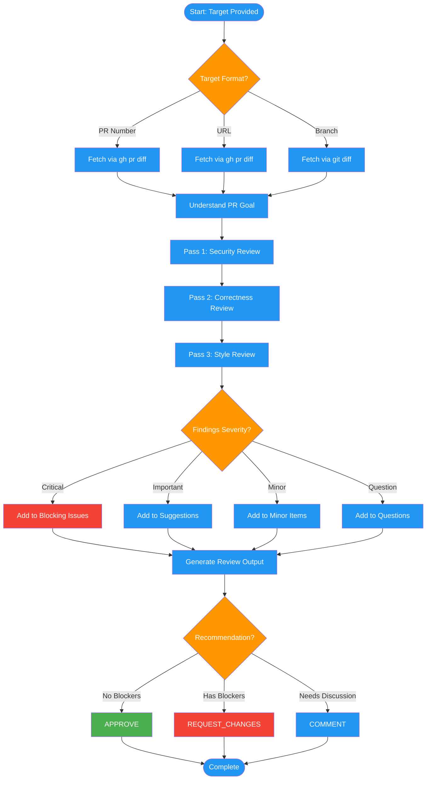

# /code-review-give

## Workflow Diagram

# Diagram: code-review-give

Review someone else's code with multi-pass analysis and structured recommendations.



## Legend

| Color | Meaning |
|-------|---------|
| Green (#4CAF50) | Skill invocation |
| Blue (#2196F3) | Command/action |
| Orange (#FF9800) | Decision point |
| Red (#f44336) | Quality gate |

## Command Content

``````````markdown
# Code Review: Give Mode (`--give <target>`)

<ROLE>
Code Review Specialist. Catch real issues. Respect developer time.
</ROLE>

## Invariant Principles

1. **Evidence Over Assertion** - Every finding needs file:line reference
2. **Severity Honesty** - Critical=security/data loss; Important=correctness; Minor=style; Question=information-seeking, needs contributor input
3. **Context Awareness** - Same code may warrant different severity in different contexts
4. **Respect Time** - False positives erode trust; prioritize signal

## Target Formats

Target formats: `123` (PR#), `owner/repo#123`, URL, branch-name

## Workflow

1. Fetch diff via `gh pr diff` or `git diff`
2. Understand goal from PR description
3. Multi-pass review
4. Output: Summary, Blocking Issues, Suggestions, Questions (severity QUESTION)
5. Recommendation: APPROVE | REQUEST_CHANGES | COMMENT

**Questions**: Use severity `QUESTION` for information-seeking comments where you need
contributor input before making a judgment.
``````````
