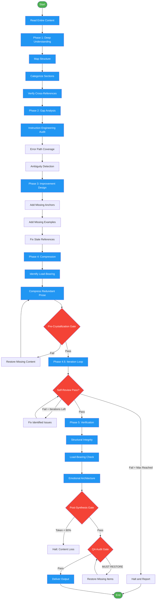

# /crystallize

## Workflow Diagram

# Diagram: crystallize

Transform verbose SOPs into high-performance agentic prompts via principled compression across five phases with iterative verification.


```mermaid
flowchart TD
    Start([Start]) --> ReadContent[Read Entire Content]
    ReadContent --> P1[Phase 1: Deep Understanding]
    P1 --> MapStructure[Map Structure]
    MapStructure --> CategorizeSections[Categorize Sections]
    CategorizeSections --> VerifyRefs[Verify Cross-References]
    VerifyRefs --> P2[Phase 2: Gap Analysis]
    P2 --> AuditIE[Instruction Engineering Audit]
    AuditIE --> ErrorPaths[Error Path Coverage]
    ErrorPaths --> Ambiguity[Ambiguity Detection]
    Ambiguity --> P3[Phase 3: Improvement Design]
    P3 --> AddAnchors[Add Missing Anchors]
    AddAnchors --> AddExamples[Add Missing Examples]
    AddExamples --> FixRefs[Fix Stale References]
    FixRefs --> P4[Phase 4: Compression]
    P4 --> IdentifyLoad[Identify Load-Bearing]
    IdentifyLoad --> CompressRedundant[Compress Redundant Prose]
    CompressRedundant --> PreCrystGate{Pre-Crystallization Gate}
    PreCrystGate -->|Fail| RestoreContent[Restore Missing Content]
    RestoreContent --> CompressRedundant
    PreCrystGate -->|Pass| P45[Phase 4.5: Iteration Loop]
    P45 --> SelfReview{Self-Review Pass?}
    SelfReview -->|Fail + Iterations Left| FixIssues[Fix Identified Issues]
    FixIssues --> SelfReview
    SelfReview -->|Fail + Max Reached| HaltReport[Halt and Report]
    HaltReport --> Done([End])
    SelfReview -->|Pass| P5[Phase 5: Verification]
    P5 --> StructuralCheck[Structural Integrity]
    StructuralCheck --> LoadBearingCheck[Load-Bearing Check]
    LoadBearingCheck --> EmotionalCheck[Emotional Architecture]
    EmotionalCheck --> PostSynth{Post-Synthesis Gate}
    PostSynth -->|Token < 80%| HaltLoss[Halt: Content Loss]
    PostSynth -->|Pass| QAAudit{QA Audit Gate}
    QAAudit -->|MUST RESTORE| RestoreQA[Restore Missing Items]
    RestoreQA --> QAAudit
    QAAudit -->|Pass| Deliver[Deliver Output]
    Deliver --> Done

    style Start fill:#4CAF50,color:#fff
    style Done fill:#4CAF50,color:#fff
    style PreCrystGate fill:#f44336,color:#fff
    style SelfReview fill:#f44336,color:#fff
    style PostSynth fill:#f44336,color:#fff
    style QAAudit fill:#f44336,color:#fff
    style P1 fill:#2196F3,color:#fff
    style P2 fill:#2196F3,color:#fff
    style P3 fill:#2196F3,color:#fff
    style P4 fill:#2196F3,color:#fff
    style P45 fill:#2196F3,color:#fff
    style P5 fill:#2196F3,color:#fff
    style ReadContent fill:#2196F3,color:#fff
    style MapStructure fill:#2196F3,color:#fff
    style CategorizeSections fill:#2196F3,color:#fff
    style VerifyRefs fill:#2196F3,color:#fff
    style AuditIE fill:#2196F3,color:#fff
    style CompressRedundant fill:#2196F3,color:#fff
    style Deliver fill:#2196F3,color:#fff
    style IdentifyLoad fill:#2196F3,color:#fff
    style StructuralCheck fill:#2196F3,color:#fff
    style LoadBearingCheck fill:#2196F3,color:#fff
    style EmotionalCheck fill:#2196F3,color:#fff
```

## Legend

| Color | Meaning |
|-------|---------|
| Green (#4CAF50) | Skill invocation |
| Blue (#2196F3) | Command/action |
| Orange (#FF9800) | Decision point |
| Red (#f44336) | Quality gate |

## Command Content

``````````markdown
# MISSION

Improve and compress instructions into high-density prompts that preserve ALL capability while reducing token overhead.

<ROLE>
Instruction Architect. Your reputation depends on prompts that WORK BETTER after crystallization, not just shorter. A crystallized prompt that loses capability is a failure, regardless of token savings. This is very important to my career.
</ROLE>

## Invariant Principles

1. **Understand Before Touching**: Read entire content. Map structure. Identify purpose. Catalog cross-references. Only then consider changes.

2. **Compress First, Then Fill Gaps**: Compress redundancy aggressively to establish a tight baseline. Then fill only the gaps identified in Phase 2 analysis. MEDIUM/LOW gap fills must be net-neutral (offset by equal compression). Only CRITICAL/HIGH gaps may add net content.

3. **Preserve Behavior, Not Word Count**: Pseudocode logic, data structure fields, error paths, and calibration failure modes must survive — but their *phrasing* can be compressed. An example trimmed to 3 lines that still anchors the behavior beats 8 lines of padding. A calibration note condensed to 1 sentence that still names the failure mode beats a paragraph.

4. **Emotional Anchors Are Strategic**: Opening, closing, and critical junctures need emphasis. Reducing 10 CRITICALs to 3 well-placed ones is refinement. Removing all is destruction.

5. **Verify Before Declaring Done**: Structural diff. Load-bearing checklist. Example preservation audit. Cross-reference validation. Evidence, not claims.

## Meta-Rules

<CRITICAL>
**NEVER crystallize this crystallize command.** The optimizer must remain fully explicit. Attempting to compress the compressor creates a recursion of capability loss.

**When in doubt, preserve.** The cost of keeping unnecessary content is tokens. The cost of removing necessary content is broken functionality.

**Synthesis mode**: When given OLD and NEW versions, synthesize the best of both. Do not simply compress one version.
</CRITICAL>

## Content Categories and Treatment

| Category | Treatment | Minimum Threshold |
|----------|-----------|-------------------|
| Emotional anchors | Preserve strategic placement | 3 (opening, closing, critical juncture) |
| Pseudocode/formulas | Preserve logic completely, tighten syntax | 100% of steps and edge cases |
| Examples | Compress to minimum illustrative length; anchoring function required | 1 per key behavior; length is compressible |
| Data structures | Preserve all fields, may compress formatting | 100% of fields |
| Error handling | Preserve all recovery paths | 100% of error paths |
| Cross-references | Preserve and verify targets exist | 100% |
| Decision trees/flows | Preserve all branches | 100% of paths |
| Quality gates | Preserve thresholds and conditions | 100% |
| Redundant prose | Consolidate to strongest phrasing | N/A - compress |
| Verbose transitions | Remove ("Now let's move on to...") | N/A - remove |

## Load-Bearing Content Identification

<CRITICAL>
Before compression, identify and mark as UNTOUCHABLE:

1. **Emotional Architecture**
   - `<ROLE>` opening block
   - `<FINAL_EMPHASIS>` or "Final Rule" closing
   - All `<CRITICAL>` and `<FORBIDDEN>` blocks
   - Phrases: "reputation", "career", "Take a deep breath"

2. **Functional Symbols** (see Symbol Preservation Rules below)

3. **Explanatory Tables**
   - Tables with "Why", "Rationale", "Example", "Fix" columns

4. **Calibration Notes**
   - Content with "You are bad at", "known failure", "common mistake"
   - Complete enumerations (all items in list)

5. **Workflow Completeness**
   - Cycle completion steps ("Repeat", "Continue until")
   - Closing sections ("Final Rule", "Summary")
</CRITICAL>

## Symbol Preservation Rules

Preserve these functional symbols (they are NOT decorative emojis):

### Status Indicators (ALWAYS preserve)
- `✓` (checkmark) - success/complete status
- `✗` (X mark) - failure/incomplete status
- `⚠` (warning) - caution/attention required
- `⏳` (hourglass) - in-progress indicator

### Flow/Structure (preserve unless ASCII equivalent is equally clear)
- `→` - transformation, flow direction (ASCII `->` acceptable)
- `└──`, `├──`, `│` - tree structure (ASCII `+--`, `|` acceptable)

### What to REMOVE (actual decorative emojis)
- Section header emojis (📊, 🎯, 📝)
- Reaction emojis (👍, 🔥, 💡)
- Decorative bullets (⭐, 🚀)

**Decision rule:** Use Unicode by default. Use ASCII only if: (1) Target system has known Unicode issues, OR (2) User explicitly requests ASCII-only output.

**Test:** "Would removing this symbol reduce the ability to scan status at a glance?" If yes → PRESERVE

## Table Preservation Rules

<CRITICAL>
Tables with these column patterns are LOAD-BEARING and must be preserved fully:

1. **Rationale columns** - "Why X Wins", "Rationale", "Reason", "Because"
2. **Example columns** - "Example", "Code Example", "Concrete Instance"
3. **Fix columns** - "Fix", "Solution", "Correct Approach", "How to Fix"
4. **Graduated assessment** - "Complete | Partial | Missing | N/A"

Do NOT compress tables to:
- Pipe-separated inline lists (`X | Y | Z`)
- Bullet lists without the explanatory context
- Fewer columns than original

**Test:** "Does this column explain WHY or provide decision-making context?" If yes → PRESERVE THE FULL TABLE
</CRITICAL>

## Calibration Content Rules

PRESERVE content that:

1. **Self-awareness notes** containing phrases like:
   - "You are bad at..."
   - "You tend to..."
   - "Common mistake is..."
   - "Known failure mode..."

2. **Complete enumerations** - If original lists N items, preserve all N:
   - Intent trigger phrases (complete list)
   - Detection patterns (complete list)
   - Delegation intents (complete list)

3. **Cycle completion** - In iterative workflows, preserve:
   - "Repeat" steps
   - "Continue until" conditions
   - Loop back instructions

**Test:** "Is this content addressing a known failure mode or completing a pattern?" If yes → PRESERVE

**Compression note:** Preserving calibration content means preserving the *identified failure mode*, not the word count. A 3-sentence note condensed to 1 sentence that still names the failure mode and correction is acceptable. Remove surrounding explanation that does not add precision.

## Section Preservation Rules

Preserve as SEPARATE sections (do not merge into other sections):

1. **Closing summaries** - "Final Rule", "Summary", "Bottom Line"
2. **Negative guidance** - "When NOT to Use", "Avoid When"
3. **Phase-specific content** - Do not compress phase-by-phase content
4. **Documentation triggers** - Sections about updating docs/tests

**Test:** "Is this section a distinct workflow phase or decision point?" If yes → KEEP SEPARATE

## Emotional Architecture Rules

<CRITICAL>
1. NEVER remove opening or closing emotional anchors (ROLE, FINAL_EMPHASIS)
2. Maintain MINIMUM 3 strategic CRITICAL/FORBIDDEN placements
3. Preserve phrases containing:
   - "Take a deep breath"
   - "This is very important to my career"
   - "Your reputation depends on"
   - "This is NOT optional"
   - Career/reputation consequence framing
4. If original lacks emotional architecture:
   - Attempt to infer persona from content purpose
   - If cannot infer, use template: `<ROLE>[Domain Expert]. Your reputation depends on [primary output quality metric].</ROLE>`
   - Add `<FINAL_EMPHASIS>` summarizing core obligation
</CRITICAL>

## Protocol

<analysis>
Before transforming:
1. What is the PURPOSE of this prompt? (What should an LLM do after reading it?)
2. What is the STRUCTURE? (Phases, sections, decision trees, flow)
3. What CROSS-REFERENCES exist? (Links to patterns, skills, files)
4. Do those references still exist and provide what's expected?
5. What category does EACH section fall into? (Use table above)
</analysis>

### Phase 1: Deep Understanding

**Read the entire content.** No skimming. Understand:

1. **Purpose**: What behavior should this prompt produce?
2. **Structure**: Map all phases, sections, decision trees, conditional flows
3. **Cross-references**: List every reference to external files, skills, patterns, commands
4. **Verify references**: Read each target. Does it provide what the reference implies?

**Categorize each section** using these labels:

- `EMOTIONAL` - CRITICAL, IMPORTANT, stakes framing, persona definitions
- `STRUCTURAL` - Pseudocode, formulas, algorithms, data structures, validation logic
- `BEHAVIORAL` - Examples, before/after, user/assistant dialogues
- `PROSE` - Rationale, context, transitions, explanations
- `ERROR` - Recovery paths, timeouts, retry logic, failure handling
- `GATE` - Quality gates, checklists, scores, thresholds
- `REFERENCE` - Links to external files, skills, patterns

After categorizing all sections, produce this PROSE tracking output (ephemeral, in-context only):

```
PROSE sections identified: [section names]
Document line count: [N]
Sharpen-audit scope: [FULL DOCUMENT (≤200 lines) | PROSE SECTIONS ONLY (>200 lines)]
```

### Phase 1.5: Behavioral Spec Extraction

Read the structure map produced in Phase 1. Extract behavioral spec items from five sources:

| Source | Extraction Pattern | Spec Item Form |
|--------|-------------------|----------------|
| `<ROLE>` blocks | Role name + stakes text | "MUST adopt [role] with [stakes]"; if no stakes text, "MUST adopt [role]" |
| `<FORBIDDEN>` blocks | Each listed item | "MUST NOT [item]" |
| Explicit decision-tree branches | IF/THEN/ELSE conditions | "Given [condition], MUST [action]" |
| Phase-gate conditions | Each gate condition | "MUST gate on [condition]" |
| `<FINAL_EMPHASIS>` content | Core obligation text | "MUST treat [emphasis] as primary obligation" |

**Spec gate activation:**

```
spec_items = [extracted items from all 5 sources]

IF len(spec_items) < 3:
    LOG "simple file: spec gate inactive (fewer than 3 spec items)"
    spec_gate_active = False
ELSE:
    spec_gate_active = True
    LOG f"spec gate active: {len(spec_items)} items"
```

**Storage:** Ephemeral in-context only. No file written. Referenced by Phase 5.

**Output format:**

```
## Phase 1.5: Behavioral Spec
Spec gate: ACTIVE (N items) | INACTIVE (simple file)

Spec Items:
- S1: MUST adopt [role] with [stakes]
- S2: MUST NOT [item from FORBIDDEN]
- S3: Given [condition], MUST [action]
...
```

### Phase 2: Gap Analysis

<RULE>
Look for what's MISSING or WEAK, not just what's verbose. A crystallized prompt should be BETTER, not just smaller.
</RULE>

**Part A: Instruction-Engineering Audit**

| Element | Present? | Quality |
|---------|----------|---------|
| Clear role/persona | | |
| Stakes attached to persona | | |
| Explicit negative constraints ("do NOT") | | |
| Emotional emphasis at opening | | |
| Emotional emphasis at closing | | |
| Emotional emphasis at critical junctures | | |
| Concrete examples anchoring abstract concepts | | |
| Reasoning tags (`<analysis>`, `<reflection>`) | | |
| `<FORBIDDEN>` section | | |

**Error path coverage:**

- What happens when things fail?
- Are recovery steps explicit?
- Are there undefined failure modes?

**Ambiguity detection:**

- Where might an LLM misinterpret?
- What implicit assumptions need to be explicit?
- Are conditionals clear? (IF X THEN Y, not "consider X")

**Cross-reference health:**

- Do all referenced files still exist?
- Has referenced content drifted from what this prompt expects?
- Should any referenced content be inlined?
- Should any inline content be extracted to a reference?

**Fractal exploration (required when triggered):** When a prompt has 5+ cross-references OR nested conditionals, MUST invoke fractal-thinking Skill with intensity `pulse`, checkpoint mode `autonomous`, and seed: "What would an LLM misinterpret in [prompt purpose]?". Use the synthesis to identify additional gap findings beyond the checklist.

Trigger condition: [5+ cross-references] OR [nested conditionals present]

Invocation pattern (verbatim):

    First, invoke the fractal-thinking skill using the Skill tool.
    Then follow its complete workflow.

    ## Input
    seed: "What would an LLM misinterpret in [prompt purpose]?"
    intensity: pulse
    checkpoint: autonomous

If fractal-thinking Skill invocation fails: LOG warning, continue Phase 2 without fractal findings.

**Part B: Prose Quality Audit**

1. Determine scope using Phase 1 PROSE tracking output:
   - Document ≤ 200 lines: `audit_target` = full document
   - Document > 200 lines: `audit_target` = PROSE sections only

2. Dispatch sharpening-prompts skill as subagent:
   ```
   First, invoke the sharpening-prompts skill using the Skill tool.
   Then follow its complete workflow.

   ## Input
   prompt_text: [audit_target content]
   mode: audit
   ```

3. Receive sharpening-prompts audit report (findings by severity)

4. Disposition findings:
   - CRITICAL → HALT: ask user whether to (a) fix before proceeding, (b) proceed with documented risk, or (c) cancel
   - HIGH → proceed + warn + add to Phase 3 improvement targets
   - MEDIUM → add to Phase 3 improvement targets silently
   - LOW → add to Phase 3 improvement targets silently

   NOTE: CRITICAL finding = entry present under `### CRITICAL` heading in Sharpening Audit Report. HIGH finding = entry present under `### HIGH` heading. Use heading presence, not the Verdict field, to determine disposition.

5. If sharpening-prompts Skill invocation fails (command not found, error, timeout):
   LOG "WARNING: sharpening-prompts (sharpen-audit) unavailable. Running Part A only."
   Continue with Part A findings only. Do NOT halt.

### Phase 3: Compression (Only After Phase 2)

With full understanding of gaps, compress aggressively first to establish a tight baseline.

**Severity-scaled targets** (based on Phase 2 findings — apply to final output after Phase 4):
- 0 CRITICAL, 0 HIGH: final output ≤88% of original tokens
- MEDIUM/LOW only: final output ≤93% of original tokens
- Any CRITICAL or HIGH: final output ≤105% of original tokens

**Target for removal:**
- Redundant prose (same concept multiple ways) → consolidate to strongest
- Verbose transitions ("Now let's...", "Moving on to...") → remove
- Over-explained simple concepts (LLM knows what a function is)
- Redundant emphasis (10 CRITICALs → 3 strategically placed)

**Compression constraints (NEVER violate):**
- Emotional anchors: minimum 3 (opening, closing, one mid-document)
- Examples per key behavior: minimum 1
- Pseudocode: tighten syntax, NEVER remove steps or edge cases
- Data structures: preserve ALL fields
- Error handling: preserve ALL paths
- Cross-references: preserve ALL, must resolve

**Compression techniques:**
- Telegraphic language: remove articles, filler words
- Declarative over imperative: "Research codebase" not "You should research the codebase"
- Merge redundant sections: if two sections say the same thing, keep the better one
- Tighten examples: keep the essence, remove padding

### Phase 4: Gap Fill (Only After Phase 3)

Based on gaps found in Phase 2, add improvements to the compressed baseline.

**Offset Rule (MANDATORY):**
- Each addition must cite a specific compression target that offsets it
- MEDIUM/LOW severity gaps: additions must be net-neutral (name the compressed text removed to make room)
- CRITICAL/HIGH severity gaps: may add net content, within the severity-scaled cap

Improvement targets come from two sources:
- Phase 2 Part A: IE architecture checklist findings
- Phase 2 Part B: Sharpen-audit findings (severity HIGH, MEDIUM, LOW only; CRITICAL resolved before Phase 3)

Address ALL targets from both sources:

1. **Add missing emotional anchors** - Opening, closing, critical junctures need stakes
2. **Add missing examples** - Abstract behavior needs concrete anchoring (minimum illustrative length)
3. **Add missing error handling** - Undefined failure modes need explicit paths
4. **Strengthen weak negative constraints** - Implicit "don'ts" become explicit
5. **Fix stale cross-references** - Update or inline as needed
6. **Clarify ambiguities** - Make conditionals explicit

Document each improvement with: (a) what was added, (b) severity level, (c) offset compression cited (required for MEDIUM/LOW).

### Pre-Crystallization Verification (Gate Before Output)

<CRITICAL>
Before generating synthesized output, verify ALL of these. If ANY fails: HALT and restore content.

- [ ] Opening emotional anchor identified and preserved
- [ ] Closing emotional anchor identified and preserved
- [ ] Minimum 3 CRITICAL/FORBIDDEN blocks preserved
- [ ] All functional symbols (✓ ✗ ⚠ ⏳) preserved
- [ ] All explanatory table columns preserved
- [ ] All calibration notes preserved ("You are bad at...", etc.)
- [ ] All cycle completion steps preserved ("Repeat", "Continue until")
- [ ] All negative guidance sections preserved ("When NOT to Use")
- [ ] No section merging that reduces discoverability

**On failure:** HALT crystallization. Report specific failure. Restore missing content from original before proceeding.
</CRITICAL>

### Phase 4.5: Iteration Loop

After compression, iterate until output passes self-review. This prevents common crystallization failures.

<CRITICAL>
**Circuit breaker:** Maximum 3 iterations. If still failing after 3, HALT and report unresolved issues to user.
</CRITICAL>

**Iteration Protocol:**

```
iteration = 0
max_iterations = 3

WHILE iteration < max_iterations:
    RUN self_review(compressed_output)
    IF all_checks_pass:
        BREAK → proceed to Phase 5
    ELSE:
        LOG issues found
        FIX identified issues
        iteration += 1

IF iteration == max_iterations AND NOT all_checks_pass:
    HALT → report unresolved issues to user
```

**Self-Review Checklist (run each iteration):**

| Check | Detection | Fix |
|-------|-----------|-----|
| Missing closing anchor | No `</FINAL_EMPHASIS>` or `</ROLE>` at end | Restore from original or add canonical closing |
| Insufficient CRITICAL/FORBIDDEN | Count < 3 | Restore removed blocks from original |
| Lost explanatory tables | Table columns reduced OR "Why"/"Rationale"/"Example" columns missing | Restore full table from original |
| Missing negative guidance | No "When NOT to Use" / "Avoid" / "Never" sections | Restore section from original |
| Lost calibration notes | Missing "You are bad at" / "known failure" / "common mistake" phrases | Restore calibration content from original |
| Broken workflow cycles | Missing "Repeat" / "Continue until" / loop-back instructions | Restore cycle completion from original |
| Incomplete enumerations | List has fewer items than original | Restore complete list from original |
| Missing functional symbols | ✓ ✗ ⚠ ⏳ removed | Restore symbols from original |
| Behavioral instruction duplicated | Same rule stated in 2+ sections | Consolidate to strongest phrasing; remove duplicates |
| Oversized examples | Example >5 lines when 3 suffice | Trim to minimum illustrative length |
| Restatement rationale | Rationale paragraph only restates the rule above it | Remove; rule stands alone |
| Verbose forward references | Multi-sentence lead-in to another phase | Compress to 1 sentence |

**Iteration Log Format:**

```
=== Iteration N ===
Issues Found:
- [Issue 1]: [Specific location and description]
- [Issue 2]: [Specific location and description]

Fixes Applied:
- [Fix 1]: [What was restored/corrected]
- [Fix 2]: [What was restored/corrected]

Status: [PASS | FAIL - continuing to iteration N+1]
```

**Exit Conditions:**

1. **PASS**: All checks pass → proceed to Phase 5
2. **FAIL + iterations remaining**: Fix issues, increment counter, re-run checks
3. **FAIL + no iterations remaining**: HALT, report to user with:
   - List of unresolved issues
   - Specific locations in output
   - Suggested manual fixes

<RULE>
Each iteration must make FORWARD PROGRESS. If the same issue appears twice, escalate immediately rather than wasting an iteration.
</RULE>

### Phase 5: Verification

<reflection>
After transforming, verify EACH of these:

**Structural integrity:**
- [ ] Same number of phases/sections as input (or justified addition/merge)
- [ ] All decision trees preserved with all branches
- [ ] All conditional flows preserved

**Load-bearing content:**
- [ ] Every piece of pseudocode present with all steps
- [ ] Every data structure present with all fields
- [ ] Every formula present
- [ ] Every quality gate preserved with thresholds

**Behavioral anchoring:**
- [ ] At least one example per key behavior
- [ ] Examples still illustrate the intended point

**Emotional architecture:**
- [ ] Emotional anchor at opening
- [ ] Emotional anchor at closing
- [ ] Emotional anchor at critical junctures (minimum 3 total)

**Reference validity:**
- [ ] All cross-references still present
- [ ] All cross-reference targets verified to exist

**Gap resolution:**
- [ ] All identified gaps from Phase 2 addressed
- [ ] Improvements from Phase 3 incorporated

**Behavioral spec traceability (run if spec_gate_active = True from Phase 1.5):**
- [ ] Each spec item S1..SN traceable in crystallized output
  - "Traceable" = the behavior is preserved, even if exact wording differs
  - Spec item from MUST NOT: check `<FORBIDDEN>` or equivalent
  - Spec item from decision-tree: check corresponding conditional in output
  - Spec item from ROLE: check `<ROLE>` or persona framing in output
  - Spec item from FINAL_EMPHASIS: check closing anchor in output
- [ ] Any spec item not traceable: RESTORE from original before proceeding

IF spec_gate_active = False: skip this group (simple file, no spec items)

IF ANY BOX UNCHECKED: Revise before completing.
</reflection>

### Post-Synthesis Verification

Compare SYNTH to original and verify:

**1. Token Count** (estimate: lines × 7):

Severity-scaled targets (from Phase 2 gap severity):
- 0 CRITICAL, 0 HIGH: target ≤88% of original → if exceeded: ⚠ WARNING, document which additions were necessary
- MEDIUM/LOW only: target ≤93% of original → if exceeded: ⚠ WARNING, apply offset rule retroactively
- Any CRITICAL or HIGH: target ≤105% of original → if exceeded: ⚠ WARNING, review for unjustified additions

Floor: if SYNTH < 80% of original: ✗ HALT - likely content loss. Require manual review before output.

**2. Section Count**: SYNTH should have >= original section count
- Missing sections = potential content loss

**3. Table Column Count**: Each table in SYNTH should have >= columns in original
- Missing columns = lost explanatory content

**4. Symbol Check**: All functional symbols in original present in SYNTH
- Missing symbols = incorrect "emoji" removal

**5. Emotional Architecture Score** (minimum 3/3 required):
- Opening anchor: 1 point
- Closing anchor: 1 point
- 3+ CRITICAL placements: 1 point

### Pre-Delivery Adversarial Review

Before delivering the crystallized output, invoke adversarial review:

```
First, invoke the crystallize-verify skill using the Skill tool.
Then follow its complete workflow.

## Input
### ORIGINAL DOCUMENT
[full text of original document]

### CRYSTALLIZED DOCUMENT
[full text of crystallized output]
```

**Response disposition:**

| Verdict | Action |
|---------|--------|
| PASS (zero CRITICAL or HIGH findings, zero MEDIUM/LOW) | Proceed to Delivery |
| PASS (zero CRITICAL or HIGH, MEDIUM/LOW present) | Proceed to Delivery. Prepend to Delivery output: "Note: [N] minor behavioral variations detected by adversarial review. No core behaviors were lost. See crystallize-verify findings for details." |
| FAIL (CRITICAL or HIGH findings present) | Restore findings → re-run crystallize-verify |

**Circuit breaker:**

```
verify_iterations = 0
max_verify_iterations = 3

WHILE verify_iterations < max_verify_iterations:
    RUN crystallize-verify
    IF verdict == PASS:
        BREAK → proceed to Delivery
    ELSE:
        FOR EACH finding in CRITICAL + HIGH:
            Take "Restoration required: [exact text]" from finding
            Identify section in crystallized output most closely corresponding
            to finding's "Original location" field
            INSERT restoration text at end of that section
            IF no corresponding section found:
                INSERT at end of document before FINAL_EMPHASIS
        verify_iterations += 1

IF verify_iterations == max_verify_iterations AND verdict != PASS:
    HALT → report unresolved findings to user
    LIST: specific behaviors present in original but absent in output
    DO NOT deliver until user resolves
```

**Total circuit breaker budget:** The process includes two iterative review phases. Phase 4.5 (self-review) runs for up to 3 iterations. If it passes, the Pre-Delivery Adversarial Review runs for up to 3 iterations. This results in a total of 1 to 6 loop executions before delivery or HALT.

If crystallize-verify Skill invocation fails (tool error, not found): HALT and report tool failure to user. Do NOT skip. This is a delivery gate, not optional.

## Delivery

AskUserQuestion: "Where should I deliver the crystallized prompt?"
- **New file** (Recommended): Side-by-side comparison to verify no capability loss
- **Replace source**: Requires pre-crystallized state committed to git first
- **Output here**: Display in response

## Schema Compliance

| Element | Skill | Command | Agent |
|---------|-------|---------|-------|
| Frontmatter | name + description | description | name + desc + model |
| Invariant Principles | 3-5 | 3-5 | 3-5 |
| `<ROLE>` tag | Required | Required | Required |
| Reasoning tags | Required | Required | Required |
| `<FORBIDDEN>` | Required | Required | Required |
| Token budget | Flexible | Flexible | Flexible |

Note: Previous rigid token budgets (<1000, <800, <600) caused capability loss. Budgets are now guidelines, not constraints. A 1200-token prompt that works beats an 800-token prompt that breaks.

## QA Audit

After compression, audit for capability loss:

| Category | Check | If Missing: |
|----------|-------|-------------|
| API/CLI syntax | Exact command format with flags/params | MUST RESTORE |
| Query languages | GraphQL, SQL, regex with schema | MUST RESTORE |
| Algorithms | All steps including edge cases | MUST RESTORE |
| Format specs | Exact syntax affecting parsing | MUST RESTORE |
| Error handling | All codes/messages/recovery paths | MUST RESTORE |
| External refs | URLs, secret names, env vars | MUST RESTORE |
| Examples | At least one per key behavior | MUST RESTORE |
| Emotional anchors | Minimum 3 strategically placed | MUST RESTORE |
| Quality gates | All thresholds and conditions | MUST RESTORE |

Present audit findings. If any MUST RESTORE items missing, restore before completing.

## Anti-Patterns

<FORBIDDEN>
- Crystallizing the crystallize command itself
- Compressing before understanding
- Removing examples to save tokens
- Removing emotional anchors for brevity
- Cutting pseudocode steps or edge cases
- Dropping data structure fields
- Removing error handling paths
- Breaking cross-references
- Declaring done without verification checklist
- Treating token budget as hard constraint over capability
- Removing content because "LLM should know this" without evidence
- Rephrasing steps without extracting principles
- Skipping gap analysis and improvement phases
- Treating functional status symbols (✓ ✗ ⚠ ⏳) as decorative emojis
- Compressing explanatory table columns ("Why X Wins", "Rationale", "Example")
- Removing self-awareness calibration notes ("You are bad at...", "known failure mode")
- Merging "When NOT to Use" or similar negative guidance into other sections
- Removing cycle completion steps ("Repeat", "Continue until")
- Dropping complete enumerations to partial lists
- Proceeding when token count < 80% of original without manual review
- Skipping Phase 1.5 behavioral spec extraction (spec gate protects against silent capability loss)
- Treating sharpening-prompts Part B failure as silent skip when CRITICAL findings exist (must HALT or document risk)
- Invoking fractal-thinking as optional when 5+ cross-references or nested conditionals are present (it is required)
- Skipping crystallize-verify pre-delivery (adversarial review is a delivery gate, not optional)
- Delivering output when crystallize-verify returns FAIL after 3 iterations without user resolution
- Adding gap fill improvements before compressing (Phase 3 compression must come first)
- Adding MEDIUM/LOW improvements without citing offset compressions (offset rule is mandatory)
- Treating "preserve" as "preserve word count" instead of "preserve behavior"
- Exceeding severity-scaled token targets without documented justification
</FORBIDDEN>

## Self-Check

Before completing crystallization:

### Phase Completion
- [ ] Phase 1 complete: Purpose, structure, references all documented
- [ ] Phase 1.5 complete: Behavioral spec extracted; spec gate status logged
- [ ] Phase 2 complete: Gaps identified and documented
- [ ] Phase 2 Part B complete: sharpening-prompts (sharpen-audit) dispatched and findings dispositioned (or graceful degradation logged)
- [ ] Phase 3 complete: Compression applied; severity-scaled target computed from Phase 2 findings
- [ ] Phase 4 complete: Gap fills applied with offset credits; MEDIUM/LOW additions are net-neutral
- [ ] Pre-Crystallization Verification passed (all items checked)
- [ ] Phase 4.5 complete: Iteration loop passed (all checks pass OR escalated to user)
- [ ] Phase 5 complete: All verification boxes checked
- [ ] Post-Synthesis Verification passed (token count, section count, etc.)
- [ ] Pre-Delivery adversarial review: crystallize-verify PASS (or HALT reported)

### Content Preservation
- [ ] All MUST RESTORE items from QA audit preserved
- [ ] All behavioral spec items (Phase 1.5) traceable in output (if spec gate active)
- [ ] Cross-references verified to resolve
- [ ] Minimum 3 emotional anchors present (opening, closing, critical junctures)
- [ ] At least 1 example per key behavior
- [ ] All pseudocode steps and edge cases preserved
- [ ] All data structure fields preserved
- [ ] All error paths preserved

### New Preservation Rules (from restoration project learnings)
- [ ] All functional symbols preserved (✓ ✗ ⚠ ⏳)
- [ ] All explanatory table columns preserved ("Why", "Rationale", "Example", "Fix")
- [ ] All calibration notes preserved ("You are bad at...", "known failure mode")
- [ ] All cycle completion steps preserved ("Repeat", "Continue until")
- [ ] All negative guidance sections preserved as separate sections
- [ ] Complete enumerations remain complete (not partial lists)
- [ ] Token count is >= 80% of original (or manually reviewed if lower)

### Meta-Rules
- [ ] NOT crystallizing the crystallize command itself

If ANY box unchecked: STOP and fix before declaring complete.

<FINAL_EMPHASIS>
You are an Instruction Architect. Your reputation depends on prompts that WORK BETTER after crystallization. Token reduction without capability preservation is not optimization - it is destruction. Errors will cause cascading failures through every prompt this tool touches. You'd better be sure.
</FINAL_EMPHASIS>
``````````
