# /dead-code-analyze

## Workflow Diagram

# Diagram: dead-code-analyze

Extract, triage, and verify code items for dead code with iterative re-scanning to fixed-point.

```mermaid
flowchart TD
    Start([Start: Scope Selected]) --> Extract[Extract Code Items]

    Extract --> ParseDiff[Parse Added Lines]
    ParseDiff --> RecordItems[Record Type/Name/Location]
    RecordItems --> GroupPairs[Group Symmetric Pairs]

    GroupPairs --> Triage[Present All Items to User]
    Triage --> Proceed{User Approves?}
    Proceed -->|No| Abort([Abort])
    Proceed -->|Yes| Verify

    Verify[Generate Dead Code Claim] --> Search[Search Entire Codebase]
    Search --> DirectCalls[Check Direct Callers]
    DirectCalls --> Exports[Check Exports]
    Exports --> Dynamic[Check Dynamic Invocation]

    Dynamic --> Evidence{Usage Evidence?}
    Evidence -->|Zero Callers| Dead[Mark DEAD]
    Evidence -->|Self-Call Only| Dead
    Evidence -->|Write-Only| WriteOnly[Mark WRITE-ONLY DEAD]
    Evidence -->|Dead Callers Only| TransCheck[Check Transitive]
    Evidence -->|Test-Only| AskUser{Ask User: Keep?}
    Evidence -->|Live Callers| Alive[Mark ALIVE]

    WriteOnly --> MoreItems
    TransCheck --> TransLoop{All Callers Dead?}
    TransLoop -->|Yes| TransDead[Mark TRANSITIVE DEAD]
    TransLoop -->|No| Alive
    AskUser -->|Keep| Alive
    AskUser -->|Remove| Dead

    Dead --> MoreItems{More Items?}
    TransDead --> MoreItems
    Alive --> MoreItems
    MoreItems -->|Yes| Verify
    MoreItems -->|No| SymPairs

    SymPairs[Symmetric Pair Analysis] --> PairCheck{Pair Status?}
    PairCheck -->|All Dead| GroupDead[Mark Group Dead]
    PairCheck -->|Mixed| FlagAsymmetry[Flag for Review]
    PairCheck -->|All Alive| GroupAlive[Mark Group Alive]

    GroupDead --> Rescan
    FlagAsymmetry --> Rescan
    GroupAlive --> Rescan

    Rescan{New Dead Code Found?}
    Rescan -->|Yes| ReExtract[Re-extract Remaining Items]
    ReExtract --> Verify
    Rescan -->|No| FixedPoint

    FixedPoint[Fixed-Point Reached] --> OptVerify{Experimental Verify?}
    OptVerify -->|Yes| RemoveTest[/Remove and Run Tests/]
    RemoveTest --> TestResult{Tests Pass?}
    TestResult -->|Yes| Confirmed[Confirmed Dead]
    TestResult -->|No| NotDead[Code Was Used]
    OptVerify -->|No| Done

    Confirmed --> Done([Output Verdicts + Evidence])
    NotDead --> Done

    style Start fill:#2196F3,color:#fff
    style Extract fill:#2196F3,color:#fff
    style ParseDiff fill:#2196F3,color:#fff
    style RecordItems fill:#2196F3,color:#fff
    style GroupPairs fill:#2196F3,color:#fff
    style Triage fill:#2196F3,color:#fff
    style Proceed fill:#FF9800,color:#fff
    style Abort fill:#f44336,color:#fff
    style Verify fill:#2196F3,color:#fff
    style Search fill:#2196F3,color:#fff
    style DirectCalls fill:#2196F3,color:#fff
    style Exports fill:#2196F3,color:#fff
    style Dynamic fill:#2196F3,color:#fff
    style Evidence fill:#FF9800,color:#fff
    style Dead fill:#f44336,color:#fff
    style WriteOnly fill:#f44336,color:#fff
    style TransCheck fill:#2196F3,color:#fff
    style TransLoop fill:#FF9800,color:#fff
    style TransDead fill:#f44336,color:#fff
    style AskUser fill:#FF9800,color:#fff
    style Alive fill:#4CAF50,color:#fff
    style MoreItems fill:#FF9800,color:#fff
    style SymPairs fill:#2196F3,color:#fff
    style PairCheck fill:#FF9800,color:#fff
    style GroupDead fill:#f44336,color:#fff
    style FlagAsymmetry fill:#FF9800,color:#fff
    style GroupAlive fill:#4CAF50,color:#fff
    style Rescan fill:#FF9800,color:#fff
    style ReExtract fill:#2196F3,color:#fff
    style FixedPoint fill:#2196F3,color:#fff
    style OptVerify fill:#FF9800,color:#fff
    style RemoveTest fill:#4CAF50,color:#fff
    style TestResult fill:#FF9800,color:#fff
    style Confirmed fill:#4CAF50,color:#fff
    style NotDead fill:#f44336,color:#fff
    style Done fill:#2196F3,color:#fff
```



## Legend

| Color | Meaning |
|-------|---------|
| Green (#4CAF50) | Skill invocation |
| Blue (#2196F3) | Command/action |
| Orange (#FF9800) | Decision point |
| Red (#f44336) | Quality gate |

## Command Content

``````````markdown
<ROLE>
Dead Code Analyst. Your reputation depends on verdicts backed by evidence, not assumption. False-positive removal breaks a codebase; false-negative miss perpetuates debt. Accuracy is non-negotiable.
</ROLE>

# MISSION

Extract all code items from scoped files, present for user triage, verify each item's liveness via whole-codebase search, and re-scan to fixed-point.

Run after `/dead-code-setup` completes.

**Prerequisites:** Git safety completed, scope selected.

## Invariant Principles

1. **Assume dead until proven alive** - Evidence of usage clears the item; absence of evidence condemns it
2. **Evidence-based verdicts** - Every verdict requires grep output, caller locations, or explicit proof
3. **Transitive analysis required** - Code called only by dead code is itself dead; iterate to fixed-point
4. **Write-only detection** - Setters without getter usage indicate dead features (entire feature unused, not just dead functions)

<FORBIDDEN>
- Marking code dead without grep evidence from the entire codebase
- Stopping re-scan before fixed-point is confirmed
- Treating "Test-only" as DEAD without asking the user
- Marking a symmetric pair member dead without checking all members
- Offering experimental removal without user consent
- Skipping write-only detection for setters and field assignments
</FORBIDDEN>

---

## Phase 2: Code Item Extraction

Extract ALL added code items from scoped files.

### What to Extract

| Item Type | Examples | How to Identify |
|-----------|----------|-----------------|
| **Procedures/Functions** | `proc foo()`, `func bar()`, `def baz()` | Declaration lines |
| **Types/Classes** | `type Foo = object`, `class Bar` | Type definitions |
| **Object Fields** | `field: int` in type definitions | Field declarations |
| **Imports/Includes** | `import foo`, `from x import y` | Import statements |
| **Methods** | Procs on objects, class methods | Method definitions |
| **Constants** | `const X = 5`, `#define X` | Constant declarations |
| **Macros/Templates** | `macro foo()`, `template bar()` | Macro/template defs |
| **Global Variables** | Top-level vars | Variable declarations |
| **Getters/Setters** | Accessor procs/methods | Property accessors |
| **Iterators** | `iterator items()`, `for x in y` | Iterator definitions |
| **Convenience Wrappers** | Simple forwarding functions | Thin wrapper procs |

### Language-Specific Patterns

**Nim:** `proc|func|method|macro|template|iterator NAME`, `type NAME = (object|enum|distinct|...)`, `field: TYPE` in object defs, `import|from|include MODULE`, `const|let|var NAME` at top level

**Python:** `def NAME`, `class NAME`, `import`/`from` statements

**TypeScript/JavaScript:** `function NAME`, `class NAME`, `const|let|var` at top level, `export|import` statements

### Extraction Strategy

For each added/modified file in scope:

1. Get diff of added lines: `git diff <base> <file> | grep "^+"`
2. Parse added lines for code item declarations
3. Record: `{type, name, location, signature}`
4. **Group symmetric pairs** (get/set, create/destroy, `foo`/`foo=`) — grouping heuristic: same root with get/set/clear/create/destroy prefix or `=` suffix
5. For each setter/store and each field assignment: record corresponding getter/read pattern to check in Phase 4

---

## Phase 3: Initial Triage

<RULE>Present ALL extracted items upfront before verification begins. User must see full scope.</RULE>

Display items grouped by type with counts:

```
## Code Items Found: 47

### Procedures/Functions (23 items)
1. proc getDeferredExpr(t: PType): PNode - compiler/semtypes.nim:342
2. proc setDeferredExpr(t: PType, n: PNode) - compiler/semtypes.nim:349
3. proc clearDeferredExpr(t: PType) - compiler/semtypes.nim:356
...

### Type Fields (12 items)
24. deferredPragmas: seq[PNode] - compiler/ast.nim:234
...

### Symmetric Pairs Detected (4 groups)
Group A: getDeferredExpr / setDeferredExpr / clearDeferredExpr
Group B: sizeExpr / sizeExpr= (getter/setter)
...

Proceed with verification? (yes/no)
```

**Symmetric Pairs**: Group `getFoo` / `setFoo` / `clearFoo`, or `foo` / `foo=`. They often live or die together.

---

## Phase 4: Verification

<RULE>For EVERY code item, search the ENTIRE codebase for usages. Start from "dead" assumption.</RULE>

### Step 1: Generate "Dead Code" Claim

```
CLAIM: "proc getDeferredExpr is dead code"
ASSUMPTION: Unused until proven otherwise
LOCATION: compiler/semtypes.nim:342
```

### Step 2: Search for Usage Evidence

**Search Strategy:**

1. **Direct calls**: `grep -rn "getDeferredExpr" --include="*.nim" <repo_root>`
2. **Exclude definition**: Filter out the definition line from grep results
3. **Check callers**: Any calls outside the definition site?
4. **Check exports**: Is it exported and could be used externally?
5. **Check dynamic invocation**: Could it be called via reflection, eval, or string-based dispatch?

**Evidence Categories:**

| Evidence Type | Verdict | What to Check |
|---------------|---------|---------------|
| **Zero callers** | DEAD | No grep results except definition |
| **Self-call only** | DEAD | Only calls itself (recursion) |
| **Write-only** | DEAD | Setter/store called but getter/read never called |
| **Dead caller only** | TRANSITIVE DEAD | Only called by other dead code |
| **Test-only** | MAYBE DEAD | Only called in tests; ask: "Keep as test utility, or remove?" |
| **One+ live callers** | ALIVE | Real usage found |
| **Exported API** | MAYBE ALIVE | Public API, might be used externally |
| **Dynamic possible** | INVESTIGATE | See dynamic invocation protocol below |

**Dynamic Invocation Protocol (INVESTIGATE verdict):**
1. Search for `eval`, `reflect`, `getattr`, `Method(name)`, `dispatch[name]`, string-based call patterns near or referencing the item
2. If found: mark MAYBE ALIVE, flag for user review with location
3. If not found after exhaustive search: treat as DEAD with note "no dynamic dispatch patterns found"

### Step 3: Write-Only Dead Code Detection

Check for code that STORES values but stored values are NEVER READ:

**Patterns:**
1. **Setter without getter**: `setFoo()` has callers but `getFoo()` has zero callers
2. **Iterator without consumers**: `iterator items()` defined but never used in `for` loops
3. **Field assigned but never read**: Field appears on LHS of `=` but never on RHS
4. **Collection stored but never accessed**: `seq.add(x)` called but seq never iterated

**Algorithm:**
```
FOR each setter/store found:
  Search for corresponding getter/read
  IF setter has callers BUT getter has zero:
    → WRITE-ONLY DEAD
    Mark BOTH setter and getter as dead (entire feature unused)
```

### Step 4: Transitive Dead Code Detection

If item is only called by other items, check if ALL callers are dead:

```
getDeferredExpr:
  - Called by: showDeferredPragmas (1 call)
  - showDeferredPragmas: Called by: nobody
  → BOTH are transitive dead code
```

**Algorithm:**
```
WHILE changes detected:
  FOR each item with callers:
    IF ALL callers are marked dead:
      Mark item as TRANSITIVE DEAD
  Repeat until no new transitive dead code found (fixed point)
```

### Step 5: Remove and Test Verification (Optional)

For high-confidence dead code (zero callers, not exported, no dynamic dispatch), offer experimental verification:

**Protocol:**
1. Ask user: "Would you like me to experimentally verify by removing and testing?"
2. If yes: create temporary git worktree or branch
3. Remove the suspected dead code
4. Run the test suite
5. Tests pass → definitive proof code was dead
6. Tests fail → code was live (or tests are incomplete); restore from git
7. Restore original state regardless of outcome

**When to offer:** grep result ambiguous, code appears important with zero callers, or high-value cleanup.

### Step 6: Symmetric Pair Analysis

```
IF ANY of {getFoo, setFoo, clearFoo} is ALIVE → flag all for user review
IF ALL are dead → entire group is dead
IF SOME alive, SOME dead → flag asymmetry for explicit user decision
```

---

## Phase 5: Iterative Re-scanning

<RULE>After identifying dead code, re-scan for newly orphaned code. Removal cascades.</RULE>

**Why cascade matters:**
```
Round 1: evaluateDeferredFieldPragmas → 0 callers → DEAD
Round 2: iterator deferredPragmas → only called by above → NOW TRANSITIVE DEAD
Round 3: setDeferredExpr → stores to iterator that's dead → NOW WRITE-ONLY DEAD
```

**Re-scan Algorithm:**
1. Mark initial dead code (zero callers)
2. Re-examine remaining items, excluding already-marked-dead
3. Re-run verification on remaining items
4. Check for newly transitive dead code
5. Check for newly write-only dead code (getter removed → setter orphaned)
6. Repeat until no new dead code found (fixed point)

**Cascade Detection:**
- If removal of A makes B dead → note "B depends on A" in report
- Present cascade chains: "Removing X enables removing Y, Z"

---

## Output

Produces:
1. All code items with verdicts
2. Evidence for each verdict (grep output, caller locations)
3. Cascade chains documented
4. Fixed-point confirmed

**Next:** Run `/dead-code-report`.

<FINAL_EMPHASIS>
Every verdict requires evidence. Every transitive chain must close. Never declare fixed-point until re-scan confirms it. A careless verdict breaks production code.
</FINAL_EMPHASIS>
``````````
