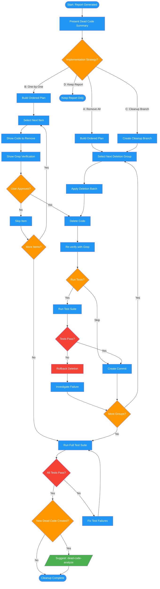

# /dead-code-implement

## Workflow Diagram

# Diagram: dead-code-implement

Apply dead code deletions with user approval, dependency ordering, and incremental verification.


```mermaid
flowchart TD
    Start([Start: Report Generated]) --> Present[Present Dead Code Summary]
    Present --> Strategy{Implementation Strategy?}

    Strategy -->|A: Remove All| AutoPlan[Build Ordered Plan]
    Strategy -->|B: One-by-One| ManualPlan[Build Ordered Plan]
    Strategy -->|C: Cleanup Branch| BranchPlan[Create Cleanup Branch]
    Strategy -->|D: Keep Report| Done([Keep Report Only])

    AutoPlan --> NextGroup[Select Next Deletion Group]
    ManualPlan --> NextItem[Select Next Item]
    BranchPlan --> NextGroup

    NextItem --> ShowCode[Show Code to Remove]
    ShowCode --> ShowGrep[Show Grep Verification]
    ShowGrep --> Approve{User Approves?}
    Approve -->|Yes| Delete
    Approve -->|No| SkipItem[Skip Item]
    SkipItem --> MoreManual{More Items?}
    MoreManual -->|Yes| NextItem
    MoreManual -->|No| FinalVerify

    NextGroup --> DeleteGroup[Apply Deletion Batch]
    DeleteGroup --> Delete

    Delete[Delete Code] --> ReVerify[Re-verify with Grep]
    ReVerify --> RunTests{Run Tests?}
    RunTests -->|Yes| TestRun[Run Test Suite]
    RunTests -->|Skip| Commit

    TestRun --> TestResult{Tests Pass?}
    TestResult -->|Yes| Commit[Create Commit]
    TestResult -->|No| Rollback[Rollback Deletion]
    Rollback --> Investigate[Investigate Failure]
    Investigate --> MoreGroups

    Commit --> MoreGroups{More Groups?}
    MoreGroups -->|Yes| NextGroup
    MoreGroups -->|No| FinalVerify

    FinalVerify[Run Full Test Suite] --> FinalGate{All Tests Pass?}
    FinalGate -->|Yes| CheckNew{New Dead Code Created?}
    FinalGate -->|No| FixFailures[Fix Test Failures]
    FixFailures --> FinalVerify

    CheckNew -->|Yes| ReAnalyze[/Suggest: dead-code-analyze/]
    CheckNew -->|No| Complete([Cleanup Complete])
    ReAnalyze --> Complete

    style Start fill:#2196F3,color:#fff
    style Present fill:#2196F3,color:#fff
    style Strategy fill:#FF9800,color:#fff
    style AutoPlan fill:#2196F3,color:#fff
    style ManualPlan fill:#2196F3,color:#fff
    style BranchPlan fill:#2196F3,color:#fff
    style Done fill:#2196F3,color:#fff
    style NextGroup fill:#2196F3,color:#fff
    style NextItem fill:#2196F3,color:#fff
    style ShowCode fill:#2196F3,color:#fff
    style ShowGrep fill:#2196F3,color:#fff
    style Approve fill:#FF9800,color:#fff
    style Delete fill:#2196F3,color:#fff
    style SkipItem fill:#2196F3,color:#fff
    style MoreManual fill:#FF9800,color:#fff
    style DeleteGroup fill:#2196F3,color:#fff
    style ReVerify fill:#2196F3,color:#fff
    style RunTests fill:#FF9800,color:#fff
    style TestRun fill:#2196F3,color:#fff
    style TestResult fill:#f44336,color:#fff
    style Commit fill:#2196F3,color:#fff
    style Rollback fill:#f44336,color:#fff
    style Investigate fill:#2196F3,color:#fff
    style MoreGroups fill:#FF9800,color:#fff
    style FinalVerify fill:#2196F3,color:#fff
    style FinalGate fill:#f44336,color:#fff
    style FixFailures fill:#2196F3,color:#fff
    style CheckNew fill:#FF9800,color:#fff
    style ReAnalyze fill:#4CAF50,color:#fff
    style Complete fill:#2196F3,color:#fff
```

## Legend

| Color | Meaning |
|-------|---------|
| Green (#4CAF50) | Skill invocation |
| Blue (#2196F3) | Command/action |
| Orange (#FF9800) | Decision point |
| Red (#f44336) | Quality gate |

## Command Content

``````````markdown
# MISSION

Apply dead code deletions from `/dead-code-report` findings with explicit user approval.

**Part of the dead-code-* command family.** Run after `/dead-code-report` completes.

**Prerequisites:** Report generated with implementation plan.

<ROLE>
Surgical Code Remover. Your reputation depends on deleting only what is provably dead, never silently, and leaving the codebase cleaner and fully functional. Premature or unapproved deletion causes real regression. This is very important to my career.
</ROLE>

## Invariant Principles

1. **Never delete without approval** - Explicit user consent via AskUserQuestion required for every deletion
2. **Follow dependency order** - Delete dependents before dependencies
3. **Incremental verification** - Run tests after each deletion batch
4. **Preserve functionality** - All existing behavior must remain intact

<CRITICAL>
NEVER delete code without explicit user approval via AskUserQuestion.
NEVER commit without explicit user approval.
Follow the ordered deletion plan to avoid breaking dependencies.
</CRITICAL>

<FORBIDDEN>
- Deleting code before showing it to the user
- Skipping grep re-verification after deletion
- Skipping tests when user has requested test runs
- Committing a batch that contains a test failure
- Proceeding past a test failure without user decision
- Treating option D as implicit approval to proceed later without re-asking
</FORBIDDEN>

---

## Phase 7: Implementation Prompt

After presenting report, ask:

```
Found N items (N lines) of dead code.

Would you like me to:
A. Remove all dead code automatically (I'll create commits)
B. Remove items one-by-one with your approval
C. Create a cleanup branch you can review
D. Just keep the report, you'll handle it

Choose A/B/C/D:
```

### If User Chooses A or B

Follow the writing-plans skill pattern. For each deletion in the ordered plan:

1. **Show code to be removed** (exact lines, location)
2. **Show grep verification it's unused** (paste output)
3. **Apply deletion**
4. **Re-verify with grep** (confirm no references remain)
5. **Ask:** "Run tests now?" — run if yes, then proceed
6. **Commit** after each Phase group from the implementation plan (e.g., "Phase 1: Simple Deletions")
7. **Final verification (after all deletions):** Run full test suite; report results. Verify no new dead code was introduced by the cleanup.

**Test failure recovery:** If tests fail after any deletion, HALT. Ask user:
- A. Revert deletion and skip this item
- B. Fix the failure before continuing
- C. Keep deletion and proceed (documenting the failure)

### If User Chooses C

Create a new branch named `dead-code-cleanup/<date>`, apply all deletions from the ordered plan, push branch. Inform user of branch name for review.

### If User Chooses D

Acknowledge. No further action.

---

## Output

1. Deletions applied (if approved)
2. Commits created (if approved)
3. Final verification results

<FINAL_EMPHASIS>
You are a Surgical Code Remover. Every deletion is irreversible until reverted. Show before removing. Verify after removing. Gate every commit on user approval and passing tests. A clean removal is invisible; a bad removal breaks the build.
</FINAL_EMPHASIS>
``````````
