# /dead-code-implement

## Workflow Diagram

# Diagram: dead-code-implement

Apply dead code deletions with user approval, dependency ordering, and incremental verification.

```mermaid
flowchart TD
    Start([Start: Report Generated]) --> Present[Present Dead Code Summary]
    Present --> Strategy{Implementation Strategy?}

    Strategy -->|A: Remove All| AutoPlan[Build Ordered Plan]
    Strategy -->|B: One-by-One| ManualPlan[Build Ordered Plan]
    Strategy -->|C: Cleanup Branch| BranchPlan[Create Cleanup Branch]
    Strategy -->|D: Keep Report| Done([Keep Report Only])

    AutoPlan --> NextGroup[Select Next Deletion Group]
    ManualPlan --> NextItem[Select Next Item]
    BranchPlan --> NextGroup

    NextItem --> ShowCode[Show Code to Remove]
    ShowCode --> ShowGrep[Show Grep Verification]
    ShowGrep --> Approve{User Approves?}
    Approve -->|Yes| Delete
    Approve -->|No| SkipItem[Skip Item]
    SkipItem --> MoreManual{More Items?}
    MoreManual -->|Yes| NextItem
    MoreManual -->|No| FinalVerify

    NextGroup --> DeleteGroup[Apply Deletion Batch]
    DeleteGroup --> Delete

    Delete[Delete Code] --> ReVerify[Re-verify with Grep]
    ReVerify --> RunTests{Run Tests?}
    RunTests -->|Yes| TestRun[Run Test Suite]
    RunTests -->|Skip| Commit

    TestRun --> TestResult{Tests Pass?}
    TestResult -->|Yes| Commit[Create Commit]
    TestResult -->|No| Rollback[Rollback Deletion]
    Rollback --> Investigate[Investigate Failure]
    Investigate --> MoreGroups

    Commit --> MoreGroups{More Groups?}
    MoreGroups -->|Yes| NextGroup
    MoreGroups -->|No| FinalVerify

    FinalVerify[Run Full Test Suite] --> FinalGate{All Tests Pass?}
    FinalGate -->|Yes| CheckNew{New Dead Code Created?}
    FinalGate -->|No| FixFailures[Fix Test Failures]
    FixFailures --> FinalVerify

    CheckNew -->|Yes| ReAnalyze[/Suggest: dead-code-analyze/]
    CheckNew -->|No| Complete([Cleanup Complete])
    ReAnalyze --> Complete

    style Start fill:#2196F3,color:#fff
    style Present fill:#2196F3,color:#fff
    style Strategy fill:#FF9800,color:#fff
    style AutoPlan fill:#2196F3,color:#fff
    style ManualPlan fill:#2196F3,color:#fff
    style BranchPlan fill:#2196F3,color:#fff
    style Done fill:#2196F3,color:#fff
    style NextGroup fill:#2196F3,color:#fff
    style NextItem fill:#2196F3,color:#fff
    style ShowCode fill:#2196F3,color:#fff
    style ShowGrep fill:#2196F3,color:#fff
    style Approve fill:#FF9800,color:#fff
    style Delete fill:#2196F3,color:#fff
    style SkipItem fill:#2196F3,color:#fff
    style MoreManual fill:#FF9800,color:#fff
    style DeleteGroup fill:#2196F3,color:#fff
    style ReVerify fill:#2196F3,color:#fff
    style RunTests fill:#FF9800,color:#fff
    style TestRun fill:#2196F3,color:#fff
    style TestResult fill:#f44336,color:#fff
    style Commit fill:#2196F3,color:#fff
    style Rollback fill:#f44336,color:#fff
    style Investigate fill:#2196F3,color:#fff
    style MoreGroups fill:#FF9800,color:#fff
    style FinalVerify fill:#2196F3,color:#fff
    style FinalGate fill:#f44336,color:#fff
    style FixFailures fill:#2196F3,color:#fff
    style CheckNew fill:#FF9800,color:#fff
    style ReAnalyze fill:#4CAF50,color:#fff
    style Complete fill:#2196F3,color:#fff
```



## Legend

| Color | Meaning |
|-------|---------|
| Green (#4CAF50) | Skill invocation |
| Blue (#2196F3) | Command/action |
| Orange (#FF9800) | Decision point |
| Red (#f44336) | Quality gate |

## Command Content

``````````markdown
# MISSION

Apply dead code deletions based on report findings with explicit user approval.

**Part of the dead-code-* command family.** Run after `/dead-code-report` completes.

**Prerequisites:** Report generated with implementation plan.

## Invariant Principles

1. **Never delete without approval** - Every deletion requires explicit user consent via AskUserQuestion
2. **Follow dependency order** - Delete dependents before dependencies to avoid breaking intermediate states
3. **Incremental verification** - Run tests after each deletion batch to catch unexpected breakage early
4. **Preserve functionality** - Deletion removes unused code only; all existing behavior must remain intact

<CRITICAL>
NEVER delete code without explicit user approval via AskUserQuestion.
NEVER commit without explicit user approval.
Follow the ordered deletion plan to avoid breaking dependencies.
</CRITICAL>

---

## Phase 7: Implementation Prompt

After presenting report, ask:

```
Found N dead code items accounting for N lines.

Would you like me to:
A. Remove all dead code automatically (I'll create commits)
B. Remove items one-by-one with your approval
C. Create a cleanup branch you can review
D. Just keep the report, you'll handle it

Choose A/B/C/D:
```

### Implementation Strategy (if user chooses A or B)

Follow the writing-plans skill pattern:

1. **Create implementation plan** (already in report)
2. **For each deletion:**
   - Show the code to be removed
   - Show grep verification it's unused
   - Apply deletion
   - Re-verify with grep
   - Run tests if requested
3. **Create commit** after each logical group
4. **Final verification:** Run full test suite

---

## Deletion Safety

1. Follow the ordered deletion plan (dependencies first)
2. Run tests after each deletion batch
3. Commit incrementally with descriptive messages
4. Verify no new dead code introduced

## Output

This command produces:
1. Deletions applied (if approved)
2. Commits created (if approved)
3. Final verification results

**Workflow Complete.** Dead code analysis and cleanup finished.
``````````
