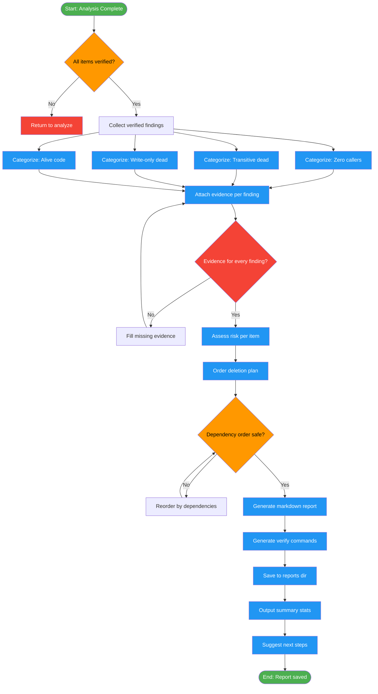

# /dead-code-report

## Workflow Diagram

# Diagram: dead-code-report

Generate a comprehensive dead code report with categorized findings, evidence, risk assessment, and an ordered implementation plan for safe deletion. Runs after `/dead-code-analyze`.



## Legend

| Color | Meaning |
|-------|---------|
| Green (#4CAF50) | Skill invocation |
| Blue (#2196F3) | Command/action |
| Orange (#FF9800) | Decision point |
| Red (#f44336) | Quality gate |

## Command Content

``````````markdown
# /dead-code-report

Generate comprehensive dead code report with findings, evidence, and implementation plan.

**Part of the dead-code-* command family.** Run after `/dead-code-analyze` completes.

**Prerequisites:** Analysis complete, all items verified with verdicts.

## Invariant Principles

1. **Evidence accompanies every finding** - No verdict without grep output, caller locations, or verification proof
2. **Categorize by confidence** - Separate high-confidence (zero callers) from transitive and write-only findings
3. **Ordered deletion plan** - Report must specify safe deletion order respecting dependencies
4. **Risk assessment required** - Each finding includes risk level and rationale for removal

---

## Phase 6: Report Generation

Generate markdown report that serves as both audit and implementation plan.

### Report Template

```markdown
# Dead Code Report

**Generated:** YYYY-MM-DDTHH:MM:SSZ
**Scope:** Branch feature/X (N commits since base)
**Items Analyzed:** N
**Dead Code Found:** N | **Alive:** N | **Transitive Dead:** N

## Summary

| Category | Dead | Alive | Notes |
|----------|------|-------|-------|
| Procedures | N | N | N transitive dead |
| Type Fields | N | N | |
| Imports | N | N | All used |

## Dead Code Findings

### High Confidence (Zero Callers)

#### 1. proc getDeferredExpr - DEAD
- **Location:** compiler/semtypes.nim:342
- **Evidence:** Zero callers in codebase
- **Search:** `grep -rn "getDeferredExpr"` → only definition found
- **Symmetric Pair:** Part of get/set/clear group; set/clear ARE used
- **Verdict:** Asymmetric API, getter never needed
- **Removal Complexity:** Simple - delete proc

### Transitive Dead Code

#### 2. proc showDeferredPragmas - TRANSITIVE DEAD
- **Location:** compiler/debug.nim:123
- **Evidence:** Only called by `dumpTypeInfo`, which is itself dead
- **Call Chain:** showDeferredPragmas ← dumpTypeInfo ← nobody
- **Verdict:** Dead because caller is dead

### Write-Only Dead Code

#### 3. iterator deferredPragmas - WRITE-ONLY DEAD
- **Location:** compiler/ast.nim:456
- **Evidence:** setDeferredExpr called 3 times, but iterator has ZERO callers
- **Write-Only Pattern:** Data is stored but never read
- **Verdict:** Entire deferred pragma storage feature is dead

## Alive Code (Verified Necessary)

#### 1. proc setDeferredExpr - ALIVE
- **Location:** compiler/semtypes.nim:349
- **Evidence:** 3 callers found
- **Callers:**
  - compiler/semtypes.nim:567 (in semGenericType)
  - compiler/pragmas.nim:234 (in processPragmas)
- **Verdict:** Necessary

## Implementation Plan

### Phase 1: Simple Deletions (Low Risk)
1. [ ] Delete `getDeferredExpr` proc (line 342)
2. [ ] Delete `importcExpr` field (line 237)

### Phase 2: Transitive Deletions
3. [ ] Delete `showDeferredPragmas` proc (line 123)

### Verification Commands

After each deletion, verify no references remain:
```bash
grep -rn "getDeferredExpr" compiler/ tests/
# Should return: no results

# Run tests
nim c -r tests/all.nim
# CRITICAL: Actually run this command and paste output
```

## Risk Assessment

| Item | Risk Level | Why |
|------|------------|-----|
| getDeferredExpr | LOW | Zero callers, symmetric pair has alternatives |
| sizeExpr group | MEDIUM | Three related items, verify carefully |

## Next Steps

Would you like me to:
A. Implement all deletions automatically
B. Implement deletions one-by-one with approval
C. Generate a git branch with deletions for review
D. Just keep this report for manual implementation
```

---

## Output

This command produces:
1. Markdown report saved to `~/.local/spellbook/docs/<project-encoded>/reports/`
2. Summary statistics
3. Ordered implementation plan for safe deletion

**Next:** Run `/dead-code-implement` to apply deletions (or review report first).
``````````
