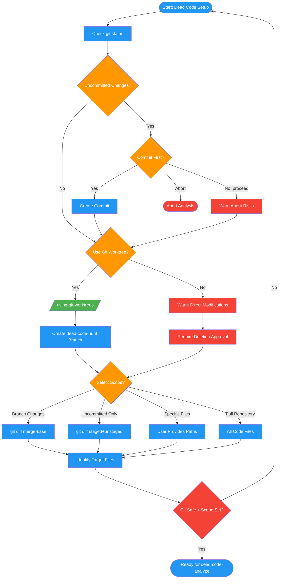

# /dead-code-setup

## Workflow Diagram

# Diagram: dead-code-setup

Git safety checks and scope selection for dead code analysis.



## Legend

| Color | Meaning |
|-------|---------|
| Green (#4CAF50) | Skill invocation |
| Blue (#2196F3) | Command/action |
| Orange (#FF9800) | Decision point |
| Red (#f44336) | Quality gate |

## Command Content

``````````markdown
# MISSION

Prepare for dead code analysis with git safety checks and scope selection.

**Part of the dead-code-* command family.** Run this first before `/dead-code-analyze`.

## Invariant Principles

1. **Git safety is mandatory** - Never analyze with uncommitted changes without explicit user acknowledgment
2. **Worktree isolation recommended** - Experimental deletions should not affect the main branch
3. **Scope before analysis** - User must explicitly select what to analyze before extraction begins
4. **Protect user work** - Dead code verification involves deletion; safety checks prevent data loss

<CRITICAL>
Git safety is MANDATORY. Never analyze with uncommitted changes unless user explicitly acknowledges the risk.
</CRITICAL>

---

## Phase 0: Git Safety (MANDATORY)

<RULE>ALWAYS check git state before any analysis. Dead code verification involves code deletion - protect user's work.</RULE>

### Step 1: Check for uncommitted changes

```bash
git status --porcelain
```

If output non-empty:
- **Present to user**: "You have uncommitted changes. Should I commit them first?"
- **Options**:
  - **Yes** - Ask for commit message and create commit
  - **No, proceed anyway** - Continue but warn about risks
  - **Abort** - Stop the analysis

### Step 2: Worktree decision

<RULE>ALWAYS ask about worktree, regardless of uncommitted changes. Protects main branch from experimental deletions.</RULE>

**Present to user**: "Should I use a git worktree for dead code hunting? (Recommended)"

**Explanation**: "A worktree creates an isolated branch where I can safely delete code to test. Your main branch stays untouched. At the end, you review findings and decide what to apply."

**Options**:
- **Yes, create worktree** (Recommended) - Invoke `using-git-worktrees` skill
- **No, work in current directory** - Warn about risks, require explicit approval for deletions

**If worktree selected**:
1. Create branch: `dead-code-hunt-YYYY-MM-DD-HHMM`
2. All "remove and test" operations happen in worktree
3. Final report generated with findings
4. User decides what to apply to main branch

**If worktree declined**:
- **Warning**: "Working directly in your current directory. Any 'remove and test' verification will modify your working files."
- Require explicit approval before ANY file modifications

### Step 3: Proceed to scope selection

Only after git safety confirmed, proceed to Phase 1.

---

## Phase 1: Scope Selection

<RULE>ALWAYS ask user to select scope before extracting any code items.</RULE>

Use AskUserQuestion with these options:

| Option | Description |
|--------|-------------|
| **A. Branch changes** | All added code since merge-base with main/master/devel |
| **B. Uncommitted only** | Only added code in staged and unstaged changes |
| **C. Specific files** | User provides file paths to analyze |
| **D. Full repository** | All code in repository (use with caution) |

After selection, identify target files:
- **Branch**: `git diff $(git merge-base HEAD main)...HEAD --diff-filter=AM --name-only`
- **Uncommitted**: `git diff --diff-filter=AM --name-only` + `git diff --cached --diff-filter=AM --name-only`
- **Specific**: User-provided paths
- **Full repo**: All code files matching language patterns

### ARH Response Processing

**After presenting scope options, process user response per ARH patterns.**

---

## Output

This command produces:
1. Git status confirmed (clean, committed, or risk acknowledged)
2. Worktree created (if selected)
3. Selected scope type and target files

**Next:** Run `/dead-code-analyze` to extract and verify code items.
``````````
