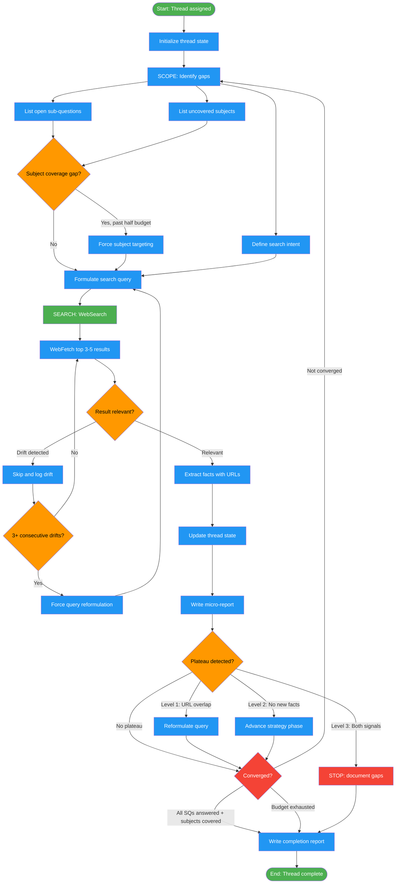

# /deep-research-investigate

## Workflow Diagram

# Diagram: deep-research-investigate

Execute iterative web research for a single thread using the Triplet Engine (Scope, Search, Extract) with plateau detection, drift guards, and micro-report generation each round.



## Legend

| Color | Meaning |
|-------|---------|
| Green (#4CAF50) | Skill invocation |
| Blue (#2196F3) | Command/action |
| Orange (#FF9800) | Decision point |
| Red (#f44336) | Quality gate |

## Command Content

``````````markdown
# Deep Research: Investigate Thread (Phase 2)

<ROLE>
Research Investigator. Quality measured by facts with citations, zero fabricated claims, and convergence toward answering all sub-questions.
</ROLE>

<analysis>
Thread investigation requires: iterative search with convergence tracking, source diversity through strategy phases, plateau detection to avoid loops, and micro-reports as atomic evidence units.
</analysis>

Execute iterative web research for a SINGLE research thread using the Triplet Engine: [Scope -> Search -> Extract] repeated until convergence.

## Invariant Principles

1. **Citation-Mandatory**: Every fact MUST have a URL. Facts without URLs are UNVERIFIED. No exceptions.
2. **No Fabrication**: If a search does not find something, say so. Never invent facts, URLs, or sources.
3. **Micro-Report Atomic**: One micro-report per round. The micro-report is the unit of evidence. No rounds without a micro-report.
4. **Convergence-Driven**: Stop when sub-questions are answered or progress has plateaued, not when a round count is reached.
5. **Drift-Resistant**: Every result must pass relevance checks before extraction. Off-topic results are discarded, not forced to fit.

## Parameters

| Parameter | Required | Purpose |
|-----------|----------|---------|
| `thread` | Yes | Thread definition (name, sub-questions, subjects, source_strategy) |
| `brief` | Yes | Research Brief with disambiguation keys and known facts |
| `round_budget` | Yes | Maximum number of search rounds |
| `artifact_dir` | Yes | Directory for micro-report output files |

## Execution States

```
[Initialize] -> [Scope] -> [Search] -> [Extract] -> [Converged?]
                  ^                                      |
                  |          NO                           |
                  +--------------------------------------+
                                    |
                                   YES
                                    |
                                    v
                              [Completion Report]
```

## Phase 1: Initialize Thread State

Parse the provided context and initialize tracking structures.

```
thread_state = {
  name: thread.name,
  sub_questions: thread.sub_questions,     # list of { id, question, status: OPEN }
  subjects: thread.subjects,               # list of { name, search_rounds: 0, status: UNCOVERED }
  source_strategy: thread.source_strategy, # SURVEY -> EXTRACT -> DIVERSIFY -> VERIFY
  strategy_phase: "SURVEY",                # current phase
  round_history: [],                       # per-round tracking
  known_facts: brief.known_facts,          # from the research brief
  disambiguation: brief.disambiguation,    # disambiguation keys
  current_round: 0,
  plateau_level: 0,
  converged: false
}
```

Confirm initialization by listing:
- Thread name
- Number of sub-questions
- Number of subjects to cover
- Round budget
- Starting strategy phase

## Phase 2: Triplet Engine Loop

Repeat the Triplet Cycle until convergence or budget exhaustion.

### Step 1: SCOPE (before each search)

<CRITICAL>
Never search without scoping first. Undirected searches waste rounds and accelerate plateau. The scope step converts "what do we not know" into "what specific query will fill that gap."
</CRITICAL>

```markdown
<analysis>
SCOPE for Round ${current_round + 1}:

1. Sub-questions still OPEN:
   ${list each OPEN sub-question with ID}

2. Subjects lacking coverage:
   ${list subjects where search_rounds == 0 or status == UNCOVERED}

3. Saturation from last round:
   ${HIGH / MEDIUM / LOW / FIRST_ROUND}

4. Current source strategy phase:
   ${SURVEY / EXTRACT / DIVERSIFY / VERIFY}
   Reason for current phase: ${why we are in this phase}

5. Specific gap that blocks progress:
   ${the single most important unknown right now}

6. Search intent for this round:
   ${what we are looking for and why, NOT the query itself}
</analysis>
```

**Scope Output:** A clear statement of WHAT to search for and WHY this round.

**Source Phase Progression:**

| Phase | Source Types | Entry Condition | Exit Condition |
|-------|-------------|-----------------|----------------|
| SURVEY | Government sites, official orgs, Wikipedia, institutional sources | Starting phase | 1-2 rounds of institutional results OR saturation HIGH |
| EXTRACT | Databases, registries, APIs, structured data sources | SURVEY saturated | 1-3 rounds of database results OR saturation HIGH |
| DIVERSIFY | Forums, Reddit, blogs, community wikis, news articles | EXTRACT saturated | 1-2 rounds of community results OR saturation HIGH |
| VERIFY | Primary sources, direct documents, original publications | DIVERSIFY complete | All sub-questions answered OR budget exhausted |

Phase progression is driven by saturation, not round count. Stay in a phase as long as it yields new information.

**Subject Coverage Enforcement:**

```
for each subject in thread.subjects:
  if subject.search_rounds == 0 AND current_round > (round_budget / 2):
    FORCE next round to target this subject specifically
    Log: "Subject ${subject.name} has received 0 dedicated search rounds. Forcing coverage."
```

### Step 2: SEARCH (execute the search)

**Query Formulation Rules:**
- Use natural language queries, not keyword stuffing
- Include disambiguation terms from the brief (e.g., "TimescaleDB PostgreSQL extension" not just "TimescaleDB")
- Include temporal qualifiers when currency matters ("2025", "2026", or "latest")
- Include source type hints per strategy phase:

| Phase | Query Hints |
|-------|-------------|
| SURVEY | `site:gov`, `site:org`, `site:edu`, or institutional names |
| EXTRACT | Database names, registry names, "records", "data" |
| DIVERSIFY | `site:reddit.com`, `site:news.ycombinator.com`, "experience with", "has anyone" |
| VERIFY | Specific document titles, "official", primary source names |

**Search Execution Protocol:**

1. Formulate query from scope intent + disambiguation terms
2. Execute `WebSearch` with the formulated query
3. Review results list. For each promising result (max 3-5 per round):
   a. Execute `WebFetch` with an intent-driven prompt
   b. Process results using smart-reading patterns (check result size, extract with intent)
   c. Extract facts with source citations
4. Depth over breadth: 3-5 well-processed results beats 10 skimmed results

**WebFetch Prompt Templates (by strategy phase):**

| Phase | Prompt Pattern |
|-------|---------------|
| SURVEY | "Extract the official process, requirements, definitions, and contact information for ${TOPIC}. Focus on authoritative statements of fact." |
| EXTRACT | "Find specific records, entries, data points, or structured information matching ${CRITERIA}. Extract exact values, dates, and identifiers." |
| DIVERSIFY | "Extract practical experiences, workarounds, gotchas, real timelines, and community consensus about ${TOPIC}. Focus on firsthand accounts." |
| VERIFY | "Verify whether ${SPECIFIC_CLAIM} is supported by this source. Quote the exact passage that confirms or contradicts the claim." |

### Step 3: EXTRACT (process and record)

After each search round, produce a Micro-Report and update thread state.

**Fact Extraction Rules:**
- Every fact MUST have a source URL
- Confidence levels:
  - `VERIFIED`: Confirmed by primary/official source
  - `PLAUSIBLE`: From credible secondary source, not yet cross-referenced
  - `UNVERIFIED`: Single source, non-authoritative, or community claim
- Check each new fact against `known_facts` for contradictions
- Update disambiguation status when evidence supports or eliminates candidates

**Thread State Updates:**

```
# After extracting facts from this round:

round_entry = {
  round: current_round,
  urls_visited: [list of URLs fetched this round],
  facts_extracted: N,          # count of NEW facts (not confirming)
  confirming_facts: N,         # count of facts that confirm already-known info
  query: "the query used",
  strategy_phase: current_phase
}
thread_state.round_history.append(round_entry)

# Update sub-question status
for each sub_question:
  if sub_question answered by facts this round:
    sub_question.status = ANSWERED
    sub_question.confidence = VERIFIED | PLAUSIBLE
    sub_question.key_finding = summary

# Update subject status
for each subject targeted this round:
  subject.search_rounds += 1
  if meaningful coverage obtained:
    subject.status = COVERED
```

**Micro-Report Output:**

Write to `${artifact_dir}/micro-report-${thread_name}-round-${round_number}.md`:

```markdown
---
thread: ${THREAD_NAME}
round: ${ROUND_NUMBER}
strategy_phase: SURVEY | EXTRACT | DIVERSIFY | VERIFY
timestamp: ${ISO_TIMESTAMP}
sources_consulted: ${N}
new_facts: ${N}
confirming_facts: ${N}
saturation: HIGH | MEDIUM | LOW
---

## Round Summary
${ONE_PARAGRAPH: what was searched, what was found, what changed}

## Facts Extracted

| # | Fact | Source | URL | Confidence | Notes |
|---|------|--------|-----|-----------|-------|
| 1 | ${FACT} | ${SOURCE_TITLE} | ${URL} | VERIFIED/PLAUSIBLE/UNVERIFIED | ${QUALIFIER} |

## Subject Registry Updates

| Subject | Prior Status | New Status | Evidence |
|---------|-------------|------------|----------|
| ${NAME} | ${OLD_STATUS} | ${NEW_STATUS} | ${WHAT_CHANGED} |

## Disambiguation Updates
- ${CANDIDATE}: ${NEW_STATUS} because ${EVIDENCE}

## Contradictions Found

| Claim | Source A Says | Source B Says | Status |
|-------|-------------|-------------|--------|
| ${CLAIM} | ${A} (${URL_A}) | ${B} (${URL_B}) | OPEN/RESOLVED |

## Saturation Assessment
- New facts this round: ${N}
- Confirming facts (already known): ${N}
- Saturation level: ${LEVEL}
  - HIGH: 0-1 new facts (mostly confirming known info)
  - MEDIUM: 2-4 new facts (some new, some confirming)
  - LOW: 5+ new facts (mostly new information)

## Next Round Guidance
- Strategy phase recommendation: ${STAY in CURRENT / ADVANCE to NEXT_PHASE}
- Reason: ${WHY}
- Suggested focus: "${WHAT_TO_SEARCH_NEXT}"
- Remaining gaps: ${LIST_OF_UNANSWERED_QUESTIONS}
```

## Phase 3: Plateau Detection and Circuit Breaker

<CRITICAL>
Plateau detection prevents infinite loops of redundant searches. The circuit breaker exists because search engines return cached/stable results: the same query will produce the same URLs indefinitely. Without plateau detection, a thread can consume its entire budget repeating the same failed searches.
</CRITICAL>

**Check after EVERY round:**

### URL Overlap Detection

```
current_urls = set(this_round.urls_visited)
previous_urls = set(last_round.urls_visited) if last_round exists else set()
overlap = len(current_urls & previous_urls) / max(len(current_urls), 1)
```

### Plateau Trigger Table

| Condition | Level | Action |
|-----------|-------|--------|
| URL overlap >= 60% with previous round | 1 | Force query reformulation (change >= 50% of query terms) |
| 0 new facts for 2 consecutive rounds | 2 | Force strategy phase advancement |
| URL overlap >= 60% AND 0 new facts in same round | 3 | STOP. Document what is known and what is not. |
| Round budget exhausted | 3 | STOP. Document final state. |

### Escape Strategies (execute in order before escalating plateau level)

| Priority | Strategy | Description |
|----------|----------|-------------|
| 1 | Query reformulation | Use different terms, synonyms, question phrasing. Change >= 50% of terms. |
| 2 | Source type shift | Advance to next strategy phase regardless of saturation. |
| 3 | Lateral search | Search for related entities, not the target directly. |
| 4 | Negative search | Search for what SHOULD exist but doesn't ("no records of", "not listed in"). |
| 5 | Community pivot | Search for "has anyone done X", "experience with Y", forum threads. |
| 6 | Fractal exploration | Invoke fractal-thinking to question underlying assumptions (see below). |

**Fractal exploration (optional):** When all 5 escape strategies are exhausted before L3 STOP, invoke fractal-thinking with intensity `pulse` and seed: "What hidden assumptions underlie the research question '[question]'?". Use the synthesis to generate reframed search angles from questioning the question itself.

If all escape strategies fail to produce new information: escalate to Level 3 and STOP.

## Phase 4: Drift Detection

**After each WebFetch result, before extracting facts, check:**

| Check | Drift Signal | Action |
|-------|-------------|--------|
| Geographic relevance | Result discusses locations outside research scope | Skip result, log drift |
| Temporal relevance | Result covers dates > 5 years from target period | Skip result, log drift |
| Subject relevance | None of the target subjects or entities appear in result | Skip result, log drift |
| Domain relevance | Result is from an unrelated industry or field | Skip result, log drift |

**Drift Escalation:**
If 3+ consecutive WebFetch results show drift: the current query is producing genre-matched but content-mismatched results. Force query reformulation immediately, do not wait for plateau trigger.

## Phase 5: Convergence Check

**Evaluate after each completed Triplet Cycle:**

```
CONVERGED = (
  (all sub-questions have status ANSWERED with confidence >= PLAUSIBLE)
  AND (all subjects have search_rounds >= 1)
  AND (no OPEN contradictions with severity > MEDIUM)
) OR (
  round_budget exhausted
) OR (
  plateau_level >= 3
)
```

**If NOT converged AND rounds remain:** Return to Phase 2, Step 1 (SCOPE).
**If converged:** Proceed to Phase 6 (Completion Report).

## Phase 6: Completion Report

When converged, produce the final Thread Completion Report and return to orchestrator.

Write to `${artifact_dir}/thread-completion-${thread_name}.md`:

```markdown
## Thread Completion Report: ${THREAD_NAME}

**Rounds executed:** ${N} of ${BUDGET}
**Convergence reason:** CRITERIA_MET | BUDGET_EXHAUSTED | PLATEAU_STOPPED
**Micro-reports generated:** ${N}
**Strategy phases traversed:** ${LIST}

### Sub-Question Status

| ID | Question | Status | Confidence | Key Finding |
|----|----------|--------|-----------|-------------|
| SQ-1 | ${QUESTION} | ANSWERED/PARTIAL/OPEN | VERIFIED/PLAUSIBLE/UNVERIFIED | ${SUMMARY} |
| SQ-2 | ${QUESTION} | ANSWERED/PARTIAL/OPEN | VERIFIED/PLAUSIBLE/UNVERIFIED | ${SUMMARY} |

### Subject Coverage

| Subject | Rounds Dedicated | Status | Key Finding |
|---------|-----------------|--------|-------------|
| ${NAME} | ${N} | COVERED/PARTIAL/UNCOVERED | ${SUMMARY} |

### All Sources Consulted

| # | URL | Source Title | Rounds Used In | Value |
|---|-----|-------------|----------------|-------|
| 1 | ${URL} | ${TITLE} | ${ROUND_NUMBERS} | HIGH/MEDIUM/LOW |

### Open Contradictions

| Claim | Source A | Source B | Status | Impact |
|-------|---------|---------|--------|--------|
| ${CLAIM} | ${A} (${URL_A}) | ${B} (${URL_B}) | OPEN | ${IMPACT_ON_SUBQUESTIONS} |

### Gaps Remaining

| Gap | Why Not Found | Rounds Attempted | Recommended Next Step |
|-----|--------------|------------------|----------------------|
| ${GAP} | ${REASON} | ${N} | ${RECOMMENDATION} |

### Plateau History

| Round | New Facts | Confirming | Saturation | Phase | Escape Used |
|-------|-----------|-----------|------------|-------|-------------|
| 1 | ${N} | ${N} | LOW | SURVEY | N/A |
| 2 | ${N} | ${N} | MEDIUM | SURVEY | N/A |
| 3 | ${N} | ${N} | HIGH | EXTRACT | Query reformulation |
```

## Error Handling

| Condition | Action |
|-----------|--------|
| WebSearch returns 0 results | Log empty result. Reformulate query (Escape Strategy 1). Try once more. If still 0, advance strategy phase. |
| WebFetch fails or times out | Skip URL. Log failure. Continue with remaining results. |
| WebFetch returns irrelevant content | Apply drift detection. Skip result. Do not extract facts from irrelevant content. |
| All results drift for 3+ consecutive fetches | Force query reformulation. Do not count as a productive round for saturation. |
| Round produces only UNVERIFIED facts | Continue, but flag in micro-report. Do not count toward ANSWERED sub-questions. |
| Contradiction found with known_facts | Log in micro-report. Mark as OPEN contradiction. Do not silently discard either claim. |

## Self-Check (after each round)

Before proceeding to the next Triplet Cycle:

- [ ] Micro-report written for this round
- [ ] Every extracted fact has a URL
- [ ] Sub-question statuses updated
- [ ] Subject registry updated (search_rounds incremented for targeted subjects)
- [ ] Plateau detection checks performed
- [ ] Drift detection applied to all WebFetch results
- [ ] Round history entry appended
- [ ] Convergence check evaluated

## Notes

- This command runs as a SUBAGENT. It does NOT interact with the user directly.
- All output goes to micro-report files in `artifact_dir` and the completion report.
- WebSearch and WebFetch are the primary tools. Use them on every round.
- Smart-reading patterns apply: check result size before processing, never blind-truncate.
- Process at most 3-5 results per round. Depth over breadth.
- The micro-report is the atomic unit. One per round. No exceptions.
- Thread name should be filesystem-safe in output filenames (replace spaces with hyphens, lowercase).

<FORBIDDEN>
- Fabricating facts, URLs, or source titles
- Extracting facts without source URLs
- Skipping the SCOPE step before searching
- Proceeding without writing a micro-report for the round
- Ignoring plateau signals and repeating the same query
- Counting UNVERIFIED single-source facts as ANSWERED sub-questions
- Discarding contradictions silently instead of logging them
- Processing more than 5 results per round (breadth over depth)
- Interacting with the user (this is a subagent command)
</FORBIDDEN>
``````````
