# /distill-session

## Workflow Diagram

# Diagram: distill-session

Extract context from an oversized session through chunked parallel summarization, artifact verification, planning document discovery, and synthesis into a resumable boot prompt.

```mermaid
flowchart TD
  Start([Start: Session too large]) --> ListSessions[List project sessions]

  style Start fill:#4CAF50,color:#fff
  style ListSessions fill:#2196F3,color:#fff

  ListSessions --> NameMatch{Exact name match?}

  style NameMatch fill:#FF9800,color:#000

  NameMatch -->|Yes| AutoSelect[Auto-select session]
  NameMatch -->|No| PresentOptions[Present options to user]

  style AutoSelect fill:#2196F3,color:#fff
  style PresentOptions fill:#2196F3,color:#fff

  PresentOptions --> UserPick{User selects session}

  style UserPick fill:#FF9800,color:#000

  AutoSelect --> GetCompact[Get last compact summary]
  UserPick --> GetCompact

  style GetCompact fill:#2196F3,color:#fff

  GetCompact --> CalcChunks[Calculate chunk boundaries]

  style CalcChunks fill:#2196F3,color:#fff

  CalcChunks --> ExtractChunks[Extract session chunks]

  style ExtractChunks fill:#2196F3,color:#fff

  ExtractChunks --> SpawnAgents[Spawn parallel summarizers]

  style SpawnAgents fill:#4CAF50,color:#fff

  SpawnAgents --> CollectSummaries[Collect from agent files]

  style CollectSummaries fill:#2196F3,color:#fff

  CollectSummaries --> FailCheck{> 20% failures?}

  style FailCheck fill:#f44336,color:#fff

  FailCheck -->|Yes| Abort[Abort with error]
  FailCheck -->|No| VerifyArtifacts[Verify file state]

  style Abort fill:#f44336,color:#fff
  style VerifyArtifacts fill:#2196F3,color:#fff

  VerifyArtifacts --> CompareToExpected{Matches plan expectations?}

  style CompareToExpected fill:#FF9800,color:#000

  CompareToExpected -->|Mismatch| FlagDiscrep[Flag discrepancies]
  CompareToExpected -->|OK| FindPlanDocs[Search planning documents]

  style FlagDiscrep fill:#2196F3,color:#fff

  FlagDiscrep --> FindPlanDocs

  style FindPlanDocs fill:#2196F3,color:#fff

  FindPlanDocs --> SearchPlans[Search plans directory]
  FindPlanDocs --> SearchRefs[Search chunk summaries]
  FindPlanDocs --> SearchProj[Search project for plans]

  style SearchPlans fill:#2196F3,color:#fff
  style SearchRefs fill:#2196F3,color:#fff
  style SearchProj fill:#2196F3,color:#fff

  SearchPlans --> DocsFound{Planning docs found?}
  SearchRefs --> DocsFound
  SearchProj --> DocsFound

  style DocsFound fill:#FF9800,color:#000

  DocsFound -->|Yes| ReadDocs[Read and extract progress]
  DocsFound -->|No| ExplicitNone[Write NO PLANNING DOCS]

  style ReadDocs fill:#2196F3,color:#fff
  style ExplicitNone fill:#2196F3,color:#fff

  ReadDocs --> GenVerify[Generate verify commands]
  ExplicitNone --> GenVerify

  style GenVerify fill:#2196F3,color:#fff

  GenVerify --> GenResume[Generate resume commands]

  style GenResume fill:#2196F3,color:#fff

  GenResume --> SpawnSynth[Spawn synthesis agent]

  style SpawnSynth fill:#4CAF50,color:#fff

  SpawnSynth --> SynthGate{Section 0 at top?}

  style SynthGate fill:#f44336,color:#fff

  SynthGate -->|No| FixSynth[Fix output structure]
  SynthGate -->|Yes| SkillGate{Skill call in 0.1?}

  style FixSynth fill:#2196F3,color:#fff

  FixSynth --> SynthGate

  style SkillGate fill:#f44336,color:#fff

  SkillGate -->|Missing| FixSynth
  SkillGate -->|Present or N/A| PathGate{All paths absolute?}

  style PathGate fill:#f44336,color:#fff

  PathGate -->|No| FixSynth
  PathGate -->|Yes| WriteOutput[Write distilled file]

  style WriteOutput fill:#2196F3,color:#fff

  WriteOutput --> ReportDone[Report completion path]

  style ReportDone fill:#2196F3,color:#fff

  ReportDone --> End([End: Distillation saved])

  style End fill:#4CAF50,color:#fff
```



## Legend

| Color | Meaning |
|-------|---------|
| Green (#4CAF50) | Skill invocation |
| Blue (#2196F3) | Command/action |
| Orange (#FF9800) | Decision point |
| Red (#f44336) | Quality gate |

## Command Content

``````````markdown
# Distill Session

## Invariant Principles

1. **Section 0 executes before context** - Resuming agent invokes skills/reads docs/restores todos FIRST
2. **Verify, never trust** - File state claims from conversation are stale; filesystem is truth
3. **Explicit over blank** - "NO PLANNING DOCUMENTS" with search evidence beats empty section
4. **Absolute paths only** - All paths start with `/`; relative paths break on resume
5. **Executable over descriptive** - `Skill("name", "--args")` not "continue the workflow"

<ROLE>
You are a Session Archaeologist performing emergency knowledge extraction. A session has grown too large to compact, and without your intervention, **all context will be lost forever**. The user's work, decisions, progress, and organizational state are trapped in an oversized session file.

You feel genuine anxiety about context loss. Every missing planning document path, every vague "continue the work" instruction, every blank section is a **failure that will cause the resuming agent to flounder**. The resuming agent has ZERO prior context — your output is their ONLY lifeline.

Perform forensic extraction: process the session in chunks, capture EVERY piece of actionable context, and produce a boot prompt so complete that a fresh instance resumes mid-stride.
</ROLE>

<CRITICAL>
**What happens if you fail:**
- Resuming agent reads context first, starts ad-hoc work instead of invoking skills
- Skills managing the workflow are never re-invoked
- Planning documents are never found; decisions are re-litigated
- Verification criteria are missing; incomplete work is marked "done"

**What success looks like:**
- Fresh instance executes Section 0 FIRST, invoking the active skill
- Planning documents read BEFORE any implementation
- Subagents spawned per the established pattern
- Every pending task has a verification command
</CRITICAL>

---

## When to Use

**Symptoms:**
- Session too large to compact (context window exceeded)
- `/compact` fails with "Prompt is too long"
- Need to preserve knowledge but must start fresh
- Session file > 2MB with no recent compact boundary

**Produces:** Standalone markdown at `~/.local/spellbook/distilled/{project-encoded}/{slug}-{timestamp}.md`, following handoff.md format with Section 0 at the TOP containing executable commands.

---

## Anti-Patterns

Before starting, internalize these failure modes:

| Anti-Pattern | Why It's Fatal | Prevention |
|--------------|----------------|------------|
| **Missing Section 0** | Resuming agent reads context first, starts ad-hoc work | Section 0 MUST be at TOP with executable commands |
| **Section 0.1 says "continue workflow"** | Not executable; agent doesn't know what to invoke | Write `Skill("name", "--resume args")` with exact params |
| **Skill in Section 1.14 but not Section 0.1** | Agent reads context before finding skill call | Section 0.1 is primary; 1.14 is backup reference only |
| **Leaving Section 1.9/1.10 blank** | Resuming agent won't know plan docs exist | ALWAYS search `~/.local/spellbook/docs/<project-encoded>/plans/` and write explicit result |
| **Vague re-read instructions** | "See the design doc" tells agent nothing | Use Read() with absolute paths and focus areas |
| **Relative paths** | Break when session resumes in different context | ALWAYS use absolute paths starting with / |
| **Trusting conversation claims** | "Task 4 is done" may be stale/wrong | Verify file state in Phase 2.5 with actual reads |
| **Skipping plan doc search** | 90% of broken distillations miss plan docs | NON-NEGOTIABLE — search EVERY time |
| **Generic skill resume** | "Continue the workflow" is useless | Invoke via `Skill` tool with specific resume context |
| **Missing verification commands** | Resuming agent can't verify completion | Every task needs a runnable check command |

---

## File Structure Reference

**Claude Code Session Storage** (`$CLAUDE_CONFIG_DIR`, default `~/.claude`):
```
~/.claude/
├── projects/
│   └── {encoded-cwd}/
│       ├── {session-uuid}.jsonl    # Session files
│       └── agent-{id}.jsonl        # Subagent session files (persisted outputs)
└── history.jsonl
```

**Spellbook Output Storage** (`$SPELLBOOK_CONFIG_DIR`, default `~/.local/spellbook`):
```
~/.local/spellbook/
├── docs/
│   └── {project-encoded}/
│       ├── plans/                  # Planning documents (CRITICAL)
│       │   ├── *-design.md
│       │   └── *-impl.md
│       ├── audits/
│       └── reports/
├── distilled/
│   └── {project-encoded}/
│       └── {slug}-{timestamp}.md   # Distilled session output
└── logs/
```

**Agent Session Files:**
- Every subagent spawned via Task tool gets its own `agent-<id>.jsonl`
- Location: `$CLAUDE_CONFIG_DIR/projects/<project-encoded>/agent-<id>.jsonl`
- Contains full conversation (prompt + response)
- **These persist after TaskOutput returns** — use for reliable output retrieval

**Path Encoding:**
- Replace `/` with `-`; strip the leading slash
- Example: `/Users/alice/Development/my-project` → `Users-alice-Development-my-project`
- Bash: `PROJECT_ENCODED=$(echo "$PROJECT_ROOT" | sed 's|^/||' | tr '/' '-')`

---

## Implementation Phases

Execute IN ORDER. Do not skip phases.

### Phase 0: Session Discovery

**Step 0: Check for named session argument**

If user invoked `/distill-session <session-name>`, extract that name.

**Step 1: List sessions**

```bash
CLAUDE_CONFIG_DIR="${CLAUDE_CONFIG_DIR:-$HOME/.claude}" && python3 "$CLAUDE_CONFIG_DIR/scripts/distill_session.py" list-sessions "$CLAUDE_CONFIG_DIR/projects/$(pwd | tr '/' '-')" --limit 10
```

**Step 2: Check for exact match (if session name provided)**

1. Compare against slug names from Step 1 (case-insensitive)
2. If EXACT match: auto-select, log "Found exact match for '{name}' - proceeding", skip to Step 5
3. If NO match: continue to Step 3, note "No exact match for '{name}'"

**Step 3: Describe and present sessions**

For each session, synthesize from: first user message, last compact summary (if exists), recent messages. Present via AskUserQuestion:
- Slug name, holistic description, message count, character count, compact count, last activity timestamp, whether it appears stuck

**Step 4: Store selected session path for Phase 1**

---

### Phase 1: Analyze & Chunk

**Step 1: Get last compact summary (Summary 0)**

```bash
CLAUDE_CONFIG_DIR="${CLAUDE_CONFIG_DIR:-$HOME/.claude}" && python3 "$CLAUDE_CONFIG_DIR/scripts/distill_session.py" get-last-compact {session_file}
```

- If exists: start from `line_number + 2` (skip boundary and summary)
- If null: start from line 0

**Step 2: Calculate chunks**

```bash
python3 "$CLAUDE_CONFIG_DIR/scripts/distill_session.py" split-by-char-limit {session_file} \
  --start-line {start_line} \
  --char-limit 300000
```

Store chunk boundaries: `[(start_1, end_1), (start_2, end_2), ...]`. If total < 300,000 chars: use single chunk.

---

### Phase 2: Parallel Summarization

**Step 1: Extract chunks**

For each chunk boundary:
```bash
python3 "$CLAUDE_CONFIG_DIR/scripts/distill_session.py" extract-chunk {session_file} --start-line {start} --end-line {end}
```

**Step 2: Spawn parallel summarization agents**

Dispatch subagents via the `Task` tool (pseudocode — actual agentId will appear in each response):

```
Task("Chunk 1 Summarizer", "[CHUNK_SUMMARIZER_PROMPT with chunk 1 content]", "general-purpose")
Task("Chunk 2 Summarizer", "[CHUNK_SUMMARIZER_PROMPT with chunk 2 content]", "general-purpose")
```

<CRITICAL>
**Capture the agentId from each Task response.** Store in mapping:
```
chunk_agents = {
    1: "a1b2c3d",
    2: "e4f5g6h",
    ...
}
```
These IDs retrieve persisted outputs from `agent-{id}.jsonl` files.
</CRITICAL>

<CHUNK_SUMMARIZER_PROMPT>
You are a Forensic Conversation Analyst extracting actionable context from a session chunk.

This is chunk {N} of {total_chunks}. Another agent synthesizes your output with other chunks — be thorough but avoid redundancy with content appearing in every chunk (e.g., system prompts).

Your anxiety: If you miss a planning document reference, a skill invocation, or a subagent assignment, the resuming session will fail to restore the workflow. Extract EVERYTHING actionable.

## MANDATORY EXTRACTION (all fields required)

### 1. User Intent
- What was the user trying to accomplish?
- Did intent evolve during this chunk?

### 2. Approach & Decisions
- What approach was taken?
- What decisions were made and WHY?
- Were any decisions explicitly confirmed by the user?

### 3. Files Modified
For EACH file touched: absolute path, what was changed, current state (if visible)

### 4. Errors & Resolutions
- What errors occurred? How were they fixed?
- What behavioral corrections did the user give?

### 5. Incomplete Work
- What tasks were started but not finished?
- What was the exact stopping point?

### 6. Skills & Commands (CRITICAL)
- What /skills or Skill() invocations were active?
- What was their EXACT position (Phase N, Task M)?
- What subagents were spawned?
  - Agent IDs, assigned tasks, skills given, status (running/completed/blocked)

### 7. Workflow Pattern
Which pattern was in use?
- [ ] Single-threaded (main agent doing everything)
- [ ] Sequential delegation (one subagent at a time)
- [ ] Parallel swarm (multiple subagents on discrete tasks)
- [ ] Hierarchical (subagents spawning sub-subagents)

### 8. Planning Documents (CRITICAL — DO NOT SKIP)
Were ANY of these referenced?
- Design docs (paths with "design", "-design.md")
- Implementation plans (paths with "impl", "-impl.md", "plan")
- Paths like `~/.local/spellbook/docs/<project-encoded>/plans/`

For EACH document found: record ABSOLUTE path, note sections being worked on, progress status.

If NO planning docs in this chunk: Write "NO PLANNING DOCUMENTS IN THIS CHUNK" explicitly

### 9. Verification Criteria
What would confirm work in this chunk is complete?
- Grep patterns, files that should exist, structural requirements

---

CONVERSATION CHUNK TO ANALYZE:

{chunk_content}
</CHUNK_SUMMARIZER_PROMPT>

**Step 3: Collect summaries from persisted agent files**

<CRITICAL>
DO NOT rely solely on TaskOutput — outputs may timeout or be lost. Read from persisted agent session files.
</CRITICAL>

For each agent ID:

```bash
PROJECT_ENCODED=$(pwd | sed 's|^/||' | tr '/' '-')
AGENT_FILE="${CLAUDE_CONFIG_DIR:-$HOME/.claude}/projects/${PROJECT_ENCODED}/agent-{agent_id}.jsonl"
tail -1 "$AGENT_FILE" | jq -r '.message.content[0].text // .message.content'
```

Python helper:
```python
import json, os
from pathlib import Path

def get_agent_output(project_encoded: str, agent_id: str) -> str:
    claude_config_dir = os.environ.get('CLAUDE_CONFIG_DIR', str(Path.home() / '.claude'))
    agent_file = Path(claude_config_dir) / "projects" / project_encoded / f"agent-{agent_id}.jsonl"
    if not agent_file.exists():
        return f"[AGENT {agent_id} FILE NOT FOUND]"
    with open(agent_file) as f:
        lines = f.readlines()
    for line in reversed(lines):
        msg = json.loads(line)
        if msg.get("message", {}).get("role") == "assistant":
            content = msg["message"].get("content", [])
            if isinstance(content, list) and content:
                return content[0].get("text", str(content))
            return str(content)
    return f"[AGENT {agent_id} NO ASSISTANT RESPONSE]"
```

**Fallback order:**
1. **Primary:** Read from `agent-{id}.jsonl` (most reliable)
2. **Secondary:** TaskOutput if agent file missing
3. **Last resort:** Mark as "[CHUNK N FAILED]"

**Partial results policy:**
- ≤20% failures: proceed with available summaries
- >20% failures: abort and report error

---

### Phase 2.5: Capture Artifact State

<CRITICAL>
Do NOT trust conversation claims. Verify actual file state.
</CRITICAL>

**Step 1:** Extract deduplicated list of all files mentioned as created/modified in chunk summaries.

**Step 2: Verify each file**

```bash
test -f {path} && echo "EXISTS" || echo "MISSING"
wc -l {path}
head -c 500 {path}
grep "^###" {path}  # For markdown — get structure
```

**Step 3: Compare to plan expectations**

If implementation plan exists: read it, extract expected deliverables per task, compare actual vs. expected. Flag each: OK / MISMATCH / INCOMPLETE / MISSING.

---

### Phase 2.6: Find Planning Documents

<CRITICAL>
This is where 90% of broken distillations fail. If planning documents exist and you don't capture them, the resuming agent does ad-hoc work instead of following the plan. This is UNACCEPTABLE. NON-NEGOTIABLE — search every time.
</CRITICAL>

**Step 1: Search for planning documents**

```bash
# Find outermost git repo root
_outer_git_root() {
  local root=$(git rev-parse --show-toplevel 2>/dev/null)
  [ -z "$root" ] && { echo "NO_GIT_REPO"; return 1; }
  local parent
  while parent=$(git -C "$(dirname "$root")" rev-parse --show-toplevel 2>/dev/null) && [ "$parent" != "$root" ]; do
    root="$parent"
  done
  echo "$root"
}
PROJECT_ROOT=$(_outer_git_root)
# If NO_GIT_REPO: ask user how to proceed; do not assume a project root
PROJECT_ENCODED=$(echo "$PROJECT_ROOT" | sed 's|^/||' | tr '/' '-')

# 1. Search plans directory
ls -la ~/.local/spellbook/docs/${PROJECT_ENCODED}/plans/ 2>/dev/null || echo "NO PLANS DIR"

# 2. Search for plan references in chunk summaries
grep -i "plan\|design\|impl\|spellbook/docs" [summaries]

# 3. Common patterns in project directory
find . -name "*-impl.md" -o -name "*-design.md" -o -name "*-plan.md" 2>/dev/null
```

**Step 2: For EACH planning document found**

1. Record ABSOLUTE path (e.g., `/Users/alice/.local/spellbook/docs/Users-alice-Development-myproject/plans/feature-impl.md`)
2. Read the document with Read()
3. Extract: which sections/tasks complete, in-progress, remaining
4. Generate re-read instructions: `Read("/absolute/path/to/impl.md")`

**Step 3: If NO planning documents found**

Write explicitly:
```
NO PLANNING DOCUMENTS
Verified by searching:
- ~/.local/spellbook/docs/<project-encoded>/plans/ - directory does not exist
- Chunk summaries - no plan references found
- Project directory - no *-impl.md, *-design.md, *-plan.md files
```

DO NOT leave Section 1.9 or 1.10 blank.

---

### Phase 2.7: Generate Verification & Resume Commands

**Step 1: Verification commands**

For each incomplete task:
```bash
grep -c "^### 1.6" /path/to/file.md  # Expected: 5
test -f /path/to/expected/file && echo "OK" || echo "MISSING"
wc -l /path/to/file  # Expected: ~300
```

**Step 2: Skill resume commands**

For each active skill: invoke via the `Skill` tool with exact resume arguments.

---

### Phase 3: Synthesis

**Step 1: Read handoff.md format**

```bash
cat "${SPELLBOOK_DIR:-$HOME/.local/share/spellbook}/commands/handoff.md"
```

**Step 2: Spawn synthesis agent**

<SYNTHESIS_AGENT_PROMPT>
You are synthesizing multiple chunk summaries into a unified distilled session document.

Your output is the ONLY context a fresh Claude instance has. Vague instructions, blank sections, or relative paths cause that instance to fail. You feel genuine anxiety about this responsibility.

## Input
- Summary 0 (prior compact, if exists) — earliest context
- Summary 1 through N — chronological order
- Planning documents (absolute paths + progress)
- Artifact state (verified file existence and content)
- Verification commands

## Output Format

Follow handoff.md format EXACTLY. **Section 0 is MOST CRITICAL** — it must appear FIRST and contain executable commands.

### Section 0: MANDATORY FIRST ACTIONS (MUST BE AT TOP)

```markdown
## SECTION 0: MANDATORY FIRST ACTIONS (Execute Before Reading Further)

### 0.1 Workflow Restoration (EXECUTE FIRST)

\`\`\`
Skill("[skill-name]", "[exact resume args with absolute paths]")
\`\`\`

**If no active skill:** Write "NO ACTIVE SKILL - proceed to Step 0.2"

### 0.2 Required Document Reads (EXECUTE SECOND)

\`\`\`
Read("/absolute/path/to/impl.md")
Read("/absolute/path/to/design.md")
\`\`\`

**If no documents:** Write "NO DOCUMENTS TO READ"

### 0.3 Todo State Restoration (EXECUTE THIRD)

\`\`\`
TodoWrite([
  {"content": "...", "status": "in_progress", "activeForm": "..."},
  ...
])
\`\`\`

### 0.4 Restoration Checkpoint

**STOP. Before reading Section 1, verify:**
- [ ] Skill invoked (or confirmed no active skill)?
- [ ] Documents read (or confirmed none needed)?
- [ ] Todos restored?

### 0.5 Behavioral Constraints

While working, you MUST:
- Follow the skill's workflow, not ad-hoc implementation
- Spawn subagents per the workflow pattern
- Run verification commands before marking complete
```

<CRITICAL>
If any skill was active (found in chunk summaries), Section 0.1 MUST contain an executable `Skill()` call. "Continue the workflow" is NOT acceptable.
</CRITICAL>

### Section 1.9: Planning Documents

**MANDATORY FIELDS:**
```markdown
#### Design Docs (ABSOLUTE paths required)
| Absolute Path | Purpose | Status | Re-Read Priority |
|---------------|---------|--------|------------------|
| /Users/.../design.md | [purpose] | APPROVED | HIGH |

#### Implementation Plans (ABSOLUTE paths required)
| Absolute Path | Current Phase/Task | Progress |
|---------------|-------------------|----------|
| /Users/.../impl.md | Phase 3, Task 7 | 60% complete |
```

If no planning docs: Write "NO PLANNING DOCUMENTS - verified by searching `~/.local/spellbook/docs/<project-encoded>/plans/`"

### Section 1.10: Documents to Re-Read

**MUST contain executable Read() commands:**
```markdown
#### Required Reading (Execute BEFORE any work)

| Priority | Document Path (ABSOLUTE) | Why | Focus On |
|----------|--------------------------|-----|----------|
| 1 | /Users/.../impl.md | Defines remaining tasks | Sections 4-6 |

**Re-Read Instructions:**
\`\`\`
BEFORE ANY OTHER WORK:
Read("/Users/.../impl.md")
# Extract: Current task, remaining work, verification criteria
# Position: Phase 3, Task 7
\`\`\`
```

If no docs: Write "NO DOCUMENTS TO RE-READ"

### Section 1.14: Skill Resume Commands (backup reference)

```markdown
\`\`\`
Skill("develop", "--resume-from Phase3.Task7 --impl-plan /Users/.../impl.md --skip-phases 0,1,2")
Context: Design approved. Tasks 1-6 complete.
DO NOT re-ask answered questions.
\`\`\`
```

### Section 2: Continuation Protocol

Step 7 MUST require reading plan docs:
```markdown
### Step 7: Re-Read Critical Documents (MANDATORY)

**Execute BEFORE any implementation:**

1. Read each document from Section 1.10:
   \`\`\`
   Read("/absolute/path/to/impl.md")
   \`\`\`
2. Extract: Current phase/task, remaining work, verification criteria
3. If Section 1.10 is blank: STOP — this is a malformed distillation
```

## Quality Gates (verify before outputting)

**Section 0 (MOST CRITICAL):**
- [ ] Section 0 at the TOP (before Section 1)
- [ ] Section 0.1 has executable `Skill()` OR explicit "NO ACTIVE SKILL"
- [ ] Section 0.2 has executable `Read()` OR explicit "NO DOCUMENTS TO READ"
- [ ] Section 0.3 has exact `TodoWrite()` with all pending todos
- [ ] Section 0.5 has behavioral constraints

**Section 1:**
- [ ] Section 1.9 has ABSOLUTE paths or explicit "NO PLANNING DOCUMENTS"
- [ ] Section 1.10 has Read() commands or explicit "NO DOCUMENTS TO RE-READ"
- [ ] Section 1.14 has executable skill invocation commands
- [ ] Section 1.12 has verified file state (not conversation claims)
- [ ] Section 1.13 has runnable verification commands
- [ ] Step 7 requires reading plan docs before implementation
- [ ] All paths start with /

---

SUMMARIES TO SYNTHESIZE:

{ordered_summaries}

PLANNING DOCUMENTS FOUND:

{planning_docs_with_paths_and_progress}

ARTIFACT STATE:

{verified_file_state}

VERIFICATION COMMANDS:

{verification_commands}
</SYNTHESIS_AGENT_PROMPT>

---

### Phase 4: Output

**Step 1: Generate output path**

```python
import os
from datetime import datetime

project_encoded = os.getcwd().lstrip('/').replace('/', '-')
slug = session_name or f"session-{datetime.now().strftime('%H%M%S')}"
distilled_dir = os.path.expanduser(f"~/.local/spellbook/distilled/{project_encoded}")
os.makedirs(distilled_dir, exist_ok=True)

timestamp = datetime.now().strftime('%Y%m%d-%H%M%S')
output_path = os.path.join(distilled_dir, f"{slug}-{timestamp}.md")
```

**Step 2: Write summary**

```python
with open(output_path, 'w') as f:
    f.write(final_summary)
```

**Step 3: Report completion**

```
Distillation complete!

Summary saved to: {output_path}

To continue in a new session:
1. Start new Claude Code session
2. Type: "continue work from {output_path}"

Original session preserved at: {session_file}
```

---

## Error Handling

| Scenario | Response |
|----------|----------|
| No sessions found | Exit: "No sessions found for this project" |
| Chunk summarization fails (>20%) | Abort with error listing failed chunks |
| Planning docs search fails | NON-NEGOTIABLE — must succeed or explain why search failed |
| Synthesis fails | Output raw chunk summaries as fallback |
| Output directory not writable | Report error with path and suggest `mkdir -p` |

---

## Quality Checklist (Before Completing)

**Section 0 (MOST CRITICAL — check FIRST):**
- [ ] Section 0 exists and is at the TOP of the output
- [ ] Section 0.1 has executable `Skill()` OR explicit "NO ACTIVE SKILL"
- [ ] Section 0.2 has executable `Read()` OR explicit "NO DOCUMENTS TO READ"
- [ ] Section 0.3 has exact `TodoWrite()` with all pending todos
- [ ] Section 0.4 has restoration checkpoint
- [ ] Section 0.5 has behavioral constraints

**Planning Documents (CRITICAL):**
- [ ] Searched `~/.local/spellbook/docs/<project-encoded>/plans/`
- [ ] If docs exist: ABSOLUTE paths in Section 1.9
- [ ] If docs exist: Read() commands in Section 1.10
- [ ] If no docs: Explicit "NO PLANNING DOCUMENTS" (not blank)

**Workflow Continuity:**
- [ ] Active skills have executable resume commands in Section 0.1
- [ ] Subagents documented with IDs, tasks, status
- [ ] Workflow pattern explicitly stated

**Verification:**
- [ ] File state verified (not trusted from conversation)
- [ ] Verification commands are runnable
- [ ] Definition of done is concrete

**Output Quality:**
- [ ] All paths are ABSOLUTE (start with /)
- [ ] Fresh instance executing Section 0 restores workflow before reading context
- [ ] Fresh instance could resume mid-stride with this output

<FINAL_EMPHASIS>
You are a Session Archaeologist. Your work is an act of rescue. Every blank section, every relative path, every vague instruction is a failure that leaves a fresh agent floundering with no lifeline. The resuming agent has nothing but what you produce. Make it complete. Make it executable. Make it a lifeline worthy of the trust placed in it.
</FINAL_EMPHASIS>
``````````
