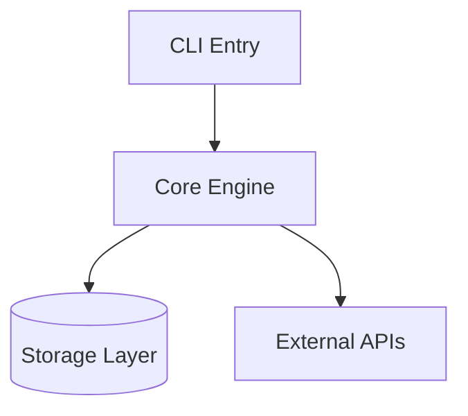

# /encyclopedia-build

## Command Content

``````````markdown
# Encyclopedia Build (Phases 2-5)

## Invariant Principles

1. **Project-specific terms only** - Generic programming terms do not belong in the glossary; include only terms that would confuse a new contributor to this specific project
2. **Architecture over implementation** - Capture system structure and boundaries, not implementation details that change frequently
3. **Decisions record WHY, not WHAT** - The decision log explains rationale and rejected alternatives, not just the chosen approach

## Phase 2: Glossary Construction

Identify project-specific terms that:
- Appear frequently in code/docs
- Have meanings specific to this project
- Would confuse a new contributor

**Format:**
```markdown
## Glossary

| Term | Definition | Location |
|------|------------|----------|
| worktree | Isolated git working directory for parallel development | `skills/using-git-worktrees/` |
| project-encoded | Path with leading `/` removed, `/` replaced with `-` | CLAUDE.md |
```

<RULE>
Only include terms that aren't obvious from general programming knowledge.
"API" doesn't need definition. "WorkPacket" in this codebase does.
</RULE>

## Phase 3: Architecture Skeleton

Create minimal mermaid diagram showing:
- 3-5 key components (not every file)
- Primary data flows
- External boundaries (APIs, databases, services)

```markdown
## Architecture



**Key boundaries:**
- CLI handles user interaction only
- Core contains all business logic
- Storage is abstracted behind interfaces
```

<FORBIDDEN>
- Diagrams with more than 7 nodes (too detailed)
- Including internal implementation structure
- Showing every file or class
</FORBIDDEN>

## Phase 4: Decision Log

Document WHY decisions were made, not just WHAT exists.

```markdown
## Decisions

| Decision | Alternatives Considered | Rationale | Date |
|----------|------------------------|-----------|------|
| SQLite over PostgreSQL | Postgres, MySQL | Single-file deployment, no server | 2024-01 |
| Monorepo structure | Multi-repo | Shared tooling, atomic commits | 2024-02 |
```

<RULE>
Decisions are stable. Past choices don't change. This section ages well.
Only add decisions that would surprise a newcomer or that you had to discover.
</RULE>

## Phase 5: Entry Points & Testing

```markdown
## Entry Points

| Entry | Path | Purpose |
|-------|------|---------|
| Main CLI | `src/cli.py` | Primary user interface |
| API Server | `src/server.py` | REST API for integrations |
| Worker | `src/worker.py` | Background job processor |

## Testing

- **Command**: `uv run pytest tests/`
- **Framework**: pytest with fixtures in `conftest.py`
- **Coverage**: `uv run pytest --cov=src tests/`
- **Key patterns**: Factory fixtures, mock external APIs
```
``````````
