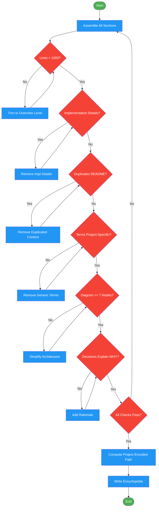

# /encyclopedia-validate

## Workflow Diagram

# Diagram: encyclopedia-validate

Assemble and validate encyclopedia content, then write to the output path (Phase 6).



## Legend

| Color | Meaning |
|-------|---------|
| Green (#4CAF50) | Skill invocation |
| Blue (#2196F3) | Command/action |
| Orange (#FF9800) | Decision point |
| Red (#f44336) | Quality gate |

## Command Content

``````````markdown
# Encyclopedia Validate (Phase 6)

## Invariant Principles

1. **Size constraint is a quality signal** - Exceeding 1000 lines means implementation details leaked in; trim to overview-level content
2. **No duplication with README or CLAUDE.md** - The encyclopedia complements existing docs, never repeats them
3. **Validation checklist is mandatory** - Every item in the reflection block must pass before writing the output file

## Assembly & Validation

Assemble sections. Validate:

```
<reflection>
- [ ] Total lines < 1000
- [ ] No implementation details (would change frequently)
- [ ] No duplication of README/CLAUDE.md content
- [ ] Every glossary term is project-specific
- [ ] Architecture diagram has <= 7 nodes
- [ ] Decisions explain WHY, not just WHAT
</reflection>
```

## Output

Write to: `~/.local/spellbook/docs/<project-encoded>/encyclopedia.md`

**Project encoding:** Absolute path with leading `/` removed and all `/` replaced with `-`.
Example: `/Users/alice/Development/myproject` becomes `Users-alice-Development-myproject`
``````````
