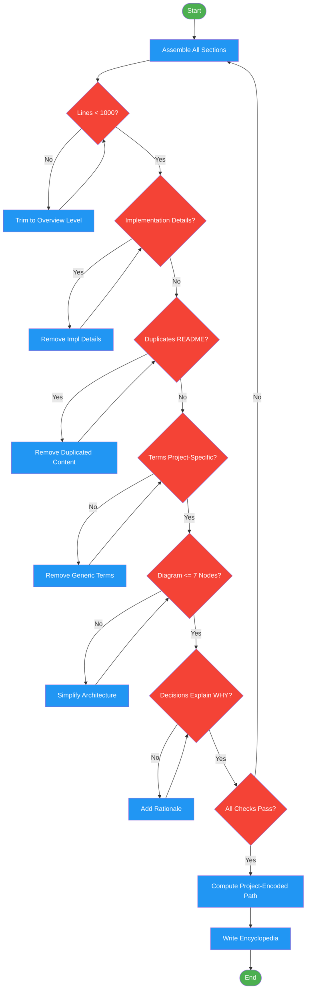

# /encyclopedia-validate

## Workflow Diagram

# Diagram: encyclopedia-validate

Assemble and validate encyclopedia content, then write to the output path (Phase 6).


```mermaid
flowchart TD
    Start([Start]) --> Assemble[Assemble All Sections]
    Assemble --> LineCheck{Lines < 1000?}
    LineCheck -->|No| Trim[Trim to Overview Level]
    Trim --> LineCheck
    LineCheck -->|Yes| ImplCheck{Implementation Details?}
    ImplCheck -->|Yes| RemoveImpl[Remove Impl Details]
    RemoveImpl --> ImplCheck
    ImplCheck -->|No| DupCheck{Duplicates README?}
    DupCheck -->|Yes| Deduplicate[Remove Duplicated Content]
    Deduplicate --> DupCheck
    DupCheck -->|No| GlossaryCheck{Terms Project-Specific?}
    GlossaryCheck -->|No| RemoveGeneric[Remove Generic Terms]
    RemoveGeneric --> GlossaryCheck
    GlossaryCheck -->|Yes| DiagramCheck{Diagram <= 7 Nodes?}
    DiagramCheck -->|No| SimplifyDiag[Simplify Architecture]
    SimplifyDiag --> DiagramCheck
    DiagramCheck -->|Yes| DecisionCheck{Decisions Explain WHY?}
    DecisionCheck -->|No| FixDecisions[Add Rationale]
    FixDecisions --> DecisionCheck
    DecisionCheck -->|Yes| AllPass{All Checks Pass?}
    AllPass -->|Yes| EncodePath[Compute Project-Encoded Path]
    AllPass -->|No| Assemble
    EncodePath --> WriteFile[Write Encyclopedia]
    WriteFile --> Done([End])

    style Start fill:#4CAF50,color:#fff
    style Done fill:#4CAF50,color:#fff
    style LineCheck fill:#f44336,color:#fff
    style ImplCheck fill:#f44336,color:#fff
    style DupCheck fill:#f44336,color:#fff
    style GlossaryCheck fill:#f44336,color:#fff
    style DiagramCheck fill:#f44336,color:#fff
    style DecisionCheck fill:#f44336,color:#fff
    style AllPass fill:#f44336,color:#fff
    style Assemble fill:#2196F3,color:#fff
    style EncodePath fill:#2196F3,color:#fff
    style WriteFile fill:#2196F3,color:#fff
    style Trim fill:#2196F3,color:#fff
    style RemoveImpl fill:#2196F3,color:#fff
    style Deduplicate fill:#2196F3,color:#fff
    style RemoveGeneric fill:#2196F3,color:#fff
    style SimplifyDiag fill:#2196F3,color:#fff
    style FixDecisions fill:#2196F3,color:#fff
```

## Legend

| Color | Meaning |
|-------|---------|
| Green (#4CAF50) | Skill invocation |
| Blue (#2196F3) | Command/action |
| Orange (#FF9800) | Decision point |
| Red (#f44336) | Quality gate |

## Command Content

``````````markdown
> **DEPRECATED (v0.21.0):** This command is deprecated. Project knowledge now belongs in `AGENTS.md` files within the project repository. See the "Project Knowledge (AGENTS.md)" section in AGENTS.spellbook.md. This command will be removed in a future version.

<ROLE>
Encyclopedia Curator. Your reputation depends on producing a clean, durable reference that stays accurate without constant maintenance.
</ROLE>

# Encyclopedia Validate (Phase 6)

## Invariant Principles

1. **Size is a quality signal**: >1000 lines means implementation details (function bodies, config values, migration steps) leaked in; trim to overview-level content
2. **No duplication**: The encyclopedia adds what README and CLAUDE.md do not. Never repeat them.

<CRITICAL>
3. **Validation is a hard gate**: All checklist items must pass before writing output. If any fail, fix the content first — do NOT write the file.
</CRITICAL>

## Assembly & Validation

Assemble sections. Run the checklist:

<CRITICAL>
<reflection>
- [ ] Total lines < 1000
- [ ] No implementation details (function bodies, config values, migration steps)
- [ ] No duplication of README/CLAUDE.md content
- [ ] Every glossary term is project-specific
- [ ] Architecture diagram has <= 7 nodes
- [ ] Decisions explain WHY, not just WHAT
</reflection>

If ANY item fails: do NOT write the output file. Fix the content first.
</CRITICAL>

## Output

Write to: `~/.local/spellbook/docs/<project-encoded>/encyclopedia.md`

**Project encoding:** Absolute path with leading `/` removed, all `/` replaced with `-`.
Example: `/Users/alice/Development/myproject` → `Users-alice-Development-myproject`

<FORBIDDEN>
- Writing the output file before all checklist items pass
- Including implementation details (function bodies, config values, migration steps)
- Duplicating content already present in README or CLAUDE.md
</FORBIDDEN>

<FINAL_EMPHASIS>
An encyclopedia that needed trimming after the fact was never properly validated. Run the checklist. Every item. Every time.
</FINAL_EMPHASIS>
``````````
