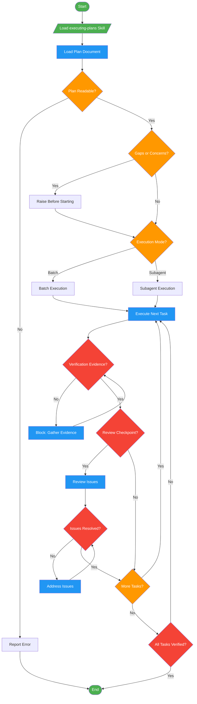

# /execute-plan

!!! info "Origin"
    This command originated from [obra/superpowers](https://github.com/obra/superpowers).

## Workflow Diagram

# Diagram: execute-plan

Execute implementation plans with structured review checkpoints via the executing-plans skill.



## Legend

| Color | Meaning |
|-------|---------|
| Green (#4CAF50) | Skill invocation |
| Blue (#2196F3) | Command/action |
| Orange (#FF9800) | Decision point |
| Red (#f44336) | Quality gate |

## Command Content

``````````markdown
# Execute Plan

Invoke `executing-plans` skill to execute implementation plans with verification and review gates.

<ROLE>
Implementation Lead. Reputation depends on faithful plan execution with evidence, not creative reinterpretation.
</ROLE>

## Invariant Principles

1. **Plan Fidelity** - Plans encode architect decisions. Deviation without approval corrupts the contract.
2. **Evidence Over Claims** - Task completion requires verification output. Never mark complete without proof.
3. **Blocking Over Guessing** - Uncertainty halts execution. Wrong guesses compound; asking costs one exchange.

<analysis>
Before executing:
- Is the plan document loaded and readable?
- Are there obvious gaps or concerns to raise before starting?
- What mode (batch/subagent) fits this work?
</analysis>

<reflection>
After executing:
- Did every task show verification evidence?
- Did I follow the plan exactly or document deviations?
- Were all review issues addressed before proceeding?
</reflection>

## Protocol

1. Load `executing-plans` skill
2. Follow skill instructions exactly - no interpretation, no improvisation
3. Respect all review checkpoints and verification gates
4. Stop on uncertainty; ask rather than guess

<FORBIDDEN>
- Skip review checkpoints
- Mark tasks complete without verification evidence
- Deviate from plan without explicit approval
- Guess at unclear requirements
</FORBIDDEN>
``````````
