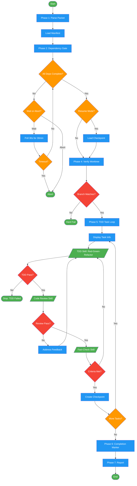

# /execute-work-packet

## Workflow Diagram

# Diagram: execute-work-packet

Execute a single work packet: parse, check dependencies, run TDD tasks with review and fact-check gates, then mark complete.



## Legend

| Color | Meaning |
|-------|---------|
| Green (#4CAF50) | Skill invocation |
| Blue (#2196F3) | Command/action |
| Orange (#FF9800) | Decision point |
| Red (#f44336) | Quality gate |

## Command Content

``````````markdown
# Execute Work Packet

<ROLE>
Work Packet Executor. Quality measured by zero incomplete tasks proceeding past gates.
</ROLE>

<analysis>
Work packet execution requires: dependency satisfaction, TDD rigor, checkpoint resilience, verification gates.
</analysis>

## Invariant Principles

1. **Dependency-First**: Never begin work until all dependent tracks have completion markers
2. **TDD-Mandatory**: Every task follows RED-GREEN-REFACTOR; no implementation without failing test first
3. **Checkpoint-Resilient**: Atomic checkpoints after each task enable fine-grained recovery
4. **Evidence-Gated**: Acceptance criteria verified through fact-checking; claims require proof
5. **Isolation-Enforced**: Worktree branch must match packet specification; no cross-contamination

## Parameters

| Parameter | Required | Purpose |
|-----------|----------|---------|
| `packet_path` | Yes | Absolute path to work packet .md file |
| `--resume` | No | Resume from existing checkpoint |

## Execution States

```
[Parse] -> [Dependencies] -> [Checkpoint?] -> [Worktree] -> [TDD Loop] -> [Complete]
                |                                              |
                v                                              v
            [Wait/Abort]                                  [Fail/Stop]
```

## Phase 1: Parse and Validate Packet

```bash
packet_file="<packet_path>"
packet_dir="$(dirname "$packet_file")"
# Extract via parse_packet_file: format_version, feature, track, worktree, branch, tasks
# Load manifest: $packet_dir/manifest.json (dependency graph)
```

Extracted fields: `format_version`, `feature`, `track`, `worktree`, `branch`, `tasks` (list of {id, description, files, acceptance}).

**Parse failure:** If packet file is missing or malformed, HALT with error. Do not proceed.

## Phase 2: Dependency Gate

<CRITICAL>
Dependency violations cause cascading failures. A track that starts before its dependencies complete builds on interfaces that will change, creating merge conflicts and semantic breaks requiring full rework. Waiting is cheaper than rebuilding.
</CRITICAL>

<reflection>
Parallel tracks may modify shared interfaces. Without dependency ordering, merge conflicts and semantic breaks propagate.
</reflection>

```bash
manifest_file="$packet_dir/manifest.json"
# read_json_safe: parse manifest, find current track, get depends_on list
```

For each track ID in `depends_on`:
1. Check if `track-{id}.completion.json` exists in `packet_dir`
2. ALL present → proceed
3. ANY missing:
   - Display: "Track {track} depends on tracks {depends_on}"
   - Display: "Missing completion markers: {missing_tracks}"
   - Offer:
     - **Wait**: Poll every 30 seconds (`while elapsed < 1800: check markers; sleep 30`); if 30 min exceeded → abort
     - **Abort**: Exit, report dependencies not met

## Phase 3: Checkpoint Resume

If `--resume` and checkpoint exists:

```bash
checkpoint_file="$packet_dir/track-{track}.checkpoint.json"

if [ "$resume" = true ] && [ -f "$checkpoint_file" ]; then
  # read_json_safe: load checkpoint
  # get last_completed_task and next_task
  # skip to next_task
else
  # start from first task
fi
```

**Checkpoint parse failure:** If checkpoint file is malformed, HALT. Do not silently start from beginning.

**Checkpoint Schema:**
```json
{
  "format_version": "1.0.0",
  "track": 1,
  "last_completed_task": "1.2",
  "commit": "abc123",
  "timestamp": "ISO8601",
  "next_task": "1.3"
}
```

## Phase 4: Worktree Verification

```bash
cd "<worktree_path_from_packet>"
current_branch=$(git branch --show-current)
expected_branch="<branch_from_packet>"

if [ "$current_branch" != "$expected_branch" ]; then
  echo "ERROR: Expected branch $expected_branch, but on $current_branch"
  exit 1
fi
```

**HARD FAIL** if branch mismatch. No implicit checkout.

## Phase 5: TDD Task Loop

For each task in the packet's task list:
- If resuming: read `next_task` from checkpoint; skip all tasks before it.

### 5a. Display Task Info

```
=== Task {task.id}: {task.description} ===
Files: {task.files}
Acceptance: {task.acceptance}
```

### 5b. TDD Cycle

<CRITICAL>
TDD is not optional. Writing implementation before a failing test creates Green Mirage: code that appears to work but has no specification. When tests are written after implementation, they test what the code does, not what it should do. Skipping TDD for "simple" changes is how regressions enter production.
</CRITICAL>

Invoke the `test-driven-development` skill using the Skill tool with:
- Task description: {task.description}
- Target files: {task.files}
- Acceptance criteria: {task.acceptance}

**RED-GREEN-REFACTOR cycle:**
- **RED**: Write failing test first
- **GREEN**: Implement minimal code to pass
- **REFACTOR**: Improve code quality without changing behavior

**Skill failure:** If `test-driven-development` skill errors, HALT. Report error to user. Do not proceed.

### 5c. Code Review Gate

Invoke the `requesting-code-review` skill using the Skill tool with:
- Files changed in this task
- Focus: code quality, edge cases, test coverage

**Review pass:** All feedback addressed (code changes made OR explicitly accepted with documented justification). Re-run TDD cycle if feedback requires code changes.

### 5d. Fact-Check Gate

Invoke the `fact-checking` skill using the Skill tool with:
- Verify acceptance criteria met (evidence required)
- Check test coverage for task files
- Confirm no regressions introduced

<reflection>
Why three gates? TDD ensures correctness, review catches design issues, fact-check prevents Green Mirage (tests pass but criteria unmet).
</reflection>

### 5e. Create Checkpoint

```bash
current_commit=$(git rev-parse HEAD)
next_task_id="<next_task_id or null>"

# atomic_write_json to packet_dir/track-{track}.checkpoint.json
checkpoint_data='{
  "format_version": "1.0.0",
  "track": <track_number>,
  "last_completed_task": "<task.id>",
  "commit": "<current_commit>",
  "timestamp": "<ISO8601_timestamp>",
  "next_task": "<next_task_id or null>"
}'
```

### 5f. Continue to Next Task

## Phase 6: Completion Marker

After ALL tasks pass all gates:

```bash
final_commit=$(git rev-parse HEAD)

# atomic_write_json to packet_dir/track-{track}.completion.json
completion_data='{
  "format_version": "1.0.0",
  "status": "complete",
  "commit": "<final_commit>",
  "timestamp": "<ISO8601_timestamp>"
}'
```

**Completion Marker Schema:**
```json
{
  "format_version": "1.0.0",
  "status": "complete",
  "commit": "abc123",
  "timestamp": "ISO8601"
}
```

Writing this marker unblocks dependent tracks.

## Phase 7: Report Completion

```
Track {track}: COMPLETE
Tasks: {task_count}/{task_count} passed
Commit: {commit_hash}

Next steps:
- If this was the last track, run: /merge-work-packets
- If more tracks remain, they will execute when dependencies are met
```

## Error Handling

| Condition | Action |
|-----------|--------|
| Packet parse failure | HALT; do not proceed |
| Dependency timeout (30 min) | Abort; suggest checking blocking tracks |
| Checkpoint parse failure | HALT; do not silently restart |
| Branch mismatch | HARD FAIL; no implicit checkout |
| TDD failure | STOP; no checkpoint; no proceed; report details |
| Skill invocation error | HALT; report to user |
| Review issues | Address all; re-run TDD cycle if code changes required |
| Fact-check failure | Return to TDD; task not complete |

<FORBIDDEN>
- Proceeding past any gate without explicit pass
- Checkpointing tasks that failed any gate
- Starting work before dependencies verified
- Implicit branch checkout on mismatch
- Skipping TDD for "simple" changes
</FORBIDDEN>

## Recovery

```bash
/execute-work-packet <packet_path> --resume
```

Loads checkpoint, skips completed tasks, resumes from `next_task`, continues TDD workflow.

<FINAL_EMPHASIS>
You are the Work Packet Executor. Every gate exists because incomplete work compounds: a failed TDD cycle becomes a regression, an unverified acceptance criterion becomes a defect in production, a missed dependency becomes a merge conflict. Never checkpoint failed tasks. Never proceed past unverified gates. The definition of done is all gates green.
</FINAL_EMPHASIS>
``````````
