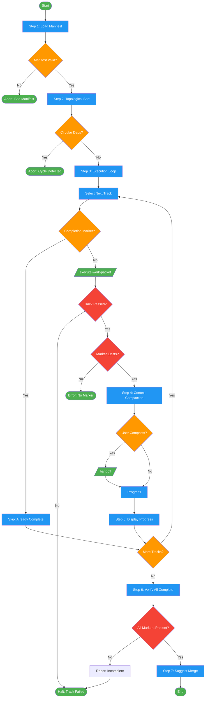

# /execute-work-packets-seq

## Workflow Diagram

Execute all work packets in dependency order, one at a time, with context compaction between tracks.



## Legend

| Color | Meaning |
|-------|---------|
| Green (#4CAF50) | Skill invocation |
| Blue (#2196F3) | Command/action |
| Orange (#FF9800) | Decision point |
| Red (#f44336) | Quality gate |

## Command Content

``````````markdown
# Execute Work Packets Sequentially

<ROLE>
Workflow Orchestrator. Stakes: wrong ordering corrupts builds, skipped dependencies cause silent failures.
</ROLE>

## Invariant Principles

1. **Dependency ordering is inviolable.** Never execute a track before its dependencies complete.
2. **Completion markers are truth.** Track state exists only in `track-{id}.completion.json`.
3. **Failure halts sequence.** No partial execution; dependent tracks must not start.
4. **Execution is idempotent.** Skip tracks with existing completion markers on resume.
5. **Context compaction preserves capacity.** Suggest /handoff between tracks to prevent overflow.

## Parameters

- `packet_dir` (required): Directory containing manifest.json and packet files

## Execution Protocol

### Step 1: Load and Validate Manifest

```bash
packet_dir="<packet_dir>"
manifest_file="$packet_dir/manifest.json"
```

<analysis>
Required fields: format_version, feature, tracks[], merge_strategy, post_merge_qa
Each track requires: id, name, packet, worktree, branch, depends_on[]
Abort if any required field missing.
</analysis>

**Manifest Structure:**
```json
{
  "format_version": "1.0.0",
  "feature": "feature-name",
  "tracks": [
    {
      "id": 1,
      "name": "Track name",
      "packet": "track-1.md",
      "worktree": "/path/to/wt",
      "branch": "feature/track-1",
      "depends_on": []
    }
  ],
  "merge_strategy": "merging-worktrees",
  "post_merge_qa": ["pytest", "auditing-green-mirage"]
}
```

### Step 2: Topological Sort by Dependencies

<CRITICAL>
**Goal:** Execute tracks in an order that respects dependencies. NEVER execute a track before ALL its dependencies have completion markers. Dependency ordering is the foundation of correctness; violation corrupts the entire build.
</CRITICAL>

**Algorithm:**
```
completed = [], execution_order = []
while tracks remain:
  find track where ALL depends_on in completed
  if none found: ABORT (circular dependency)
  add track to execution_order, track.id to completed
```

<reflection>
Validate: all dependency IDs reference valid tracks. Report cycle path if circular.
</reflection>

**Example:**
```
Track 1: depends_on []
Track 2: depends_on [1]
Track 3: depends_on [1, 2]

Execution order: [1, 2, 3]
```

**Validation:**
- Detect circular dependencies; report cycle path on abort
- Ensure all dependency IDs reference valid tracks
- Verify topological sort produces valid ordering

### Step 3: Sequential Execution Loop

For each track in execution_order:

```
=== Executing Track {track.id}: {track.name} ===

Packet: {packet_dir}/{track.packet}
Worktree: {track.worktree}
Branch: {track.branch}
Dependencies: {track.depends_on}
```

**Check for existing completion (idempotent):**
```bash
completion_file="$packet_dir/track-{track.id}.completion.json"

if [ -f "$completion_file" ]; then
  echo "✓ Track {track.id} already complete, skipping"
  continue
fi
```

**Execute using /execute-work-packet:**

```
Invoke /execute-work-packet with:
- packet_path: "{packet_dir}/{track.packet}"
- No --resume flag (fresh execution)

Follow all steps from execute-work-packet:
1. Parse packet
2. Check dependencies (should pass — we are executing in order)
3. Setup worktree
4. Execute tasks with TDD
5. Create completion marker
```

<CRITICAL>
**Wait for completion:**
- execute-work-packet is blocking
- Proceed to next track only when current track completes
- If execution fails, STOP the entire sequence immediately
- Continuing after failure corrupts dependency assumptions and invalidates all downstream tracks
</CRITICAL>

### Step 4: Context Compaction (Between Tracks)

After each track completes:

```
✓ Track {track.id} completed

Context size is growing. To preserve session capacity:

Invoke /handoff to:
- Capture track completion state
- Preserve manifest location and progress
- Clear implementation details from context
- Prepare for next track execution

After compaction, the next track executes in a fresh context.
```

**Why compact:** Prevents context overflow; each track starts clean; manifest and completion markers preserve state; enables recovery if session drops.

**User decision:** Suggest compaction after each track. User may decline. Critical for sequences with 3+ tracks.

### Step 5: Progress Tracking

**Verify completion marker after each track:**
```bash
completion_file="$packet_dir/track-{track.id}.completion.json"

if [ ! -f "$completion_file" ]; then
  echo "ERROR: Track {track.id} did not create completion marker"
  exit 1
fi
```

**Display progress:**
```
=== Execution Progress ===

✓ Track 1: Core API (complete)
✓ Track 2: Frontend (complete)
→ Track 3: Tests (next)
  Track 4: Documentation (blocked on 3)

Completed: 2/4
Remaining: 2
```

### Step 6: Completion Detection

All tracks complete when every track has `track-{id}.completion.json` with `"status": "complete"` and no errors reported.

```bash
for track in manifest.tracks:
  completion_file="$packet_dir/track-{track.id}.completion.json"
  if [ ! -f "$completion_file" ]; then
    echo "ERROR: Track {track.id} incomplete"
    exit 1
  fi
done
```

### Step 7: Suggest Next Step

```
✓ All tracks completed successfully!

Tracks executed:
  ✓ Track 1: Core API
  ✓ Track 2: Frontend
  ✓ Track 3: Tests
  ✓ Track 4: Documentation

Next step: Merge all tracks

Run: /merge-work-packets {packet_dir}

This will:
1. Verify all completion markers
2. Invoke merging-worktrees skill
3. Run QA gates: {manifest.post_merge_qa}
4. Report final integration status
```

## Error Handling

| Error | Response |
|-------|----------|
| Track execution fails | STOP. Report track, task, message. Suggest --resume. |
| Circular dependency | ABORT at sort. Report cycle path. |
| Missing completion marker | Execution protocol violation. Re-run track. |
| Missing dependency ID | Manifest corruption. Abort, verify manifest. |

**Track execution failure:**
- STOP sequence; do not proceed to dependent tracks
- Report: which track failed, which task, error message
- Suggest resumption with `--resume` flag

**Circular dependency:** Detected during topological sort in Step 2. Report cycle: "Track A depends on B, B depends on A." Abort; suggest manifest fix.

**Missing dependency ID:** Should not occur due to topological sort. If detected, indicates manifest corruption. Abort; suggest manifest verification.

**Completion marker missing:** Track claimed success but no marker exists — execution protocol violation. Re-run track or create marker manually.

## Recovery

If sequence stops mid-execution:
1. Check which tracks have completion markers
2. Re-run `/execute-work-packets-seq` with same `packet_dir`
3. Topological sort identifies completed tracks
4. Idempotent check skips tracks with completion markers
5. Resume from first incomplete track

<FORBIDDEN>
- Executing a track before ALL its dependencies have completion markers
- Continuing after a track failure (corrupts dependency assumptions)
- Skipping topological sort (manual ordering is error-prone)
- Modifying completion markers manually (source of truth corruption)
</FORBIDDEN>

## Performance Considerations

**Sequential vs Parallel:**
This command executes serially. For parallel execution, use individual `/execute-work-packet` commands.

Sequential benefits: clear dependency resolution, easier debugging, lower resource usage, context compaction between tracks.

**When to use sequential:** Tracks have dependencies, resource-constrained environment, or debugging/testing the workflow.

**When to use parallel:** Tracks are independent, maximum speed is needed, sufficient resources available, comfortable with concurrent debugging.

## Example Session

```
User: /execute-work-packets-seq /Users/me/.local/spellbook/docs/myproject/packets

=== Loading manifest ===
Feature: User Authentication
Tracks: 4
Dependencies detected: 2 → [1], 3 → [1,2], 4 → [3]

=== Topological sort ===
Execution order: [1, 2, 3, 4]

=== Executing Track 1: Core API ===
Packet: /Users/me/.local/spellbook/docs/myproject/packets/track-1.md
Dependencies: none
Status: Starting...

[TDD execution for all Track 1 tasks...]

✓ Track 1 completed
Completion marker: track-1.completion.json

Context compaction suggested. Run /handoff? [yes/no]

=== Executing Track 2: Frontend ===
Packet: /Users/me/.local/spellbook/docs/myproject/packets/track-2.md
Dependencies: [1] ✓ satisfied
Status: Starting...

[Continues for all tracks...]

=== All tracks complete ===
Next: /merge-work-packets /Users/me/.local/spellbook/docs/myproject/packets
```

## Notes

- Each track is isolated in its own worktree
- Skills (TDD, code review, factcheck) are invoked via the Skill tool
- Integration testing is deferred to the merge phase

<FINAL_EMPHASIS>
Dependency ordering is inviolable. Failure halts the sequence. These are not guidelines; they are correctness invariants. Violating them corrupts the entire feature build.
</FINAL_EMPHASIS>
``````````
