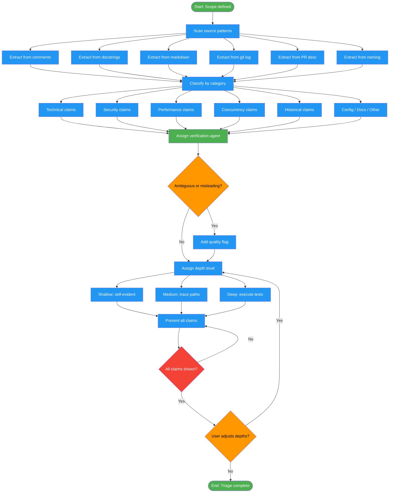

# /fact-check-extract

## Workflow Diagram

# Diagram: fact-check-extract

Extract all claims from code, comments, docstrings, commits, and naming conventions, then triage by category and verification depth before proceeding to verification.



## Legend

| Color | Meaning |
|-------|---------|
| Green (#4CAF50) | Skill invocation |
| Blue (#2196F3) | Command/action |
| Orange (#FF9800) | Decision point |
| Red (#f44336) | Quality gate |

## Command Content

``````````markdown
# Fact-Check: Claim Extraction and Triage (Phases 2-3)

## Invariant Principles

1. **Extract before judging** - Collect all claims first; do not assess truth during extraction
2. **Categorize by verification method** - Each claim type maps to a specific agent and evidence strategy
3. **Implicit claims count** - Naming conventions and code structure make claims just as much as explicit comments do

## Phase 2: Claim Extraction

**Sources**:
| Source | Patterns |
|--------|----------|
| Comments | `//`, `#`, `/* */`, `"""`, `'''`, `<!-- -->`, `--` |
| Docstrings | Function/class/module documentation |
| Markdown | README, CHANGELOG, docs/*.md |
| Commits | `git log --format=%B` for branch commits |
| PR descriptions | Via `gh pr view` |
| Naming | `validateX`, `safeX`, `isX`, `ensureX` |

**Categories**:
| Category | Examples | Agent |
|----------|----------|-------|
| Technical | "O(n log n)", "matches RFC 5322", "handles UTF-8" | CorrectnessAgent |
| Behavior | "returns null when...", "throws if...", "never blocks" | CorrectnessAgent |
| Security | "sanitized", "XSS-safe", "bcrypt hashed", "no injection" | SecurityAgent |
| Concurrency | "thread-safe", "reentrant", "atomic", "lock-free" | ConcurrencyAgent |
| Performance | "O(n)", "cached 5m", "lazy-loaded", benchmarks | PerformanceAgent |
| Invariant/state | "never null after init", "always sorted", "immutable" | CorrectnessAgent |
| Side effects | "pure function", "idempotent", "no side effects" | CorrectnessAgent |
| Dependencies | "requires Node 18+", "compatible with Postgres 14" | ConfigurationAgent |
| Configuration | "defaults to 30s", "env var X controls Y" | ConfigurationAgent |
| Historical | "workaround for Chrome bug", "fixes #123" | HistoricalAgent |
| TODO/FIXME | Referenced issues, "temporary" hacks | HistoricalAgent |
| Examples | Code examples in docs/README | DocumentationAgent |
| Test coverage | "covered by tests in test_foo.py" | DocumentationAgent |
| External refs | URLs, RFC citations, spec references | DocumentationAgent |

Also flag: **Ambiguous**, **Misleading**, **Jargon-heavy**

## Phase 3: Triage

<RULE>Present ALL claims upfront. User must see full scope before verification.</RULE>

Display grouped by category with depth recommendations:

```
## Claims Found: 23

### Security (4 claims)
1. [MEDIUM] src/auth.ts:34 - "passwords hashed with bcrypt"
2. [DEEP] src/db.ts:89 - "SQL injection safe via parameterization"
...

Adjust depths? (Enter numbers to change, or 'continue')
```

**Depth Definitions**:
| Depth | Approach | When to Use |
|-------|----------|-------------|
| Shallow | Read code, reason about behavior | Simple, self-evident claims |
| Medium | Trace execution paths, analyze control flow | Most claims |
| Deep | Execute tests, run benchmarks, instrument | Critical/numeric claims |

ARH pattern for responses: DIRECT_ANSWER (accept, proceed), RESEARCH_REQUEST (dispatch analysis), UNKNOWN (analyze, regenerate), SKIP (use defaults).
``````````
