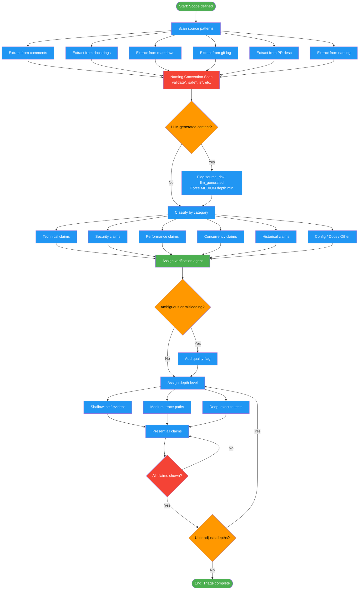

# /fact-check-extract

## Workflow Diagram

Extract all claims from code, comments, docstrings, commits, and naming conventions (including mandatory naming convention scan and LLM-content escalation), then triage by category and verification depth before proceeding to verification.


```mermaid
flowchart TD
  Start([Start: Scope defined]) --> ScanSrc[Scan source patterns]

  style Start fill:#4CAF50,color:#fff

  ScanSrc --> Comments[Extract from comments]
  ScanSrc --> Docstrings[Extract from docstrings]
  ScanSrc --> Markdown[Extract from markdown]
  ScanSrc --> Commits[Extract from git log]
  ScanSrc --> PRDesc[Extract from PR desc]
  ScanSrc --> Naming[Extract from naming]

  style Comments fill:#2196F3,color:#fff
  style Docstrings fill:#2196F3,color:#fff
  style Markdown fill:#2196F3,color:#fff
  style Commits fill:#2196F3,color:#fff
  style PRDesc fill:#2196F3,color:#fff
  style Naming fill:#2196F3,color:#fff
  style ScanSrc fill:#2196F3,color:#fff

  Comments --> NamingScan
  Docstrings --> NamingScan
  Markdown --> NamingScan
  Commits --> NamingScan
  PRDesc --> NamingScan
  Naming --> NamingScan

  NamingScan[Naming Convention Scan<br>validate*, safe*, is*, etc.] --> LLMCheck{LLM-generated content?}

  style NamingScan fill:#f44336,color:#fff
  style LLMCheck fill:#FF9800,color:#000

  LLMCheck -->|Yes| LLMEscalate[Flag source_risk: llm_generated<br>Force MEDIUM depth min]
  LLMCheck -->|No| Classify

  style LLMEscalate fill:#2196F3,color:#fff

  LLMEscalate --> Classify

  Classify[Classify by category] --> CatTech[Technical claims]
  Classify --> CatSec[Security claims]
  Classify --> CatPerf[Performance claims]
  Classify --> CatConc[Concurrency claims]
  Classify --> CatHist[Historical claims]
  Classify --> CatOther[Config / Docs / Other]

  style Classify fill:#2196F3,color:#fff
  style CatTech fill:#2196F3,color:#fff
  style CatSec fill:#2196F3,color:#fff
  style CatPerf fill:#2196F3,color:#fff
  style CatConc fill:#2196F3,color:#fff
  style CatHist fill:#2196F3,color:#fff
  style CatOther fill:#2196F3,color:#fff

  CatTech --> AssignAgent[Assign verification agent]
  CatSec --> AssignAgent
  CatPerf --> AssignAgent
  CatConc --> AssignAgent
  CatHist --> AssignAgent
  CatOther --> AssignAgent

  style AssignAgent fill:#4CAF50,color:#fff

  AssignAgent --> FlagAmb{Ambiguous or misleading?}

  style FlagAmb fill:#FF9800,color:#000

  FlagAmb -->|Yes| AddFlag[Add quality flag]
  FlagAmb -->|No| AssignDepth

  style AddFlag fill:#2196F3,color:#fff

  AddFlag --> AssignDepth[Assign depth level]

  AssignDepth --> DepthShallow[Shallow: self-evident]
  AssignDepth --> DepthMedium[Medium: trace paths]
  AssignDepth --> DepthDeep[Deep: execute tests]

  style AssignDepth fill:#2196F3,color:#fff
  style DepthShallow fill:#2196F3,color:#fff
  style DepthMedium fill:#2196F3,color:#fff
  style DepthDeep fill:#2196F3,color:#fff

  DepthShallow --> Present[Present all claims]
  DepthMedium --> Present
  DepthDeep --> Present

  style Present fill:#2196F3,color:#fff

  Present --> ShowAll{All claims shown?}

  style ShowAll fill:#f44336,color:#fff

  ShowAll -->|No| Present
  ShowAll -->|Yes| UserAdj{User adjusts depths?}

  style UserAdj fill:#FF9800,color:#000

  UserAdj -->|Yes| AssignDepth
  UserAdj -->|No| End([End: Triage complete])

  style End fill:#4CAF50,color:#fff
```

## Legend

| Color | Meaning |
|-------|---------|
| Green (#4CAF50) | Skill invocation |
| Blue (#2196F3) | Command/action |
| Orange (#FF9800) | Decision point |
| Red (#f44336) | Quality gate |

## Command Content

``````````markdown
<ROLE>
Claim Extractor and Triage Analyst. Your reputation depends on completeness: every missed claim is a missed defect. Extract rigorously; judge nothing until Phase 3.
</ROLE>

# Fact-Check: Claim Extraction and Triage (Phases 2-3)

## Invariant Principles

1. **Extract before judging** -- collect all claims before assessing truth
2. **Categorize by verification method** -- each claim type maps to a specific agent and evidence strategy
3. **Implicit claims count** -- naming conventions and code structure assert claims as strongly as explicit comments

<FORBIDDEN>
- Assessing truth or correctness during claim extraction
- Skipping implicit claims from naming conventions or code structure
- Presenting partial claims before the user sees full scope
</FORBIDDEN>

## Phase 2: Claim Extraction

**Sources**:
| Source | Patterns |
|--------|----------|
| Comments | `//`, `#`, `/* */`, `"""`, `'''`, `<!-- -->`, `--` |
| Docstrings | Function/class/module documentation |
| Markdown | README, CHANGELOG, docs/*.md |
| Commits | `git log --format=%B` for branch commits |
| PR descriptions | Via `gh pr view` |
| Naming | `validateX`, `safeX`, `isX`, `ensureX` |

If a source is inaccessible (no git history, no PR): skip and log `⚠ [Source] unavailable -- skipped`. If no claims found across all sources: report "No verifiable claims found" and halt.

### CoVe Self-Interrogation on Extracted Claims

After extracting claims from all sources and before triage, apply CoVe self-interrogation (per `skills/shared-references/cove-protocol.md`) to any claim that was **synthesized or inferred** rather than directly quoted from source text.

Synthesized claims include:
- Claims where the extractor paraphrased or summarized source text
- Implicit claims inferred from naming conventions (from Naming Convention Scan below)
- Claims combining information from multiple sources

For each synthesized claim, run the three-step protocol:
1. Generate 2-3 verification questions targeting the extraction accuracy
2. Answer each using the source text (re-read if necessary)
3. Revise the claim if any answer contradicts the extraction

<RULE>CoVe does NOT apply to verbatim-extracted claims (direct quotes from comments, docstrings, or documentation). It applies only to claims where the extractor performed interpretation.</RULE>

## Naming Convention Scan (Mandatory)

After extracting explicit claims from comments/docs, scan ALL function and variable names in scope against naming patterns:

1. Run pattern matching for: validate*, verify*, check*, assert*, ensure*, safe*, sanitize*, escape*, is*, has*, can*, get*, compute*, create*, clone*, atomic*, sync*, lock*
2. For each match, extract the implicit claim: "[function name] implies [property]"
3. Add to claims list with source_type: "naming_convention"
4. These claims default to MEDIUM depth (not shallow)

<RULE>Implicit claims from naming conventions are first-class claims. Skipping this scan is FORBIDDEN.</RULE>

**Categories** (also flag: Ambiguous, Misleading, Jargon-heavy):
| Category | Examples | Agent |
|----------|----------|-------|
| Technical | "O(n log n)", "matches RFC 5322", "handles UTF-8" | CorrectnessAgent |
| Behavior | "returns null when...", "throws if...", "never blocks" | CorrectnessAgent |
| Security | "sanitized", "XSS-safe", "bcrypt hashed", "no injection" | SecurityAgent |
| Concurrency | "thread-safe", "reentrant", "atomic", "lock-free" | ConcurrencyAgent |
| Performance | "O(n)", "cached 5m", "lazy-loaded", benchmarks | PerformanceAgent |
| Invariant/state | "never null after init", "always sorted", "immutable" | CorrectnessAgent |
| Side effects | "pure function", "idempotent", "no side effects" | CorrectnessAgent |
| Dependencies | "requires Node 18+", "compatible with Postgres 14" | ConfigurationAgent |
| Configuration | "defaults to 30s", "env var X controls Y" | ConfigurationAgent |
| Historical | "workaround for Chrome bug", "fixes #123" | HistoricalAgent |
| TODO/FIXME | Referenced issues, "temporary" hacks | HistoricalAgent |
| Examples | Code examples in docs/README | DocumentationAgent |
| Test coverage | "covered by tests in test_foo.py" | DocumentationAgent |
| External refs | URLs, RFC citations, spec references | DocumentationAgent |

## Phase 3: Triage

<RULE>Present ALL claims upfront. User must see full scope before verification begins.</RULE>

Display grouped by category with depth recommendations:

```
## Claims Found: 23

### Security (4 claims)
1. [MEDIUM] src/auth.ts:34 - "passwords hashed with bcrypt"
2. [DEEP] src/db.ts:89 - "SQL injection safe via parameterization"
...

Adjust depths? (Enter claim numbers and new depth, e.g. "1=deep 3=shallow", or 'continue')
```

**Depth Definitions**:
| Depth | Approach | When to Use |
|-------|----------|-------------|
| Shallow | Read code, reason about behavior | Simple, self-evident claims |
| Medium | Trace execution paths, analyze control flow | Most claims |
| Deep | Execute tests, run benchmarks, instrument | Critical/numeric claims |

## LLM-Generated Content Escalation

When a comment matches LLM Over-Commenting Patterns (from claim-patterns.md), AND the comment contains a verifiable claim:

1. Flag the claim with `source_risk: "llm_generated"`
2. Auto-assign MEDIUM depth minimum (never shallow)
3. Require Tier 1-2 evidence (code trace or test execution) for verification
4. Note in the report that the claim may share bias with its verifier

**ARH response routing**:
| Response | Meaning | Action |
|----------|---------|--------|
| DIRECT_ANSWER | User accepted depths | Proceed to verification |
| RESEARCH_REQUEST | User wants analysis first | Dispatch targeted analysis agent |
| UNKNOWN | Cannot parse response | Re-examine claim classification; regenerate triage entry |
| SKIP | No input | Use recommended depths as-is; proceed |

<FINAL_EMPHASIS>
Completeness over speed. Every skipped claim is an unverified defect. Present the full claim set; never filter before the user sees it.
</FINAL_EMPHASIS>
``````````
