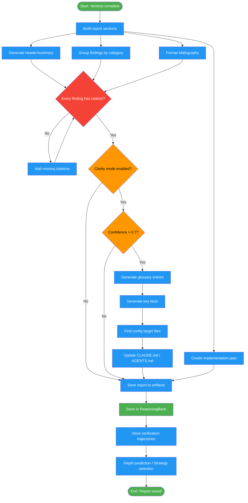

# /fact-check-report

## Workflow Diagram

# Diagram: fact-check-report

Generate a fact-checking report with traceable bibliography, actionable findings, optional clarity-mode glossary injection, and learning trajectory persistence for future sessions.



## Legend

| Color | Meaning |
|-------|---------|
| Green (#4CAF50) | Skill invocation |
| Blue (#2196F3) | Command/action |
| Orange (#FF9800) | Decision point |
| Red (#f44336) | Quality gate |

## Command Content

``````````markdown
# Fact-Check: Report and Learning (Phases 6-7)

## Invariant Principles

1. **Traceability through bibliography** - Every finding must link to its verification evidence with proper citation format
2. **Actionable over comprehensive** - Report prioritizes findings that require code changes over informational items
3. **Learning feeds forward** - Verified facts and patterns are persisted for future sessions, not discarded after reporting

## Phase 6: Report

Sections: Header, Summary, Findings by Category, Bibliography, Implementation Plan

**Bibliography Formats**:
| Type | Format |
|------|--------|
| Code trace | `file:lines - finding` |
| Test | `command - result` |
| Web source | `Title - URL - "excerpt"` |
| Git history | `commit/issue - finding` |
| Documentation | `Docs: source section - URL` |
| Benchmark | `Benchmark: method - results` |
| Paper/RFC | `Citation - section - URL` |

## Phase 6.5: Clarity Mode (if enabled)

Generate glossaries/key facts from verified claims (confidence > 0.7).

**Targets**: `CLAUDE.md`, `GEMINI.md`, `AGENTS.md`, `*_AGENT.md`, `*_AI.md`

**Glossary Entry**: `- **[Term]**: [1-2 sentence definition]. [Usage context.]`

**Key Fact Categories**: Architecture, Behavior, Integration, Error Handling, Performance

Update existing sections or append before `---` separators.

## Phase 7: Learning

Store trajectories in ReasoningBank:
```typescript
await reasoningBank.insertPattern({
  type: 'verification-trajectory',
  domain: 'fact-checking-learning',
  pattern: { claimText, claimType, depthUsed, verdict, timeSpent, evidenceQuality }
});
```

Applications: depth prediction, strategy selection, ordering optimization, false positive reduction.
``````````
