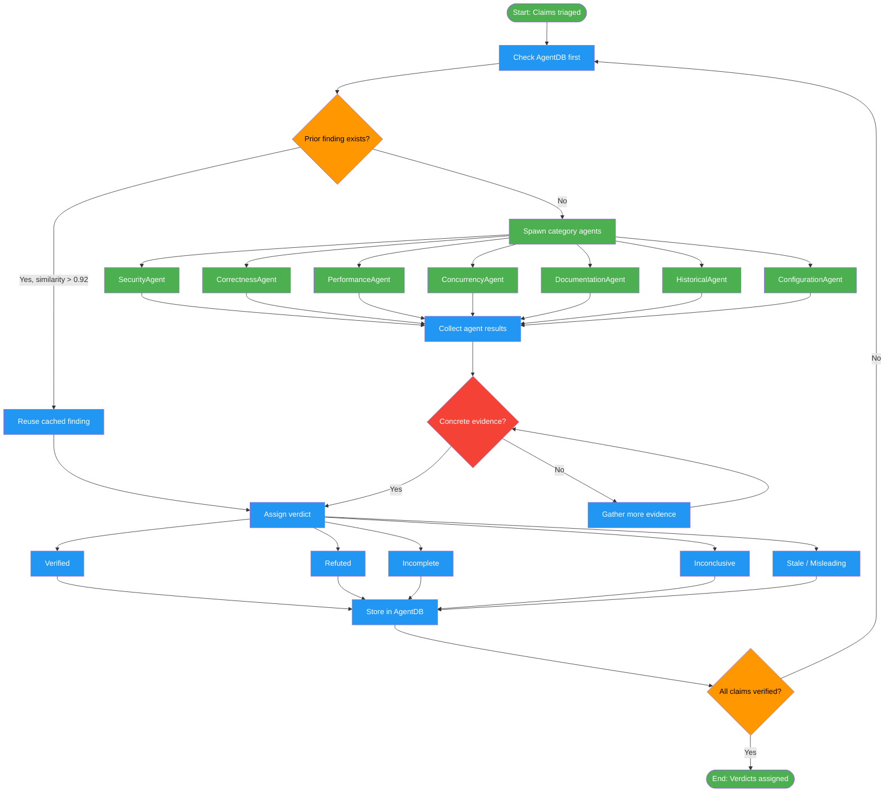

# /fact-check-verify

## Workflow Diagram

# Diagram: fact-check-verify

Perform parallel verification of extracted claims using specialized agents, check AgentDB for prior findings, produce evidence-backed verdicts, and store results for future sessions.



## Legend

| Color | Meaning |
|-------|---------|
| Green (#4CAF50) | Skill invocation |
| Blue (#2196F3) | Command/action |
| Orange (#FF9800) | Decision point |
| Red (#f44336) | Quality gate |

## Command Content

``````````markdown
# Fact-Check: Parallel Verification and Verdicts (Phases 4-5)

## Invariant Principles

1. **Check before verifying** - Always consult existing findings in AgentDB before doing redundant work
2. **Evidence requires source** - Every verdict must cite code traces, test results, docs, or benchmarks
3. **Confidence is not consensus** - A claim verified by one agent is not confirmed until cross-referenced

## Phase 4: Parallel Verification

<RULE>Check AgentDB BEFORE verifying. Store findings AFTER.</RULE>

```typescript
// Before: check existing
const existing = await agentdb.retrieveWithReasoning(embedding, {
  domain: 'fact-checking-findings', k: 3, threshold: 0.92
});
if (existing.memories[0]?.similarity > 0.92) return existing.memories[0].pattern;

// After: store finding
await agentdb.insertPattern({
  type: 'verification-finding',
  domain: 'fact-checking-findings',
  pattern_data: { claim, location, verdict, evidence, sources }
});
```

Spawn category agents via swarm-orchestration (hierarchical topology):
- SecurityAgent, CorrectnessAgent, PerformanceAgent
- ConcurrencyAgent, DocumentationAgent, HistoricalAgent, ConfigurationAgent

## Phase 5: Verdicts

<RULE>Every verdict MUST have concrete evidence. NO exceptions.</RULE>

| Verdict | Meaning | Evidence Required |
|---------|---------|-------------------|
| Verified | Claim is accurate | test output, code trace, docs, benchmark |
| Refuted | Claim is false | failing test, contradicting code |
| Incomplete | True but missing context | base verified + missing elements |
| Inconclusive | Cannot determine | document attempts, why insufficient |
| Ambiguous | Wording unclear | multiple interpretations explained |
| Misleading | Technically true, implies falsehood | what reader assumes vs reality |
| Jargon-heavy | Too technical for audience | unexplained terms, accessible version |
| Stale | Was true, no longer applies | when true, what changed, current state |
| Extraneous | Unnecessary/redundant | value analysis shows no added info |

**Fractal exploration (optional):** When a claim receives an Inconclusive or Ambiguous verdict, invoke fractal-thinking with intensity `pulse` and seed: "Is '[claim]' true? What evidence would confirm or refute it?". Use the synthesis to upgrade the verdict with multi-path evidence.
``````````
