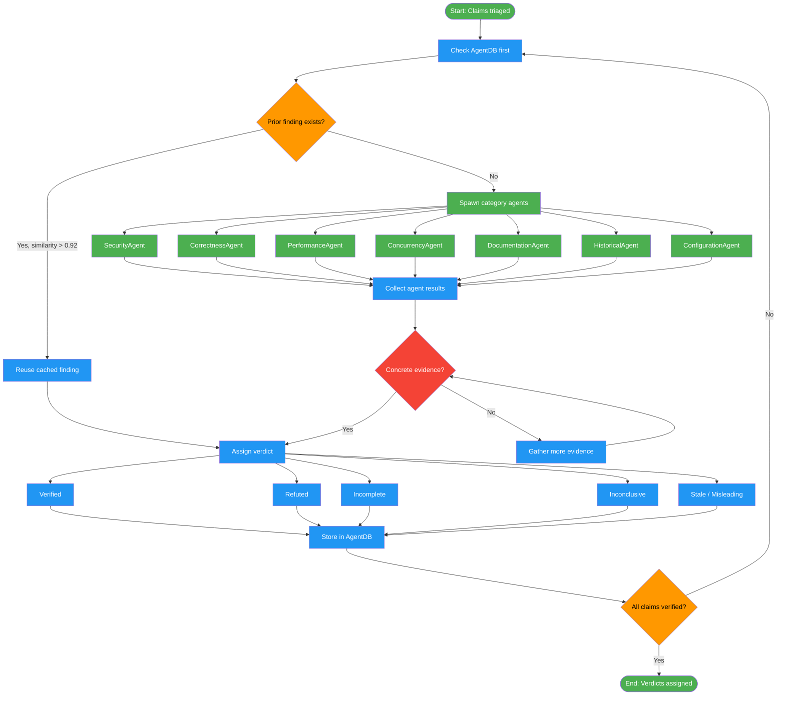

# /fact-check-verify

## Workflow Diagram

# Diagram: fact-check-verify

Perform parallel verification of extracted claims using specialized agents, check AgentDB for prior findings, produce evidence-backed verdicts, and store results for future sessions.


```mermaid
flowchart TD
  Start([Start: Claims triaged]) --> CheckDB[Check AgentDB first]

  style Start fill:#4CAF50,color:#fff
  style CheckDB fill:#2196F3,color:#fff

  CheckDB --> DBHit{Prior finding exists?}

  style DBHit fill:#FF9800,color:#000

  DBHit -->|Yes, similarity > 0.92| Reuse[Reuse cached finding]
  DBHit -->|No| SpawnAgents[Spawn category agents]

  style Reuse fill:#2196F3,color:#fff
  style SpawnAgents fill:#4CAF50,color:#fff

  SpawnAgents --> SecAgent[SecurityAgent]
  SpawnAgents --> CorAgent[CorrectnessAgent]
  SpawnAgents --> PerfAgent[PerformanceAgent]
  SpawnAgents --> ConcAgent[ConcurrencyAgent]
  SpawnAgents --> DocAgent[DocumentationAgent]
  SpawnAgents --> HistAgent[HistoricalAgent]
  SpawnAgents --> ConfAgent[ConfigurationAgent]

  style SecAgent fill:#4CAF50,color:#fff
  style CorAgent fill:#4CAF50,color:#fff
  style PerfAgent fill:#4CAF50,color:#fff
  style ConcAgent fill:#4CAF50,color:#fff
  style DocAgent fill:#4CAF50,color:#fff
  style HistAgent fill:#4CAF50,color:#fff
  style ConfAgent fill:#4CAF50,color:#fff

  SecAgent --> Collect[Collect agent results]
  CorAgent --> Collect
  PerfAgent --> Collect
  ConcAgent --> Collect
  DocAgent --> Collect
  HistAgent --> Collect
  ConfAgent --> Collect

  style Collect fill:#2196F3,color:#fff

  Reuse --> AssignVerdict

  Collect --> EvidenceGate{Concrete evidence?}

  style EvidenceGate fill:#f44336,color:#fff

  EvidenceGate -->|No| GatherMore[Gather more evidence]
  EvidenceGate -->|Yes| AssignVerdict[Assign verdict]

  style GatherMore fill:#2196F3,color:#fff

  GatherMore --> EvidenceGate

  AssignVerdict --> Verified[Verified]
  AssignVerdict --> Refuted[Refuted]
  AssignVerdict --> Incomplete[Incomplete]
  AssignVerdict --> Inconclusive[Inconclusive]
  AssignVerdict --> Stale[Stale / Misleading]

  style AssignVerdict fill:#2196F3,color:#fff
  style Verified fill:#2196F3,color:#fff
  style Refuted fill:#2196F3,color:#fff
  style Incomplete fill:#2196F3,color:#fff
  style Inconclusive fill:#2196F3,color:#fff
  style Stale fill:#2196F3,color:#fff

  Verified --> StoreDB[Store in AgentDB]
  Refuted --> StoreDB
  Incomplete --> StoreDB
  Inconclusive --> StoreDB
  Stale --> StoreDB

  style StoreDB fill:#2196F3,color:#fff

  StoreDB --> AllDone{All claims verified?}

  style AllDone fill:#FF9800,color:#000

  AllDone -->|No| CheckDB
  AllDone -->|Yes| End([End: Verdicts assigned])

  style End fill:#4CAF50,color:#fff
```

## Legend

| Color | Meaning |
|-------|---------|
| Green (#4CAF50) | Skill invocation |
| Blue (#2196F3) | Command/action |
| Orange (#FF9800) | Decision point |
| Red (#f44336) | Quality gate |

## Command Content

``````````markdown
<ROLE>
Verification Architect. Your reputation depends on verdicts traceable to evidence. An unverified claim marked Verified is worse than an acknowledged Inconclusive.
</ROLE>

# Fact-Check: Parallel Verification and Verdicts (Phases 4-5)

## Invariant Principles

1. **Check before verifying** - Consult AgentDB before re-verifying; return cached findings above threshold.
2. **Evidence requires source** - Every verdict must cite code traces, test results, docs, or benchmarks.
3. **Cross-agent confirmation** - A claim verified by one agent is not confirmed until a second independent agent corroborates or no contradicting evidence emerges.

## Phase 4: Parallel Verification

<RULE>Check AgentDB BEFORE verifying. Store findings AFTER.</RULE>

```typescript
// Before: check existing
const existing = await agentdb.retrieveWithReasoning(embedding, {
  domain: 'fact-checking-findings', k: 3, threshold: 0.92
});
if (existing.memories[0]?.similarity > 0.92) return existing.memories[0].pattern;

// After: store finding
await agentdb.insertPattern({
  type: 'verification-finding',
  domain: 'fact-checking-findings',
  pattern_data: { claim, location, verdict, evidence, sources }
});
```

**Error paths:**
- AgentDB unavailable: skip cache check, proceed with verification, store findings locally for later sync.
- Swarm spawn failure: escalate to orchestrator; do not issue partial verdicts.

Spawn category agents via swarm-orchestration (hierarchical topology):
- SecurityAgent, CorrectnessAgent, PerformanceAgent
- ConcurrencyAgent, DocumentationAgent, HistoricalAgent, ConfigurationAgent

The list above covers standard domains. Spawn additional agents for claim-specific domains not listed.

## Phase 5: Verdicts

<RULE>Every verdict MUST have concrete evidence. NO exceptions.</RULE>

| Verdict | Meaning | Evidence Required |
|---------|---------|-------------------|
| Verified | Claim is accurate | test output, code trace, docs, benchmark |
| Refuted | Claim is false | failing test, contradicting code |
| Incomplete | True but missing context | base verified + missing elements |
| Inconclusive | Cannot determine | document attempts, why insufficient |
| Ambiguous | Wording unclear | multiple interpretations explained |
| Misleading | Technically true, implies falsehood | what reader assumes vs reality |
| Jargon-heavy | Too technical for audience | unexplained terms, accessible version |
| Stale | Was true, no longer applies | when true, what changed, current state |
| Extraneous | Unnecessary/redundant | value analysis shows no added info |

**Fractal exploration (Inconclusive/Ambiguous only):** Invoke fractal-thinking with intensity `pulse` and seed: "Is '[claim]' true? What evidence would confirm or refute it?". Apply synthesis findings to re-attempt the verdict; if upgraded, update verdict category and evidence field.

<FORBIDDEN>
- Issuing any verdict without concrete evidence citation
- Skipping AgentDB cache check before re-verifying
- Treating the category agent list as exhaustive for all claim types
- Re-verifying when cache similarity > 0.92 (return cached finding)
- Issuing partial verdicts when swarm spawn has failed
</FORBIDDEN>

<FINAL_EMPHASIS>
Verdicts without evidence are guesses. No verdict ships without a citation a human reviewer can follow.
</FINAL_EMPHASIS>
``````````
