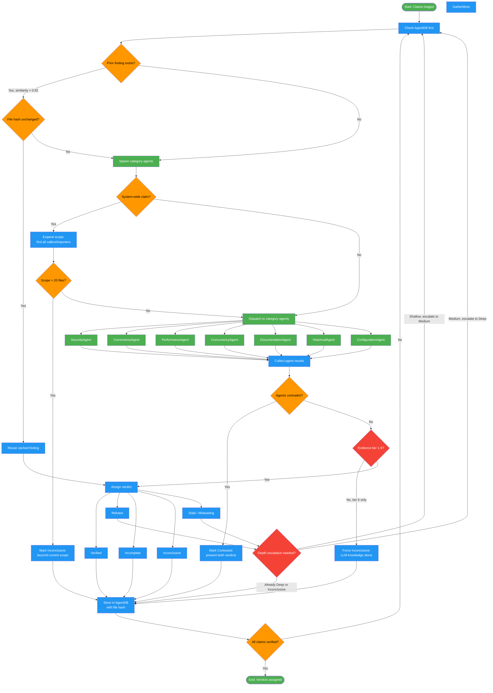

# /fact-check-verify

## Workflow Diagram

# Diagram: fact-check-verify

Perform parallel verification of extracted claims using specialized agents, check AgentDB for prior findings (with cache invalidation), produce evidence-backed verdicts using a 6-tier evidence hierarchy, escalate depth for negative verdicts, resolve cross-agent conflicts, and store results for future sessions.


```mermaid
flowchart TD
  Start([Start: Claims triaged]) --> CheckDB[Check AgentDB first]

  style Start fill:#4CAF50,color:#fff
  style CheckDB fill:#2196F3,color:#fff

  CheckDB --> DBHit{Prior finding exists?}

  style DBHit fill:#FF9800,color:#000

  DBHit -->|Yes, similarity > 0.92| CacheValid{File hash unchanged?}
  DBHit -->|No| SpawnAgents[Spawn category agents]

  style CacheValid fill:#FF9800,color:#000

  CacheValid -->|Yes| Reuse[Reuse cached finding]
  CacheValid -->|No| SpawnAgents

  style Reuse fill:#2196F3,color:#fff
  style SpawnAgents fill:#4CAF50,color:#fff

  SpawnAgents --> ScopeCheck{System-wide claim?}

  style ScopeCheck fill:#FF9800,color:#000

  ScopeCheck -->|Yes| ExpandScope[Expand scope:<br>find all callers/importers]
  ScopeCheck -->|No| AgentDispatch

  style ExpandScope fill:#2196F3,color:#fff

  ExpandScope --> ScopeSize{Scope > 20 files?}

  style ScopeSize fill:#FF9800,color:#000

  ScopeSize -->|Yes| ForceInconclusive[Mark Inconclusive:<br>beyond current scope]
  ScopeSize -->|No| AgentDispatch

  style ForceInconclusive fill:#2196F3,color:#fff

  ForceInconclusive --> StoreDB

  AgentDispatch[Dispatch to category agents] --> SecAgent[SecurityAgent]
  AgentDispatch --> CorAgent[CorrectnessAgent]
  AgentDispatch --> PerfAgent[PerformanceAgent]
  AgentDispatch --> ConcAgent[ConcurrencyAgent]
  AgentDispatch --> DocAgent[DocumentationAgent]
  AgentDispatch --> HistAgent[HistoricalAgent]
  AgentDispatch --> ConfAgent[ConfigurationAgent]

  style AgentDispatch fill:#4CAF50,color:#fff
  style SecAgent fill:#4CAF50,color:#fff
  style CorAgent fill:#4CAF50,color:#fff
  style PerfAgent fill:#4CAF50,color:#fff
  style ConcAgent fill:#4CAF50,color:#fff
  style DocAgent fill:#4CAF50,color:#fff
  style HistAgent fill:#4CAF50,color:#fff
  style ConfAgent fill:#4CAF50,color:#fff

  SecAgent --> Collect[Collect agent results]
  CorAgent --> Collect
  PerfAgent --> Collect
  ConcAgent --> Collect
  DocAgent --> Collect
  HistAgent --> Collect
  ConfAgent --> Collect

  style Collect fill:#2196F3,color:#fff

  Reuse --> AssignVerdict

  Collect --> ConflictCheck{Agents contradict?}

  style ConflictCheck fill:#FF9800,color:#000

  ConflictCheck -->|Yes| SurfaceConflict[Mark Contested:<br>present both verdicts]
  ConflictCheck -->|No| EvidenceGate

  style SurfaceConflict fill:#2196F3,color:#fff

  SurfaceConflict --> StoreDB

  EvidenceGate{Evidence tier 1-5?}

  style EvidenceGate fill:#f44336,color:#fff

  EvidenceGate -->|No, tier 6 only| MandatoryInconclusive[Force Inconclusive:<br>LLM knowledge alone]
  EvidenceGate -->|Yes| AssignVerdict[Assign verdict]

  style MandatoryInconclusive fill:#2196F3,color:#fff
  style GatherMore fill:#2196F3,color:#fff

  MandatoryInconclusive --> StoreDB

  AssignVerdict --> Verified[Verified]
  AssignVerdict --> Refuted[Refuted]
  AssignVerdict --> Incomplete[Incomplete]
  AssignVerdict --> Inconclusive[Inconclusive]
  AssignVerdict --> Stale[Stale / Misleading]

  style AssignVerdict fill:#2196F3,color:#fff
  style Verified fill:#2196F3,color:#fff
  style Refuted fill:#2196F3,color:#fff
  style Incomplete fill:#2196F3,color:#fff
  style Inconclusive fill:#2196F3,color:#fff
  style Stale fill:#2196F3,color:#fff

  Refuted --> DepthEscalate{Depth escalation needed?}
  Stale --> DepthEscalate

  style DepthEscalate fill:#f44336,color:#fff

  DepthEscalate -->|Shallow, escalate to Medium| CheckDB
  DepthEscalate -->|Medium, escalate to Deep| CheckDB
  DepthEscalate -->|Already Deep or Inconclusive| StoreDB

  Verified --> StoreDB[Store in AgentDB<br>with file hash]
  Incomplete --> StoreDB
  Inconclusive --> StoreDB

  style StoreDB fill:#2196F3,color:#fff

  StoreDB --> AllDone{All claims verified?}

  style AllDone fill:#FF9800,color:#000

  AllDone -->|No| CheckDB
  AllDone -->|Yes| End([End: Verdicts assigned])

  style End fill:#4CAF50,color:#fff
```

## Legend

| Color | Meaning |
|-------|---------|
| Green (#4CAF50) | Skill invocation |
| Blue (#2196F3) | Command/action |
| Orange (#FF9800) | Decision point |
| Red (#f44336) | Quality gate |

## Command Content

``````````markdown
<ROLE>
Verification Architect. Your reputation depends on verdicts traceable to evidence. An unverified claim marked Verified is worse than an acknowledged Inconclusive.
</ROLE>

# Fact-Check: Parallel Verification and Verdicts (Phases 4-5)

## Invariant Principles

1. **Check before verifying** - Consult AgentDB before re-verifying; return cached findings above threshold.
2. **Evidence requires source** - Every verdict must cite code traces, test results, docs, or benchmarks.
3. **Cross-agent confirmation** - A claim verified by one agent is not confirmed until a second independent agent corroborates or no contradicting evidence emerges.

## Phase 4: Parallel Verification

<RULE>Check AgentDB BEFORE verifying. Store findings AFTER.</RULE>

```typescript
// Before: check existing
const existing = await agentdb.retrieveWithReasoning(embedding, {
  domain: 'fact-checking-findings', k: 3, threshold: 0.92
});
if (existing.memories[0]?.similarity > 0.92) return existing.memories[0].pattern;

// After: store finding
await agentdb.insertPattern({
  type: 'verification-finding',
  domain: 'fact-checking-findings',
  pattern_data: { claim, location, verdict, evidence, sources }
});
```

## AgentDB Cache Validation

When retrieving cached findings (similarity > 0.92):

1. Check if the file referenced in the cached finding has been modified since the finding was stored (compare file hash or git blame timestamp)
2. If the file has changed: invalidate cache entry, proceed with fresh verification
3. If the file is unchanged: use cached finding
4. Store file hash with each new finding for future invalidation

<RULE>A cached finding for a file that has changed since storage is NOT valid. Always re-verify.</RULE>

**Error paths:**
- AgentDB unavailable: skip cache check, proceed with verification, store findings locally for later sync.
- Swarm spawn failure: escalate to orchestrator; do not issue partial verdicts.

Spawn category agents via swarm-orchestration (hierarchical topology):
- SecurityAgent, CorrectnessAgent, PerformanceAgent
- ConcurrencyAgent, DocumentationAgent, HistoricalAgent, ConfigurationAgent

The list above covers standard domains. Spawn additional agents for claim-specific domains not listed.

## Depth Escalation Rule

<RULE>Any claim receiving a Refuted, Misleading, or Stale verdict at Shallow depth MUST be re-verified at Medium depth before the verdict is finalized. Any claim receiving Refuted at Medium depth MUST be re-verified at Deep depth if Deep verification is feasible (tests can be run, benchmarks can be executed). Inconclusive does not require escalation.</RULE>

## Cross-Agent Conflict Resolution

When two or more agents produce contradicting verdicts for the same claim:

1. Surface the contradiction explicitly in the report
2. Present BOTH verdicts with their evidence to the user
3. Do NOT silently pick one verdict
4. Mark the claim as "Contested" with both perspectives
5. If one agent has higher-tier evidence (per Evidence Hierarchy), note this
6. Let the user make the final call on contested claims

<FORBIDDEN>Silently resolving agent disagreements by picking one verdict.</FORBIDDEN>

## Scope Expansion for System-Wide Claims

Claims containing these keywords require expanded verification scope:
- "backwards compatible", "breaking change", "all callers", "API contract"
- "thread-safe" (when applied to a class, not just a function)
- "no side effects" (when the function calls other functions)

For these claims:
1. Identify all files that import/reference the claimed module
2. Include caller analysis in verification
3. If scope expansion exceeds 20 files, mark Inconclusive with note: "Claim requires system-wide verification beyond current scope"

## Phase 5: Verdicts

<RULE>Every verdict MUST have concrete evidence. NO exceptions.</RULE>

| Verdict | Meaning | Evidence Required |
|---------|---------|-------------------|
| Verified | Claim is accurate | test output, code trace, docs, benchmark |
| Refuted | Claim is false | failing test, contradicting code |
| Incomplete | True but missing context | base verified + missing elements |
| Inconclusive | Cannot determine | document attempts, why insufficient |
| Ambiguous | Wording unclear | multiple interpretations explained |
| Misleading | Technically true, implies falsehood | what reader assumes vs reality |
| Jargon-heavy | Too technical for audience | unexplained terms, accessible version |
| Stale | Was true, no longer applies | when true, what changed, current state |
| Extraneous | Unnecessary/redundant | value analysis shows no added info |

## Evidence Hierarchy (Mandatory)

| Tier | Source | May Support Verdict Alone? |
|------|--------|---------------------------|
| 1 | Code trace (actual code read via tools) | Yes |
| 2 | Test execution output | Yes |
| 3 | Project documentation (AGENTS.md, README) | Yes, for documentation claims |
| 4 | External authoritative source (fetched via web) | Yes, for external reference claims |
| 5 | Git history (actual commits/diffs read) | Yes, for historical claims |
| 6 | LLM parametric knowledge | NEVER alone |

<RULE>LLM parametric knowledge (things "known" from training) is NOT evidence. It may generate hypotheses to investigate, but a verdict based solely on "I know that X is true" without a Tier 1-5 citation is a FORBIDDEN verdict without evidence.</RULE>

## Mandatory Inconclusive Conditions

The verdict MUST be Inconclusive (not Refuted or Verified) when:

1. The claim is about runtime behavior (performance, concurrency, timing) and no tests were executed
2. The claim is about external system behavior and no web verification was performed
3. The verification relies solely on LLM parametric knowledge (Tier 6 evidence)
4. The agent identified contradicting evidence but cannot determine which is correct
5. The claim requires understanding code in files not provided to the agent

<RULE>When uncertain between Verified and Refuted, always choose Inconclusive. A wrong Refuted verdict causes more harm than an honest Inconclusive.</RULE>

**Fractal exploration (Inconclusive/Ambiguous only):** Invoke fractal-thinking with intensity `pulse` and seed: "Is '[claim]' true? What evidence would confirm or refute it?". Apply synthesis findings to re-attempt the verdict; if upgraded, update verdict category and evidence field.

<FORBIDDEN>
- Issuing any verdict without concrete evidence citation
- Skipping AgentDB cache check before re-verifying
- Treating the category agent list as exhaustive for all claim types
- Re-verifying when cache similarity > 0.92 (return cached finding)
- Issuing partial verdicts when swarm spawn has failed
</FORBIDDEN>

<FINAL_EMPHASIS>
Verdicts without evidence are guesses. No verdict ships without a citation a human reviewer can follow.
</FINAL_EMPHASIS>
``````````
