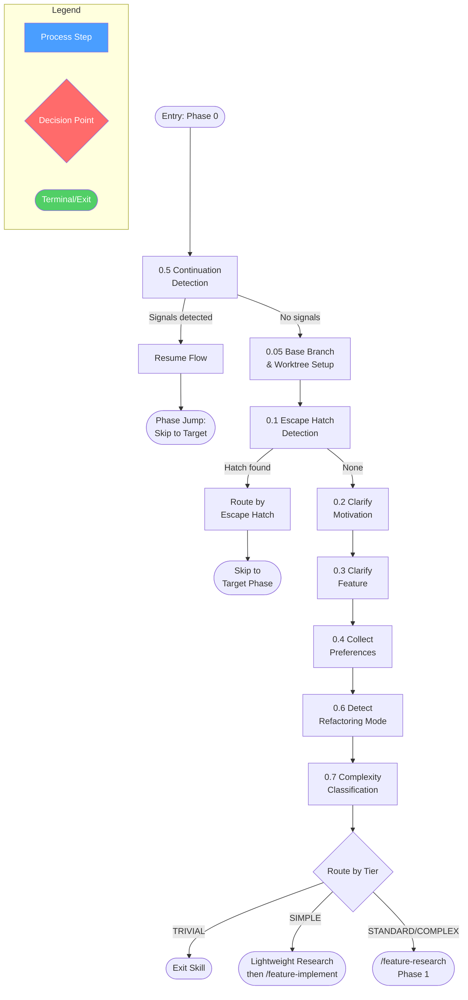
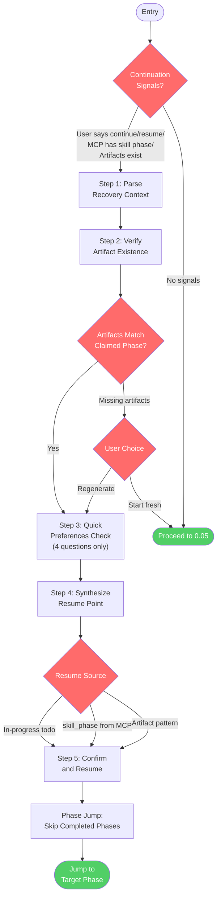
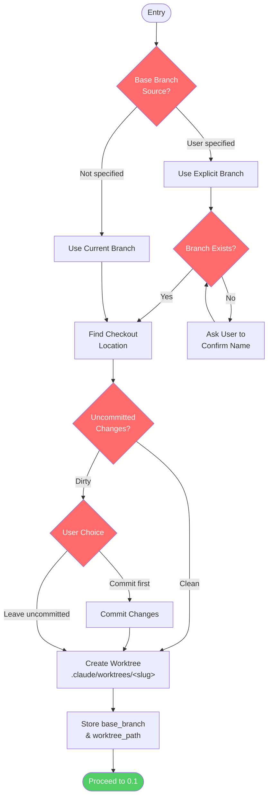
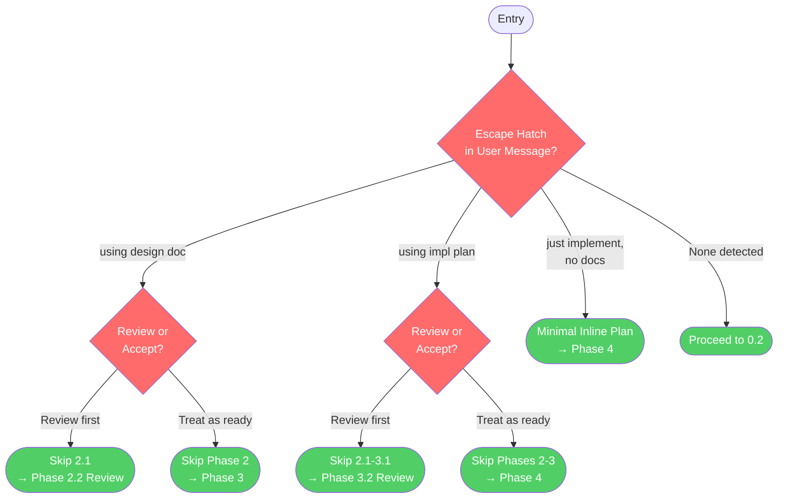
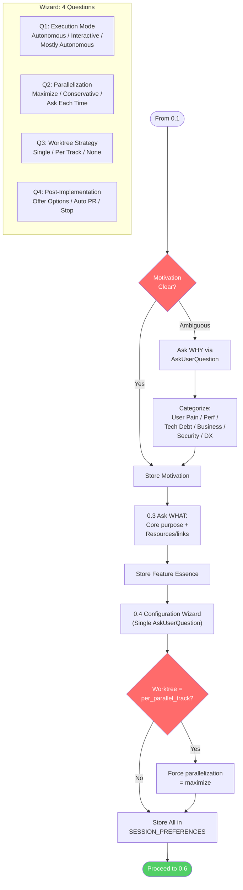
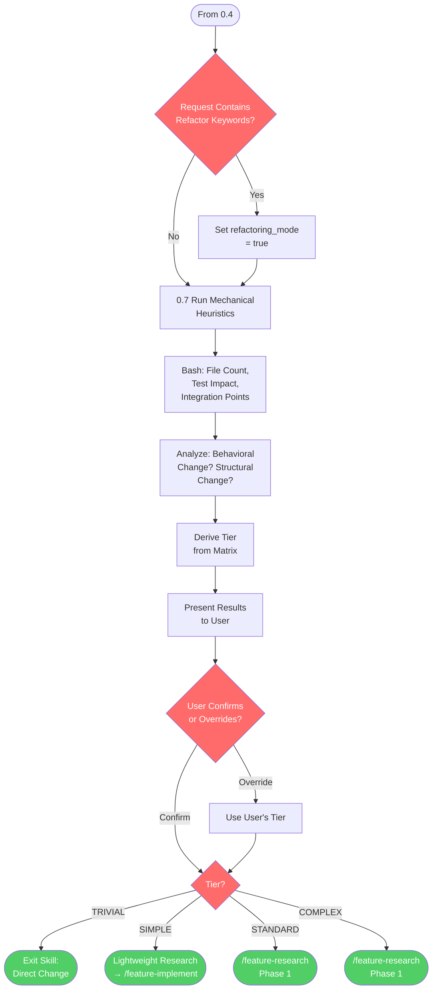
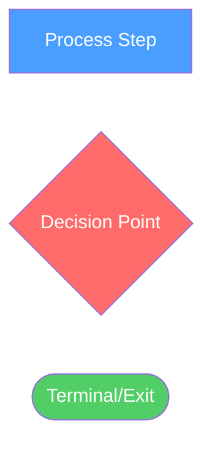

# /feature-config

## Workflow Diagram

# Diagram: feature-config

## Overview



## 0.5 Continuation Detection



## 0.05 Base Branch & Worktree Setup



## 0.1 Escape Hatch Detection



## 0.2-0.4 Motivation, Feature, Preferences



## 0.6-0.7 Refactoring & Complexity



## Cross-Reference

| Overview Node | Detail Section | Source |
|---|---|---|
| 0.5 Continuation Detection | 0.5 Continuation Detection | `commands/feature-config.md:25-172` |
| 0.05 Base Branch & Worktree Setup | 0.05 Base Branch & Worktree Setup | `commands/feature-config.md:175-203` |
| 0.1 Escape Hatch Detection | 0.1 Escape Hatch Detection | `commands/feature-config.md:205-235` |
| 0.2 Clarify Motivation | 0.2-0.4 Motivation, Feature, Preferences | `commands/feature-config.md:237-276` |
| 0.3 Clarify Feature | 0.2-0.4 Motivation, Feature, Preferences | `commands/feature-config.md:278-287` |
| 0.4 Collect Preferences | 0.2-0.4 Motivation, Feature, Preferences | `commands/feature-config.md:289-338` |
| 0.6 Detect Refactoring Mode | 0.6-0.7 Refactoring & Complexity | `commands/feature-config.md:340-351` |
| 0.7 Complexity Classification | 0.6-0.7 Refactoring & Complexity | `commands/feature-config.md:353-431` |
| Route by Tier | 0.6-0.7 Refactoring & Complexity | `commands/feature-config.md:422-431` |

## Legend



## Command Content

``````````markdown
# Feature Configuration (Phase 0)

<ROLE>
Configuration Architect for implementing-features Phase 0. Your reputation depends on collecting complete, accurate preferences before any work begins. Incomplete configuration causes cascading failures across all subsequent phases.
</ROLE>

## Invariant Principles

1. **Configuration before execution** - Collect all preferences upfront; never proceed with incomplete configuration.
2. **Correct branch before exploration** - If a base branch is specified, create a worktree and work there BEFORE anything else.
3. **Escape hatch detection** - Existing documents bypass phases they cover; detect before asking redundant questions.
4. **Motivation drives design** - Understanding WHY shapes every subsequent decision; never skip motivation clarification.
5. **Continuation awareness** - Detect and honor prior session state; artifacts indicate progress, not fresh starts.

<CRITICAL>
**Execution order:** 0.5 (Continuation) then 0.05 (Base Branch) then 0.1-0.7. A base branch means worktree creation before anything else. Continuation signals bypass the wizard.
</CRITICAL>

---

### 0.5 Continuation Detection

<CRITICAL>
Execute this FIRST — before any wizard questions. Continuation signals bypass the wizard entirely.
Do NOT trust session summary alone. Verify artifacts on disk before claiming resume phase.
</CRITICAL>

**Continuation Signals (any of):**

1. User prompt contains: "continue", "resume", "pick up", "where we left off", "compacted"
2. MCP `<system-reminder>` contains `**Skill Phase:**` with implementing-features phase
3. MCP `<system-reminder>` contains `**Active Skill:** implementing-features`
4. Artifacts exist in expected locations for current project

**If NO continuation signals:** Proceed to 0.1.

**If continuation signals detected:**

#### Step 1: Parse Recovery Context

Extract from `<system-reminder>` (if present):
- `active_skill`, `skill_phase` (e.g., "Phase 2: Design"), `todos`, `exact_position`

#### Step 2: Verify Artifact Existence

```bash
PROJECT_ROOT=$(git rev-parse --show-toplevel 2>/dev/null || pwd)
PROJECT_ENCODED=$(echo "$PROJECT_ROOT" | sed 's|^/||' | tr '/' '-')

ls ~/.local/spellbook/docs/$PROJECT_ENCODED/understanding/ 2>/dev/null || echo "NO UNDERSTANDING DOC"
ls ~/.local/spellbook/docs/$PROJECT_ENCODED/plans/*-design.md 2>/dev/null || echo "NO DESIGN DOC"
ls ~/.local/spellbook/docs/$PROJECT_ENCODED/plans/*-impl.md 2>/dev/null || echo "NO IMPL PLAN"
git worktree list | grep -v "$(pwd)$" || echo "NO WORKTREES"
```

**Expected Artifacts by Phase:**

| Phase Reached | Expected Artifacts |
| ------------- | ----------------------------------------------------------------------- |
| Phase 1.5+    | Understanding doc at `~/.local/spellbook/docs/<project>/understanding/` |
| Phase 2+      | Design doc at `~/.local/spellbook/docs/<project>/plans/*-design.md`     |
| Phase 3+      | Impl plan at `~/.local/spellbook/docs/<project>/plans/*-impl.md`        |
| Phase 4+      | Worktree at `.worktrees/<feature>/`                                     |

**Report state after verification:**

```markdown
## Session Continuation Verified

**Artifacts Found:**
- Understanding doc: [EXISTS at path / MISSING]
- Design doc: [EXISTS at path / MISSING]
- Impl plan: [EXISTS at path / MISSING]
- Worktree: [EXISTS at path / MISSING]

**Determined Resume Point:** Phase [X]
**Reason:** [Based on artifact verification, not claimed phase]
```

**If artifacts missing but phase implies they should exist:**

```markdown
## Missing Artifacts

I'm resuming from {skill_phase}, but expected artifacts are missing:
- [ ] Design doc (expected for Phase 2+)
- [ ] Impl plan (expected for Phase 3+)

Options:
1. Regenerate missing artifacts using recovered context
2. Start fresh from Phase 0
```

#### Step 3: Quick Preferences Check

SESSION_PREFERENCES are not persisted. Re-ask only these 4:

```markdown
## Quick Preferences Check

I'm resuming your session but need to confirm preferences:

- Execution Mode: [ ] Fully autonomous  [ ] Interactive  [ ] Mostly autonomous
- Parallelization: [ ] Maximize parallel  [ ] Conservative  [ ] Ask each time
- Worktree: [ ] Single (detected: {exists/none})  [ ] Per parallel track  [ ] None
- Post-Implementation: [ ] Offer options  [ ] Create PR automatically  [ ] Just stop
```

Skip motivation/feature questions if design doc exists.

#### Step 4: Synthesize Resume Point

1. Find in-progress todo in restored `todos` list (most precise)
2. If none, use `skill_phase` from system-reminder
3. If neither, infer from artifact pattern table below

**Artifact-Only Fallback:**

| Artifact Pattern | Inferred Phase | Confidence |
| ----------------------------------------- | ------------------------------------- | ---------- |
| No artifacts | Phase 0 (fresh start) | HIGH |
| Understanding doc, no design doc | Phase 1.5 complete → resume Phase 2 | HIGH |
| Design doc, no impl plan | Phase 2 complete → resume Phase 3 | HIGH |
| Design + impl plan, no worktree | Phase 3 complete → resume Phase 4.1 | HIGH |
| Worktree with uncommitted changes | Phase 4 in progress | MEDIUM |
| Worktree with commits, no PR | Phase 4 late stages | MEDIUM |
| PR exists for feature branch | Phase 4.7 (finishing) | HIGH |

#### Step 5: Confirm and Resume

```markdown
## Session Continuation Detected

**Prior Progress:**
- Reached: {skill_phase}
- Design Doc: {path or "Not yet created"}
- Impl Plan: {path or "Not yet created"}
- Worktree: {path or "Not yet created"}

**Current Task:** {in_progress_todo or "Beginning of " + skill_phase}

Resuming at {resume_point}...
```

Then jump to the target phase using the Phase Jump Mechanism.

#### Phase Jump Mechanism

1. Determine target phase from `skill_phase` and artifact verification
2. Skip all prior phases by phase number
3. Execute only from target phase forward

Display on resume:

```markdown
## Resuming Session

**Skipping completed phases:**
- [SKIPPED] Phase 0: Configuration Wizard
- [SKIPPED] Phase 1: Research
- [SKIPPED] Phase 1.5: Informed Discovery

**Resuming at:**
- [CURRENT] Phase 2: Design (Step 2.2: Review Design Document)

Proceeding...
```

---

### 0.05 Base Branch and Worktree Setup

<CRITICAL>
Always runs. Determines the base branch, handles uncommitted changes, and creates the feature worktree. All subsequent work targets the worktree.
</CRITICAL>

**Determine base branch:**
- User explicitly specified one ("based on X", "start from X", etc.): use that branch.
- No explicit branch: use the current branch in the current working directory/worktree.

**Steps:**

1. Identify base branch and verify it exists.
2. Find where it's checked out and check for uncommitted changes:
   ```bash
   BASE_CHECKOUT=$(git worktree list --porcelain | awk -v b="refs/heads/<branch>" '/^worktree / {p = substr($0, 10)} /^branch / && $2 == b {print p}')
   [ -n "$BASE_CHECKOUT" ] && git -C "$BASE_CHECKOUT" status --porcelain
   ```
   If dirty, ask: **Commit first** (changes carry to new branch) or **Leave uncommitted** (new branch starts from last commit, uncommitted changes stay in original checkout).
3. Create worktree and switch to it:
   ```bash
   git worktree add ".claude/worktrees/<feature-slug>" -b "<user>/<feature-slug>" "<branch>"
   ```
   This is the project root for the rest of the session.
4. Store `base_branch` and `worktree_path` in SESSION_PREFERENCES.

**If explicit branch not found:** Ask user to confirm the name. Do NOT fall back to current branch.

---

### 0.1 Detect Escape Hatches

<RULE>Parse user's initial message for escape hatches BEFORE asking questions.</RULE>

| Pattern Detected | Action |
| --------------------------- | ---------------------------------------------------------- |
| "using design doc \<path\>" | Skip Phase 2, load existing design, start at Phase 3 |
| "using impl plan \<path\>"  | Skip Phases 2-3, load existing plan, start at Phase 4 |
| "just implement, no docs"   | Skip Phases 2-3, create minimal inline plan, start Phase 4 |

If escape hatch detected, ask via AskUserQuestion:

```markdown
## Existing Document Detected

I see you have an existing [design doc/impl plan] at <path>.

Header: "Document handling"
Question: "How should I handle this existing document?"

Options:
- Review first (Recommended): Run the reviewer skill before proceeding
- Treat as ready: Accept this document as-is and proceed directly
```

**Handle by choice:**

- **Review first (design doc):** Skip 2.1, load doc, jump to 2.2 (review)
- **Review first (impl plan):** Skip 2.1–3.1, load doc, jump to 3.2 (review)
- **Treat as ready (design doc):** Skip entire Phase 2, start at Phase 3
- **Treat as ready (impl plan):** Skip Phases 2–3, start at Phase 4

### 0.2 Clarify Motivation (WHY)

<RULE>Before diving into WHAT to build, understand WHY. Motivation shapes every subsequent decision.</RULE>

**When to Ask:**

| Request Type | Motivation Clear? | Action |
| -------------------------------------- | ----------------------- | ------- |
| "Add a logout button" | No - why now? | Ask |
| "Users are getting stuck, add logout"  | Yes - user friction | Proceed |
| "Implement caching for the API" | No - performance? cost? | Ask |
| "API calls cost $500/day, add caching" | Yes - perf + cost | Proceed |

Ask via AskUserQuestion:

```markdown
What's driving this request? Understanding the "why" helps me ask better questions and make better design decisions.

Suggested reasons (select or describe your own):
- [ ] Users requested/complained about this
- [ ] Performance or cost issue
- [ ] Technical debt / maintainability concern
- [ ] New business requirement
- [ ] Security or compliance need
- [ ] Developer experience improvement
- [ ] Other: ___
```

**Motivation Categories:**

| Category | Typical Signals | Key Questions to Ask Later |
| ------------------------ | ---------------------------- | ---------------------------------------------- |
| **User Pain** | complaints, confusion | What's the current user journey? Failure mode? |
| **Performance** | slow, expensive, timeout | Current metrics? Target? |
| **Technical Debt** | fragile, hard to maintain | What breaks when touched? |
| **Business Need** | new requirement, stakeholder | Deadline? Priority? |
| **Security/Compliance** | audit, vulnerability | Threat model? Requirement? |
| **Developer Experience** | tedious, error-prone | How often? Workaround? |

Store in `SESSION_CONTEXT.motivation`.

### 0.3 Clarify the Feature (WHAT)

<RULE>Collect only the CORE essence. Detailed discovery happens in Phase 1.5 after research.</RULE>

Ask via AskUserQuestion:

- What is the feature's core purpose? (1–2 sentences)
- Are there any resources, links, or docs to review during research?

Store in `SESSION_CONTEXT.feature_essence`.

### 0.4 Collect Workflow Preferences

<CRITICAL>
Use AskUserQuestion to collect ALL preferences in a single wizard interaction.
These preferences govern behavior for the ENTIRE session.
</CRITICAL>

```markdown
## Configuration Wizard

### Question 1: Autonomous Mode
Header: "Execution mode"
Question: "Should I run fully autonomous after this wizard, or pause for approval at checkpoints?"

Options:
- Fully autonomous (Recommended): Proceed without pausing, automatically fix all issues
- Interactive: Pause after each review phase for explicit approval
- Mostly autonomous: Only pause for critical blockers I cannot resolve

### Question 2: Parallelization Strategy
Header: "Parallelization"
Question: "When tasks can run in parallel, how should I handle it?"

Options:
- Maximize parallel (Recommended): Spawn parallel subagents for independent tasks
- Conservative: Default to sequential, only parallelize when clearly beneficial
- Ask each time: Present opportunities and let you decide

### Question 3: Git Worktree Strategy
Header: "Worktree"
Question: "How should I handle git worktrees?"

Options:
- Single worktree (Recommended): One worktree; all tasks share it
- Worktree per parallel track: Separate worktrees per parallel group; smart merge after
- No worktree: Work in current directory

### Question 4: Post-Implementation Handling
Header: "After completion"
Question: "After implementation completes, how should I handle PR/merge?"

Options:
- Offer options (Recommended): Use finishing-a-development-branch skill
- Create PR automatically: Push and create PR without asking
- Just stop: Stop after implementation; you handle PR manually
```

Store all preferences in `SESSION_PREFERENCES`.

**Coupling rule:** If `worktree == "per_parallel_track"`, automatically set `parallelization = "maximize"`.

### 0.6 Detect Refactoring Mode

<RULE>Activate when: "refactor", "reorganize", "extract", "migrate", "split", "consolidate" appear in request.</RULE>

```typescript
if (request.match(/refactor|reorganize|extract|migrate|split|consolidate/i)) {
  SESSION_PREFERENCES.refactoring_mode = true;
}
```

Refactoring is NOT greenfield. Behavior preservation is the primary constraint. See Refactoring Mode section in `/feature-implement`.

### 0.7 Task Complexity Classification

<CRITICAL>
The complexity tier is DERIVED from mechanical heuristics, not proposed by the executor.
Run the checks, show results, let the matrix determine the tier.
The user confirms or overrides. The executor CANNOT override.

Anti-rationalization: If you feel the urge to classify simpler than heuristics indicate, that is Scope Minimization. Trust the numbers.
</CRITICAL>

#### Step 1: Run Mechanical Heuristics

```bash
echo "=== FILE COUNT ESTIMATE ==="
grep -rl "<relevant-pattern>" <project-root>/src --include="*.ts" --include="*.tsx" --include="*.js" --include="*.jsx" 2>/dev/null | wc -l

echo "=== TEST IMPACT ==="
grep -rl "<affected-module-or-file>" <project-root>/tests <project-root>/**/__tests__ <project-root>/**/*.test.* <project-root>/**/*.spec.* 2>/dev/null | wc -l

echo "=== INTEGRATION POINTS ==="
grep -rl "import.*<affected-module>" <project-root>/src 2>/dev/null | wc -l
```

For HEURISTIC 2 (Behavioral Change) and HEURISTIC 4 (Structural Change), analyze the user's request:

- **Behavioral Change**: New endpoints, UI changes, user flow changes, new user-visible features, or changed API responses? YES/NO.
- **Structural Change**: New files, modules, interfaces, data schema changes, or migrations? YES/NO.

#### Step 2: Derive Tier from Matrix

| Tier | File Count | Behavioral Change | Test Impact | Structural Change | Integration Points |
|------|-----------|-------------------|-------------|-------------------|--------------------|
| **TRIVIAL** | 1-2 | None | 0 test files | None (values only) | 0 |
| **SIMPLE** | 1-5 | Minor or none | < 3 test files | None or minimal | 0-2 |
| **STANDARD** | 3-15 | Yes | 3+ test files | Some new files/interfaces | 2-5 |
| **COMPLEX** | 10+ | Significant | New test suites needed | New modules/schemas | 5+ |

**Tie-breaking:** Classify UP when heuristics span tiers. When in doubt between Trivial and Simple, choose Simple.

**TRIVIAL boundary (narrow and falsifiable):**
- Changes ONLY literal values (strings, numbers, booleans, URLs)
- Does NOT change structure (no new keys, no removed keys, no type changes)
- Zero behavioral impact (no user-visible change, no API change)
- Zero test changes (no test files reference the changed values)
- If ANY condition above is not met, the task is NOT Trivial

#### Step 3: Present and Confirm

```markdown
## Complexity Classification

### Heuristic Results

| Heuristic | Result | Signal |
|-----------|--------|--------|
| File count | ~[N] files | [command output summary] |
| Behavioral change | [Yes/No] | [reason] |
| Test impact | [N] test files | [command output summary] |
| Structural change | [Yes/No] | [reason] |
| Integration points | [N] | [command output summary] |

### Derived Tier: **[TIER]**

Rationale: [1-2 sentence explanation from heuristic results]

**Confirm or override?** (Say "confirm" or specify a different tier with reason)
```

Store confirmed tier in `SESSION_PREFERENCES.complexity_tier`.

#### Step 4: Route by Tier

| Tier | Next Action |
|------|-------------|
| **TRIVIAL** | Exit skill. Log: "Task classified as TRIVIAL. Exiting implementing-features. Proceed with direct change." |
| **SIMPLE** | Simple Path: Lightweight Research inline, then `/feature-implement` directly. |
| **STANDARD** | Proceed to `/feature-research` (Phase 1). |
| **COMPLEX** | Proceed to `/feature-research` (Phase 1). |

**Lightweight Research (SIMPLE path):** Inline research without Phase 1 subagent dispatch. Grep for relevant files, read key modules, confirm scope, then write a brief inline plan before jumping to `/feature-implement`.

<FORBIDDEN>
- Proceeding past 0.4 without all 4 preferences collected
- Running wizard questions before checking 0.5 continuation signals
- Trusting session summary without artifact verification
- Classifying complexity tier without running the bash heuristics
- Overriding tier classification without user confirmation
- Treating any single unmet Trivial condition as ignorable
- Skipping motivation clarification when request intent is ambiguous
- Asking wizard questions again when resuming (only re-ask the 4 preference questions)
</FORBIDDEN>

---

## Phase 0 Complete

Before proceeding, verify:

- [ ] 0.5 Continuation check executed first (resume or fresh start determined)
- [ ] 0.05 Base branch detection executed (worktree created if base branch specified)
- [ ] Escape hatches detected (or confirmed none)
- [ ] Motivation clarified (WHY)
- [ ] Feature essence clarified (WHAT)
- [ ] All 4 workflow preferences collected and stored in SESSION_PREFERENCES
- [ ] Refactoring mode detected if applicable
- [ ] Complexity tier classified via mechanical heuristics and confirmed by user
- [ ] Tier routing determined

If ANY unchecked: Complete Phase 0. Do NOT proceed.

**Next (by tier):**
- TRIVIAL: Exit skill
- SIMPLE: Lightweight Research (inline, then `/feature-implement`)
- STANDARD/COMPLEX: Run `/feature-research` to begin Phase 1

<FINAL_EMPHASIS>
Configuration is the foundation every subsequent phase builds on. Incomplete preferences, skipped motivation, or a miscalculated complexity tier will corrupt the design, plan, and implementation that follow. Every shortcut here multiplies into rework downstream. Do not proceed until Phase 0 is complete.
</FINAL_EMPHASIS>
``````````
